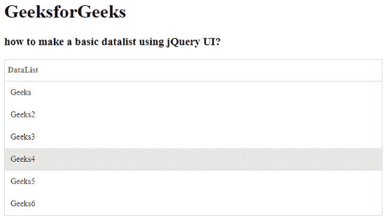

# easy ui jquery data list widget

> 哎哎哎::1230【https://www . geeksforgeeks . org/easy ui-jquery-data list 小部件/

EasyUI 是一个 HTML5 框架，用于使用基于 jQuery、React、Angular 和 Vue 技术的用户界面组件。它有助于构建交互式 web 和移动应用程序的功能，为开发人员节省了大量时间。

在本文中，我们将学习如何使用 jQuery 易用户界面设计数据列表。数据列表呈现列表中的项目。它是一个特殊的数据网格，在一列中显示数据。

**jQuery 易 UI 下载:**

```
https://www.jeasyui.com/download/index.php
```

**语法:**

```
<input class="easyui-datalist">
```

**属性:**

*   **行:**该属性定义显示行行。
*   **复选框:**定义是否为每行显示一个复选框。
*   **值字段:**要绑定到行的字段值名称。
*   **文本字段:**要在该行上显示的字段名称。
*   **分组字段:**指示要分组的字段。
*   **文本格式化程序:**文本字段格式化程序功能。
*   **组格式化程序:**格式化程序函数返回组内容，

**CDN 链接:**首先，添加你的项目所需的 jQuery Easy UI 脚本，链接是本地路径。

**示例:**

## 超文本标记语言

```
<!doctype html> 
<html> 

<head> 
    <meta charset="UTF-8"> 
    <meta name="viewport" content="initial-scale=1.0, 
        maximum-scale=1.0, user-scalable=no"> 

    <!-- EasyUI specific stylesheets-->
    <link rel="stylesheet" type="text/css"
        href="themes/metro/easyui.css"> 

    <link rel="stylesheet" type="text/css"
        href="themes/mobile.css"> 

    <link rel="stylesheet" type="text/css"
        href="themes/icon.css"> 

    <!--jQuery library -->
    <script type="text/javascript" src="jquery.min.js"> 
    </script> 

    <!--jQuery libraries of EasyUI -->
    <script type="text/javascript"
        src="jquery.easyui.min.js"> 
    </script> 

    <!--jQuery library of EasyUI Mobile -->
    <script type="text/javascript"
        src="jquery.easyui.mobile.js"> 
    </script> 
    <script type="text/javascript">
      $('#gfg').datalist();
    </script>
</head> 

<body>
    <h1>GeeksforGeeks</h1>
    <h3>how to make a basic datalist using jQuery UI?</h3>
    <ul id="gfg"class="easyui-datalist" title="DataList">
      <li value="1">Geeks</li>
      <li value="2">Geeks2</li>
      <li value="3">Geeks3</li>
      <li value="4">Geeks4</li>
      <li value="5">Geeks5</li>
      <li value="6">Geeks6</li>
    </ul>
</body>
</html>
```

**输出:**



数据列表

**参考:**T2】http://www.jeasyui.com/documentation/