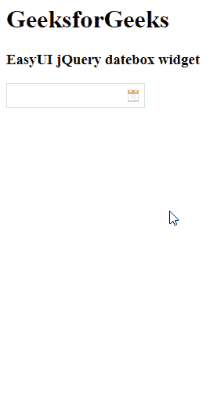

# easy ui jquery date box widget

> 哎哎哎:# t0]https://www . geeksforgeeks . org/easy ui-jquery-datebox 小部件/

EasyUI 是一个 HTML5 框架，用于使用基于 jQuery、React、Angular 和 Vue 技术的用户界面组件。它有助于构建交互式 web 和移动应用程序的功能，为开发人员节省了大量时间。

在本文中，我们将学习如何使用 jQuery 易用户界面设计一个日期框。datebox 小部件是访问日期、月份和年份的日历。

**jQuery 易 UI 下载:**

```
https://www.jeasyui.com/download/index.php
```

**语法:**

```
<input class="easyui-datebox">
```

**属性:**

*   **面板宽度:**下拉日历面板宽度。
*   **面板高度:**下拉日历面板高度。
*   **当前文本:**当天按钮显示的文本。
*   **关闭文本:**关闭按钮显示的文本。
*   **确定文本:**为确定按钮显示的文本，保留给 datetimebox 插件。
*   **禁用:**为真时禁用该字段。
*   **按钮:**日历下方的按钮。

**事件:**

*   **onSelect:** 当用户选择日期时触发。

**方法:**

*   **选项:**返回选项对象。
*   **日历:**获取日历对象。
*   **设置值:**设置日期框值。
*   **克隆来源:**从源日期框克隆日期框

**CDN 链接:**首先，添加项目所需的 jQuery Easy UI 脚本。

> <！–易 UI 的 jQuery 库–>
> <脚本类型=“text/JavaScript”src =“jQuery . easui . min . js”>
> </脚本>

**例 1:**

## 超文本标记语言

```
<!doctype html> 
<html> 

<head> 
    <meta charset="UTF-8"> 
    <meta name="viewport" content="initial-scale=1.0, 
        maximum-scale=1.0, user-scalable=no"> 

    <!-- EasyUI specific stylesheets-->
    <link rel="stylesheet" type="text/css"
        href="themes/metro/easyui.css"> 

    <link rel="stylesheet" type="text/css"
        href="themes/mobile.css"> 

    <link rel="stylesheet" type="text/css"
        href="themes/icon.css"> 

    <!--jQuery library -->
    <script type="text/javascript" src="jquery.min.js"> 
    </script> 

    <!--jQuery libraries of EasyUI -->
    <script type="text/javascript"
        src="jquery.easyui.min.js"> 
    </script> 

    <!--jQuery library of EasyUI Mobile -->
    <script type="text/javascript"
        src="jquery.easyui.mobile.js"> 
    </script> 

    <script type="text/javascript"> 
      $(document).ready(function (){ 
        $('#gfg').datebox({ 
          closeText: 'text',
        }); 
      }); 
    </script> 
</head> 

<body>

    <h1>GeeksforGeeks</h1>
    <h3>EasyUI jQuery datebox widget</h3>
    <input id="gfg" class="easyui-datebox">

</body>
</html>
```

**输出:**



**参考:**T2】http://www.jeasyui.com/documentation/