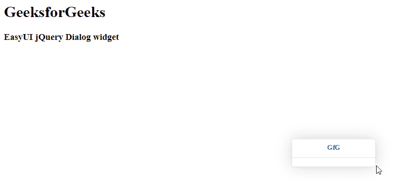

# easy ui jquery 对话小部件

> 原文:[https://www.geeksforgeeks.org/easyui-jquery-dialog-widget/](https://www.geeksforgeeks.org/easyui-jquery-dialog-widget/)

EasyUI 是一个 HTML5 框架，用于使用基于 jQuery、React、Angular 和 Vue 技术的用户界面组件。它有助于构建交互式 web 和移动应用程序的功能，为开发人员节省了大量时间。

在本文中，我们将学习如何使用 jQuery EasyUI 设计一个对话框。对话框小部件是一个浮动的可拖动面板，可以用作应用程序对话框。

**jQuery 易 UI 下载:**

```html
https://www.jeasyui.com/download/index.php
```

**语法:**

```html
<input class="easyui-dialog">
```

**属性:**

*   **标题:**对话框标题文字
*   **可折叠:**定义是否显示可折叠按钮
*   **可最小化:**定义是否显示可最小化按钮
*   **最大化:**定义是否显示最大化按钮
*   **可调整大小:**定义对话框是否可以调整大小
*   **工具栏:**对话框顶部工具栏
*   **按钮:**对话框底部按钮

**方法:**

*   **对话框**:返回外部对话框对象。

**CDN 链接:**首先，添加你的项目所需的 jQuery Easy UI 脚本，链接是本地路径。

**例 1:**

## 超文本标记语言

```html
<!doctype html> 
<html> 

<head> 
    <meta charset="UTF-8"> 
    <meta name="viewport" content="initial-scale=1.0, 
        maximum-scale=1.0, user-scalable=no"> 

    <!-- EasyUI specific stylesheets-->
    <link rel="stylesheet" type="text/css"
        href="themes/metro/easyui.css"> 

    <link rel="stylesheet" type="text/css"
        href="themes/mobile.css"> 

    <link rel="stylesheet" type="text/css"
        href="themes/icon.css"> 

    <!--jQuery library -->
    <script type="text/javascript" src="jquery.min.js"> 
    </script> 

    <!--jQuery libraries of EasyUI -->
    <script type="text/javascript"
        src="jquery.easyui.min.js"> 
    </script> 

    <!--jQuery library of EasyUI Mobile -->
    <script type="text/javascript"
        src="jquery.easyui.mobile.js"> 
    </script> 

    <script type="text/javascript">
        // jQuery
        $(document).ready(function (){ 
            $('#gfg').dialog({ 
                title: 'GfG',
                resizable: true
            }); 
      }); 
    </script> 
</head> 

<body>

    <h1>GeeksforGeeks</h1>
    <h3>EasyUI jQuery Dialog widget</h3>
    <input id="gfg" class="easyui-dialog">
</body>
</html>
```

**输出:**



**参考:**T2】http://www.jeasyui.com/documentation/