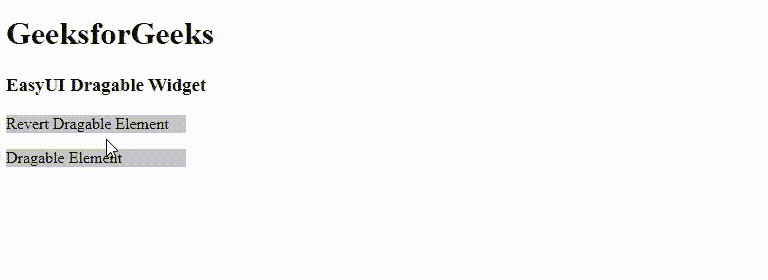

# EasyUI jQuery 挖泥船构件

> 哎哎哎::1230【https://www . geeksforgeeks . org/easy ui-jquery-draggable 小部件/

在本文中，我们将学习如何使用 jQuery EasyUI 设计一个可拖动的小部件。EasyUI 是一个 HTML5 框架，用于使用基于 jQuery、React、Angular 和 Vue 技术的用户界面组件。它有助于构建交互式 web 和移动应用程序的功能，为开发人员节省了大量时间。

小部件从标记或选择器中创建一个**可拖动的**元素。

**下载 jQuery 的 EasyUI:**

```
https://www.jeasyui.com/download/index.php
```

**语法:**

```
var a = $(".selector").draggable({

});
```

**属性:**

*   **代理:**类型为字符串或函数。用于设置“克隆”的代理元素。克隆元素用作代理。如果指定了一个函数，它必须返回一个 jQuery 对象。
*   **回复:**是布尔类型。当拖动停止时，元素将返回到其起始位置。
*   **光标:**为字符串类型。拖动时要显示的 CSS 光标。
*   **δX**:类型号。对应于当前光标的拖动元素位置 x。
*   **δY**:类型号。对应于当前光标的拖动元素位置 y。
*   **手柄**:它的类型是选择器。启动可拖动的句柄。
*   **禁用:**类型为布尔型。如果设置为*真，*可拖动功能将被禁用。
*   **边:**它的类型是数字。可用于启动可拖动属性的拖动宽度。
*   **轴:**它的类型是字符串。它设置被拖动元素移动的轴。
*   **延迟:**它的类型是延迟。它以毫秒为单位定义时间延迟。

#### **事件:**

*   **onBeforeDrag:** 参数是一个事件。它会在拖动前触发。
*   **onStartDrag:** 参数是一个事件。当对象开始拖动时，它会激发。
*   **onDrag:** 参数为事件。它会在拖动过程中触发。
*   **OneDDrAG:**参数是一个事件。拖动结束时会触发。
*   **ontopdrag:**参数是一个事件。拖动停止时会触发。

#### **方法:**

*   **选项:**返回选项属性。
*   **代理:**如果设置了代理属性，则返回拖动代理。
*   **启用:**启用拖动动作。
*   **禁用:**禁用拖动动作。

**注意:**在下面的例子中只显示了几个例子，开发人员可以根据应用程序的要求尝试上面列出的其他属性、事件和方法。

**CDN 链接:**首先，添加项目所需的 jQuery Easy UI 脚本。

> <！–易 UI 的 jQuery 库–>
> <脚本类型=“text/JavaScript”src =“jQuery . easui . min . js”></脚本>
> <！–易 UI Mobile 的 jQuery 库–>
> <脚本类型=“text/JavaScript”src =“jQuery . easui . Mobile . js”></脚本>

**示例:**以下示例演示了 jQuery EasyUI 可拖动小部件。

## 超文本标记语言

```
<!DOCTYPE html>
<html>

<head>
    <meta charset="UTF-8">
    <meta name="viewport"
          content="initial-scale=1.0, maximum-scale=1.0,
                   user-scalable=no">

    <!-- EasyUI specific stylesheets-->
    <link rel="stylesheet" type="text/css"
          href="themes/metro/easyui.css">

    <link rel="stylesheet" type="text/css"
          href="themes/mobile.css">

    <link rel="stylesheet" type="text/css"
          href="themes/icon.css">

    <!--jQuery library -->
    <script type="text/javascript" src="jquery.min.js">
    </script>

    <!--jQuery libraries of EasyUI -->
    <script type="text/javascript"
            src="jquery.easyui.min.js">
    </script>

    <!--jQuery library of EasyUI Mobile -->
    <script type="text/javascript"
            src="jquery.easyui.mobile.js">
    </script>

    <script type="text/javascript">
        $(document).ready(function (){
            $('#gfg1').draggable({
                handle:'#drag1',
            });
        });

        $(document).ready(function (){
            $('#gfg').draggable({
                handle:'#drag',
                cursor: 'pointer',
                revert: 'true'
            });
        });
    </script>
</head>

<body>

    <h1>GeeksforGeeks</h1>
    <h3>EasyUI Draggable Widget</h3>
    <div id="gfg">
        <div id="drag"
             style="background:rgb(199, 199, 199);
                    width: 180px;">

<p>Revert Draggable Element
<p>
        </div>
    </div>
    <div id="gfg1">
        <div id="drag1"
             style="background:rgb(199, 199, 199);
                    width: 180px;">

<p>Draggable Element
<p>
        </div>
    </div>

</body>

</html>
```

**输出:**



**参考:**T2】http://www.jeasyui.com/documentation/