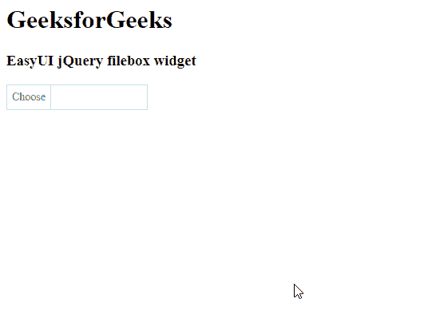

# easy ui jquery file bbox widget

> 哎哎哎:# t0]https://www . geeksforgeeks . org/easy ui-jquery-filebbox 小部件/

EasyUI 是一个 HTML5 框架，用于使用基于 jQuery、React、Angular 和 Vue 技术的用户界面组件。它有助于构建交互式 web 和移动应用程序的功能，为开发人员节省了大量时间。

在本文中，我们将学习如何使用 jQuery 易用户界面设计一个文件盒。文件框小部件代表一个 HTML 表单中的文件字段。

**jQuery 易 UI 下载:**

```
https://www.jeasyui.com/download/index.php
```

**语法:**

```
<input class="easyui-FileBox">
```

**属性:**

*   **按钮文本:**是定义按钮文本的字符串。
*   **按钮图标:**是定义按钮的图标的字符串。
*   **按钮对齐:**是定义按钮位置的字符串。
*   **accept:** 它是一个字符串，指定服务器接受的文件类型。
*   **multiple:** 是定义是否接受多个文件的布尔值。
*   **分隔符:**定义多个文件名之间的分隔符字符。

**方法:**

*   **文件:**返回选中的文件列表对象。

**CDN 链接:**首先，添加项目所需的 jQuery Easy UI 脚本。

> <！–易 UI 的 jQuery 库–>
> <脚本类型=【text/JavaScript】src =【jQuery . easui . min . js】></脚本>
> <！–易 UI Mobile 的 jQuery 库–>
> <脚本类型=“text/JavaScript”src =“jQuery . easui . Mobile . js”></脚本>

**示例:**

## 超文本标记语言

```
<html>
<head>

  <!-- EasyUI specific stylesheets -->
  <link rel="stylesheet"
        type="text/css"
        href="themes/metro/easyui.css">

  <link rel="stylesheet" 
        type="text/css"
        href="themes/mobile.css">

  <link rel="stylesheet"
        type="text/css" 
        href="themes/icon.css">

  <!-- jQuery library -->
  <script type="text/javascript"
          src="jquery.min.js">
  </script>

  <!-- jQuery libraries of EasyUI -->
  <script type="text/javascript"
          src="jquery.easyui.min.js">
  </script>

  <!-- jQuery library of EasyUI Mobile -->
  <script type="text/javascript"
          src="jquery.easyui.mobile.js">
  </script>
</head>
<body>
  <h1>GeeksforGeeks</h1>
  <h3>EasyUI jQuery filebox widget</h3>

  <!-- Define the EasyUI FileBox using markup -->
  <input id="gfg" class="easyui-filebox">
</body>
</html>
```

**输出:**



**参考:**T2】https://www.jeasyui.com/documentation/filebox.php