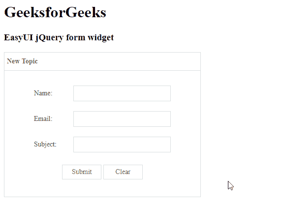

# easy ui jquery form widget

> 哎哎哎:# t0]https://www . geeksforgeeks . org/easy ui-jquery-form widget/

EasyUI 是一个 HTML5 框架，用于使用基于 jQuery、React、Angular 和 Vue 技术的用户界面组件。它有助于构建交互式 web 和移动应用程序的功能，为开发人员节省了大量时间。

在本文中，我们将学习如何使用 jQuery EasyUI 设计表单。表单提供了各种方法来执行带有表单字段的动作，如 ajax 提交、加载、清除等。

**jQuery 易 UI 下载:**

```
https://www.jeasyui.com/download/index.php
```

**语法:**

```
<form>
   <form element>
</form>
```

**属性:**

*   **新数据:**设置为*假*验证表单域。
*   **iframe:****定义是否使用 *iframe* 模式提交表单。**
*   ****ajax:** 定义表单是否使用 ajax 提交。**
*   ****脏:**定义表单是否只提交已更改的字段。**
*   ****queryParams:** 这些是在发布表单时将发送到服务器的附加参数。**
*   ****URL:** 这是要提交的表单动作 URL。**

****事件:****

*   ****onSubmit:** 提交前触发的事件。**
*   ****onProgress:** 当上传进度数据可用时触发的事件。**
*   ****成功:**表单提交成功时触发的事件。**
*   ****onBeforeLoad:** 在请求加载数据之前触发的事件。**
*   ****加载成功:**加载表单数据时触发的事件。**
*   ****加载错误:****事件****在加载表单数据时出现错误时触发。********
*   ********onChange:** 当字段值改变时触发的事件。******

******方法:******

*   ******清除:**清除表单数据。****
*   ******复位:**复位表单数据。****
*   ******验证:**进行表单域验证。****
*   ******启用验证:**启用验证。****
*   ******禁用验证:**禁用验证。****
*   ******重置验证:**重置验证。****
*   ******重置时间:**重置脏标志。****

******进场:******

*   ****首先，添加项目所需的 jQuery Easy UI 脚本。****

******例 1:******

## ****超文本标记语言****

```
**<!doctype html> 
<html> 

<head> 
    <meta charset="UTF-8"> 
    <meta name="viewport" content="initial-scale=1.0, 
        maximum-scale=1.0, user-scalable=no"> 

    <!-- EasyUI specific stylesheets-->
    <link rel="stylesheet" type="text/css"
        href="themes/metro/easyui.css"> 

    <link rel="stylesheet" type="text/css"
        href="themes/mobile.css"> 

    <link rel="stylesheet" type="text/css"
        href="themes/icon.css"> 

    <!--jQuery library -->
    <script type="text/javascript" src="jquery.min.js"> 
    </script> 

    <!--jQuery libraries of EasyUI -->
    <script type="text/javascript"
        src="jquery.easyui.min.js"> 
    </script> 

    <!--jQuery library of EasyUI Mobile -->
    <script type="text/javascript"
        src="jquery.easyui.mobile.js"> 
    </script> 

  <script type="text/javascript"> 
      $(document).ready(function (){ 
          $('#gfg').form({
            novalidate: true
          }); 
      }); 
    </script> 
</head> 

<body>

    <h1>GeeksforGeeks</h1>
    <h3>EasyUI jQuery form widget</h3>

<div class="easyui-panel" title="New Topic" 
     style="width:100%;max-width:400px;padding:30px 60px;">
        <form id="gfg" method="post">
            <div style="margin-bottom:20px">
                <input class="easyui-textbox" name="name" style="width:100%" 
                       data-options="label:'Name:'">
            </div>
            <div style="margin-bottom:20px">
                <input class="easyui-textbox" name="email" style="width:100%" 
                       data-options="label:'Email:'">
            </div>
            <div style="margin-bottom:20px">
                <input class="easyui-textbox" name="subject" style="width:100%" 
                       data-options="label:'Subject:'">
            </div>

        <div style="text-align:center;padding:5px 0">
            <a href="javascript:void(0)" class="easyui-linkbutton" 
               onclick="submitForm()" style="width:80px">Submit</a>
            <a href="javascript:void(0)" class="easyui-linkbutton" 
               onclick="clearForm()" style="width:80px">Clear</a>
        </div>

</form>
</div>

</body>
</html>**
```

******输出:******

****

表单小部件**** 

******参考:**T2】http://www.jeasyui.com/documentation/****