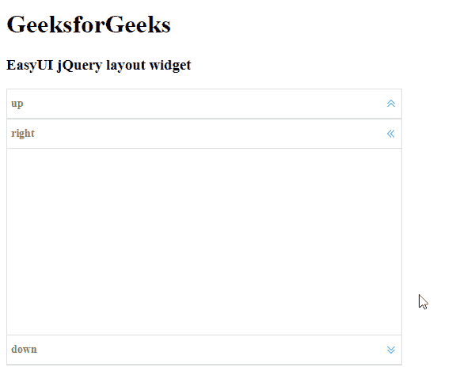

# easy ui jquery layout widget

> 哎哎哎::1230【https://www . geeksforgeeks . org/easy ui-jquery 布局小部件/

EasyUI 是一个 HTML5 框架，用于使用基于 jQuery、React、Angular 和 Vue 技术的用户界面组件。它有助于构建交互式 web 和移动应用程序的功能，为开发人员节省了大量时间。

在本文中，我们将学习如何使用 jQuery EasyUI 设计布局。布局为集装箱，最多有*北、南、东、西、*和*中心*五个区域。中心区域面板是必需的，但边缘区域面板是可选的。

**jQuery 易 UI 下载:**

```html
https://www.jeasyui.com/download/index.php
```

**语法:**

```html
<div class="layout"></div>
```

**布局选项:**

*   **适合:**如果设置为*真，*则设置布局大小以适合其父容器。

**区域面板选项:**

*   **标题:**布局面板标题文本。
*   **区域:**定义布局面板位置
*   **边框:**设置为*真*显示布局面板边框。
*   **拆分:**设置为*真*显示一个拆分条，用户可以在其中更改面板大小。
*   **图标 Cls:** 图标 CSS 类，用于在面板标题上显示图标。
*   **href:** 从远程服务器加载数据的网址。
*   **可折叠:**定义是否显示可折叠按钮。
*   **最小宽度:**最小面板宽度。
*   **明八:**最小面板高度。
*   **最大宽度:**最大面板宽度。
*   **最大高度:**最大面板高度。
*   **展开模式:**点击折叠面板时的展开模式。
*   **折叠尺寸:**折叠后的面板尺寸。
*   **隐藏展开工具:**设置为*真*以隐藏折叠面板上的展开工具。
*   **隐藏折叠内容:**设置为*真*隐藏折叠面板上的标题栏。
*   **折叠内容:**要在折叠面板上显示的标题内容。

**事件:**

*   **肿瘤失效**:折叠区域面板时事件触发。
*   **onExpand** :事件在展开区域面板时触发。
*   **onAdd** :添加新的区域面板时事件触发。
*   **onRemove** :移除区域面板时事件触发。

#### **方法:**

*   **调整大小:**设置布局大小
*   **面板:**返回指定面板。
*   **折叠:**它**T3】折叠指定的面板。**
*   **展开:**展开指定面板。
*   **添加:**添加指定面板。
*   **移除:**移除指定面板。
*   **分割:**分割区域面板。
*   **取消分割:**取消分割区域面板。
*   **停止折叠:**停止折叠区域面板。

**方法:**首先，添加项目所需的 jQuery Easy UI 脚本。

> <脚本类型= " text/JavaScript " src = " jquery . easy ui . min . js "></脚本>
> 
> <脚本类型= " text/JavaScript " src = " jquery . easy ui . mobile . js "></脚本>

**示例:**

## 超文本标记语言

```html
<!doctype html>
<html>

<head>
    <meta charset="UTF-8">
    <meta name="viewport" content=
        "initial-scale=1.0, maximum-scale=1.0,
        user-scalable=no">

    <!-- EasyUI specific stylesheets-->
    <link rel="stylesheet" type="text/css" 
        href="themes/metro/easyui.css">

    <link rel="stylesheet" type="text/css" 
        href="themes/mobile.css">

    <link rel="stylesheet" type="text/css" 
        href="themes/icon.css">

    <!--jQuery library -->
    <script type="text/javascript" 
        src="jquery.min.js">
    </script>

    <!--jQuery libraries of EasyUI -->
    <script type="text/javascript" 
        src="jquery.easyui.min.js">
    </script>

    <!--jQuery library of EasyUI Mobile -->
    <script type="text/javascript" 
        src="jquery.easyui.mobile.js">
    </script>

    <script type="text/javascript">
        $(document).ready(function() {
            $('#gfg').layout('show', {});
        });
    </script>
</head>

<body>

    <h1>GeeksforGeeks</h1>
    <h3>EasyUI jQuery layout widget</h3>

    <div id="gfg" class="easyui-layout" 
        style="width:500px;height:350px;">

        <div data-options=
            "region:'north',title:'up'">
        </div>

        <div data-options=
            "region:'center',title:'center'">
        </div>

        <div data-options=
            "region:'south',title:'down'">
        </div>

        <div data-options=
            "region:'east',title:'left'">
        </div>

        <div data-options=
            "region:'west',title:'right'">
        </div>
    </div>
</body>

</html>
```

**输出:**



**参考:**T2】http://www.jeasyui.com/documentation/