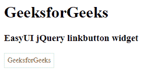

# easy ui jquery link button widget

> 哎哎哎:# t0]https://www . geeksforgeeks . org/easy ui-jquery-link button 小部件/

EasyUI 是一个 HTML5 框架，用于使用基于 jQuery、React、Angular 和 Vue 技术的用户界面组件。它有助于构建交互式 web 和移动应用程序的功能，为开发人员节省了大量时间。

在本文中，我们将学习如何使用 jQuery EasyUI 设计链接按钮。链接按钮用于创建超链接按钮。这是一个普通的<和>标签的代表。它可以同时显示图标和文本，也可以只显示图标或文本。

**jQuery 易 UI 下载:**

```html
https://www.jeasyui.com/download/index.php
```

**语法:**

```html
<div class="linkbutton">
</div>
```

**属性:**

*   **宽度:**该部件的宽度。
*   **高度:**该构件的高度。
*   **id:** 该组件的 id 属性。
*   **禁用:**为真禁用按钮。
*   **切换:**为真，用户可以将其状态切换为选中或未选中。
*   **选中:**定义按钮的状态是否被选中。
*   **组:**表示按钮所属的组名。
*   **素色:** True 显示素色效果。
*   **文本:**按钮文本。
*   **图标颜色:**一个 CSS 类，在左侧显示一个 16×16 的图标。
*   **图标对齐:**按钮图标的位置。
*   **尺寸:**按钮尺寸。

#### **事件:**

*   **onClick:** 点击按钮时触发。

#### **方法:**

*   **选项**:返回选项属性。
*   **调整大小**:调整按钮大小。
*   **禁用**:禁用按钮。
*   **启用**:启用按钮。
*   **选择**:选择按钮。
*   **取消选择**:取消选择按钮。

**CDN 链接:**首先，添加项目所需的 jQuery Easy UI 脚本。

> <！–易 UI 的 jQuery 库–>
> <脚本类型=【text/JavaScript】src =【jQuery . easui . min . js】></脚本>
> <！–易 UI Mobile 的 jQuery 库–>
> <脚本类型=“text/JavaScript”src =“jQuery . easui . Mobile . js”></脚本>

**示例:**

## 超文本标记语言

```html
<!doctype html> 
    <html> 

    <head> 
        <meta charset="UTF-8"> 
        <meta name="viewport" content="initial-scale=1.0, 
            maximum-scale=1.0, user-scalable=no"> 

        <!-- EasyUI specific stylesheets-->
        <link rel="stylesheet" type="text/css"
            href="themes/metro/easyui.css"> 

        <link rel="stylesheet" type="text/css"
            href="themes/mobile.css"> 

        <link rel="stylesheet" type="text/css"
            href="themes/icon.css"> 

        <!--jQuery library -->
        <script type="text/javascript" src="jquery.min.js"> 
        </script> 

        <!--jQuery libraries of EasyUI -->
        <script type="text/javascript"
            src="jquery.easyui.min.js"> 
        </script> 

        <!--jQuery library of EasyUI Mobile -->
        <script type="text/javascript"
            src="jquery.easyui.mobile.js"> 
        </script> 

    <script type="text/javascript"> 
      $(document).ready(function (){ 
          $('#gfg').linkbutton({
              text: "GeeksforGeeks"
          }); 
      }); 
        </script> 
    </head> 

    <body>

        <h1>GeeksforGeeks</h1>
        <h3>EasyUI jQuery linkbutton widget</h3>
        <a href=
"https://www.geeksforgeeks.org/" id="gfg" class="easyui-linkbutton">
        </a>
    </body>
</html>
```

**输出:**



**参考:**T2】http://www.jeasyui.com/documentation/