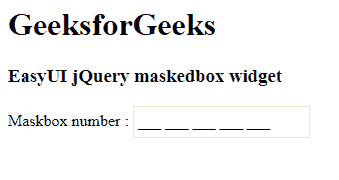

# EasyUI jQuery 掩蔽箱构件

> 哎哎哎:# t0]https://www . geeksforgeeks . org/easy ui-jquery-masked box 小部件/

EasyUI 是一个 HTML5 框架，用于使用基于 jQuery、React、Angular 和 Vue 技术的用户界面组件。它有助于构建交互式 web 和移动应用程序的功能，为开发人员节省了大量时间。

在本文中，我们将学习如何使用 jQuery EasyUI 设计一个屏蔽框。屏蔽框在用户键入时强制其结构。

**jQuery 易 UI 下载:**

```
https://www.jeasyui.com/download/index.php
```

**语法:**

```
<input class="easyui-maskedbox">
```

**属性:**

*   **掩码:**表示当前掩码的字符串。
*   **提示字符:**用于提示用户输入的字符。
*   **掩码:**掩码规则定义。

**方法:**

*   **选项:**返回选项对象。
*   **初始化值:**在不触发*变更*事件的情况下初始化值。
*   **设置值:**设置组件值。

**进场:**

*   首先，添加项目所需的 jQuery Easy UI 脚本。

**示例:**

## 超文本标记语言

```
<!doctype html> 
<html> 

<head> 
    <meta charset="UTF-8"> 
    <meta name="viewport" content="initial-scale=1.0, 
        maximum-scale=1.0, user-scalable=no"> 

    <!-- EasyUI specific stylesheets-->
    <link rel="stylesheet" type="text/css"
        href="themes/metro/easyui.css"> 

    <link rel="stylesheet" type="text/css"
        href="themes/mobile.css"> 

    <link rel="stylesheet" type="text/css"
        href="themes/icon.css"> 

    <!--jQuery library -->
    <script type="text/javascript" src="jquery.min.js"> 
    </script> 

    <!--jQuery libraries of EasyUI -->
    <script type="text/javascript"
        src="jquery.easyui.min.js"> 
    </script> 

    <!--jQuery library of EasyUI Mobile -->
    <script type="text/javascript"
        src="jquery.easyui.mobile.js"> 
    </script> 

    <script type="text/javascript"> 
      $(document).ready(function (){ 
          $('#gfg').maskedbox({}); 
      }); 
    </script> 
</head> 

<body>

    <h1>GeeksforGeeks</h1>
    <h3>EasyUI jQuery maskedbox widget</h3>

  Maskbox number : <input id="gfg" class="easyui-maskedbox" mask="999 999 999 999 999">
</select>
</body>
</html>
```

**输出:**



屏蔽框小部件

**参考:**T2】http://www.jeasyui.com/documentation/