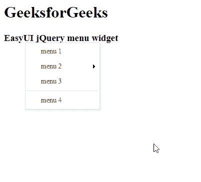

# easy ui jquery 菜单小部件

> 哎哎哎:# t0]https://www . geeksforgeeks . org/easy ui-jquery 菜单小部件/

EasyUI 是一个 HTML5 框架，用于使用基于 jQuery、React、Angular 和 Vue 技术的用户界面组件。它有助于构建交互式 web 和移动应用程序的功能，为开发人员节省了大量时间。

在本文中，我们将学习如何使用 jQuery EasyUI 设计菜单。菜单通常用于上下文菜单。它是构建另一个菜单组件(如菜单按钮和拆分按钮)的基础组件。它还可以用于导航和执行命令。

**jQuery 易 UI 下载:**

```html
https://www.jeasyui.com/download/index.php
```

**语法:**

```html
<div class="menu">
</div>
```

**属性:**

*   **zIndex:** 菜单 z-index 样式，从它开始增加。
*   **左侧:**菜单左侧位置。
*   **顶部:**菜单顶部位置。
*   **对齐:**菜单对齐。
*   **最小宽度:**菜单的最小宽度。
*   **项目高度:**菜单项高度。
*   **持续时间:**它以毫秒为单位定义持续时间。
*   **隐藏菜单:**设置为*真*时，鼠标退出菜单时自动隐藏菜单。
*   **内联:**如果设置为真，它将停留在其父元素中，当设置为*假*时，它将位于所有元素的顶部。
*   **fit:** 如果设置为 *true，*设置菜单大小。

**事件:**

*   **显示菜单后显示:**启动。
*   **在侧面:**菜单隐藏后触发。
*   **点击:**点击菜单项时触发。

**方法:**

*   **选项:**返回选项对象。
*   **显示:**在指定位置显示菜单。
*   **隐藏:**隐藏菜单。
*   **销毁:**销毁菜单
*   **getItem:** 获取菜单项属性，其中包括一个指示该项 DOM 元素的“目标”属性。
*   **设置文本:**设置指定的菜单项文本。
*   **设置图标:**设置指定的菜单项图标。
*   **查找项目:**查找指定的菜单项。
*   **追加项目:**追加新的菜单项。
*   **移除项目:**移除指定的菜单项。
*   **启用项目:**启用菜单项。
*   **禁用菜单项:**禁用菜单项。
*   **显示项目:**显示菜单项。
*   **隐藏菜单项:**隐藏菜单项。
*   **调整大小:**调整特殊菜单的大小。

**CDN 链接:**首先，添加项目所需的 jQuery Easy UI 脚本。

> <！–易 UI 的 jQuery 库–>
> <脚本类型=【text/JavaScript】src =【jQuery . easui . min . js】></脚本>
> <！–易 UI Mobile 的 jQuery 库–>
> <脚本类型=“text/JavaScript”src =“jQuery . easui . Mobile . js”></脚本>

**示例:**

## 超文本标记语言

```html
<!doctype html> 
    <html> 

    <head> 
        <meta charset="UTF-8"> 
        <meta name="viewport" content="initial-scale=1.0, 
            maximum-scale=1.0, user-scalable=no"> 

        <!-- EasyUI specific stylesheets-->
        <link rel="stylesheet" type="text/css"
            href="themes/metro/easyui.css"> 

        <link rel="stylesheet" type="text/css"
            href="themes/mobile.css"> 

        <link rel="stylesheet" type="text/css"
            href="themes/icon.css"> 

        <!--jQuery library -->
        <script type="text/javascript" src="jquery.min.js"> 
        </script> 

        <!--jQuery libraries of EasyUI -->
        <script type="text/javascript"
            src="jquery.easyui.min.js"> 
        </script> 

        <!--jQuery library of EasyUI Mobile -->
        <script type="text/javascript"
            src="jquery.easyui.mobile.js"> 
        </script> 

    <script type="text/javascript"> 
      $(document).ready(function (){ 
          $('#gfg').menu('show',{
              left: 50,
               top: 100
          }); 
      }); 
        </script> 
    </head> 

    <body>

        <h1>GeeksforGeeks</h1>
        <h3>EasyUI jQuery menu widget</h3>

    <div id="gfg" class="easyui-menu" style="width:120px;">
    <div>menu 1</div>
    <div>
        <span>menu 2</span>
        <div style="width:150px;">
            <div><b>Sub menu 1</b></div>
            <div>Sub menu 2</div>
            <div>Sub menu 3</div>
        </div>
    </div>
    <div>menu 3</div>
    <div class="menu-sep"></div>
    <div>menu 4</div>
    </div>

    </body>
    </html>
```

**输出:**



菜单小部件

**参考:**T2】http://www.jeasyui.com/documentation/