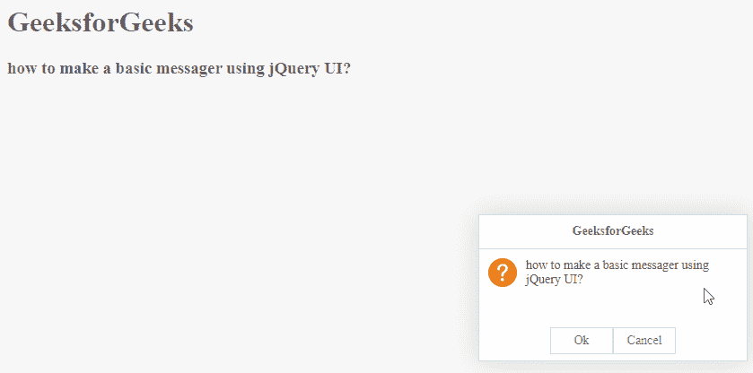

# easy ui jquery 信使小部件

> 哎哎哎:# t0]https://www . geeksforgeeks . org/easy ui-jquery-messenger 小部件/

EasyUI 是一个 HTML5 框架，用于使用基于 jQuery、React、Angular 和 Vue 技术的用户界面组件。它有助于构建交互式 web 和移动应用程序的功能，为开发人员节省了大量时间。

在本文中，我们将学习如何使用 jQuery EasyUI 设计一个 messager。messager widget 提供不同风格的消息框，包括提醒、确认、提示、进度等

**jQuery 易 UI 下载:**

```
https://www.jeasyui.com/download/index.php
```

**语法:**

```
<input class="easyui-messager">
```

**属性:**

*   **确定**:确定按钮文本。
*   **取消**:取消按钮文本。
*   **消息**:对话框显示的消息。
*   **fn** :点击确定或取消按钮时的回拨功能。

#### **方法:**

*   **$.messager.show:** 窗口在屏幕右下方。
*   **$.messager.alert:** 报警窗口
*   **$.messager.confirm:** 带有确定和取消按钮的确认消息窗口
*   **$.messager.prompt:** 窗口，带有“确定”和“取消”按钮，提示用户输入一些文本。
*   **$.messager.progress:** 进度消息窗口

**CDN 链接:**首先，添加项目所需的 jQuery Easy UI 脚本。

> <！–易 UI 的 jQuery 库–>
> <脚本类型=“text/JavaScript”src =“jQuery . easui . min . js”>
> </脚本> <！–易 UI Mobile 的 jQuery 库–>
> <脚本类型=“text/JavaScript”src =“jQuery . easui . Mobile . js”>
> </脚本>

**示例:**

## 超文本标记语言

```
<!doctype html> 
<html> 

<head> 
    <meta charset="UTF-8"> 
    <meta name="viewport" 
          content="initial-scale=1.0, maximum-scale=1.0, 
                   user-scalable=no"> 

    <!-- EasyUI specific stylesheets-->
    <link rel="stylesheet" type="text/css"
          href="themes/metro/easyui.css"> 

    <link rel="stylesheet" type="text/css"
          href="themes/mobile.css"> 

    <link rel="stylesheet" type="text/css"
          href="themes/icon.css"> 

    <!--jQuery library -->
    <script type="text/javascript" src="jquery.min.js"> 
    </script> 

    <!--jQuery libraries of EasyUI -->
    <script type="text/javascript"
            src="jquery.easyui.min.js"> 
    </script> 

    <!--jQuery library of EasyUI Mobile -->
    <script type="text/javascript"
            src="jquery.easyui.mobile.js"> 
    </script> 

    <h1>GeeksforGeeks</h1>
    <h3>how to make a basic messager using jQuery UI?</h3>

    <script type="text/javascript">
        $.messager.confirm('GeeksforGeeks',
                           'how to make a basic messager using jQuery UI?')
</script>
</head> 
</html>
```

**输出:**



**参考:**T2】http://www.jeasyui.com/documentation/