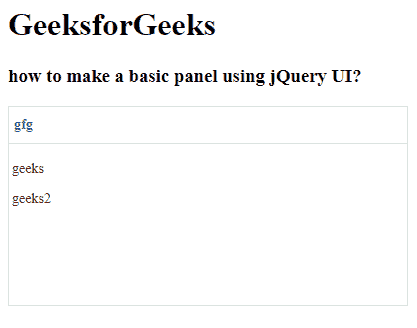

# easy ui jquery panel widget

> 哎哎哎:# t0]https://www . geeksforgeeks . org/easy ui-jquery-panel widget/

EasyUI 是一个 HTML5 框架，用于使用基于 jQuery、React、Angular 和 Vue 技术的用户界面组件。它有助于构建交互式 web 和移动应用程序的功能，为开发人员节省了大量时间。

在本文中，我们将学习如何使用 jQuery 易用户界面设计面板。面板用作其他内容物的容器。它是构建布局、选项卡、折叠等其他组件的基础组件。

**jQuery 易 UI 下载:**

```html
https://www.jeasyui.com/download/index.php
```

**语法:**

```html
<div class="panel">
</div>
```

**属性:**

*   **id:** 该面板的 id 属性。
*   **标题:**要在面板标题中显示的标题文本。
*   **图标颜色:**一个 CSS 类，在面板中显示一个 16×16 的图标。
*   **宽度:**设置面板宽度。
*   **高度:**设置面板高度。
*   **左侧:**设置面板左侧位置。
*   **顶部:**设置面板顶部位置。
*   **cls:** 它给面板增加了一个 CSS 类。
*   **header rcls:**它在面板标题中添加了一个 CSS 类。
*   **bodyCls:** 它给面板主体增加了一个 CSS 类。
*   **样式:**它给面板增加了自定义的规格样式。
*   **适合:**当设置为*真时，面板尺寸适合其父容器。*
*   **边框:**显示面板边框。
*   **剂量设定:**如果设置为*真*，面板将被调整大小。
*   **noheader:** 如果设置为 true，将不会创建面板标题。
*   **内容:**设置面板主体内容。
*   **halign:** 设置面板标题对齐。
*   **标题方向:**设置标题标题方向。
*   **可折叠:**如果设置，显示可折叠按钮。
*   **可最小化:**如果设置，则显示一个可最小化按钮。
*   **可最大化:**如果设置，则显示一个可最大化按钮。
*   **可关闭:**如果设置，则显示可关闭按钮。
*   **表头:**设置面板表头。
*   **页脚:**设置面板页脚。
*   **开放动画:**设置开放动画。
*   **开启时长:**设置开启时长。
*   **关闭动画:**设置关闭动画。
*   **关闭持续时间:**设置关闭持续时间。
*   **折叠:**如果设置，面板在初始化时折叠。
*   **最小化:**如果设置，面板在初始化时最小化。
*   **最大化:**如果设置，面板在初始化时最大化。
*   **关闭:**如果设置，面板在初始化时关闭。
*   **href:** 加载远程数据然后显示在面板中的 URL。
*   **缓存:**设置为真，缓存从 *href* 加载的面板内容。
*   **加载消息:**加载远程数据时，在面板中显示一条消息。
*   **方法:**HTTP 方法加载内容页面。
*   **查询参数:**设置加载内容页面时发送的附加参数。
*   **加载器:**定义如何从远程服务器加载内容页面。

**事件:**

*   **onBeforeLoad:** 加载内容页面前触发，返回 *false* 忽略该动作。
*   **onLoad:** 加载远程数据时触发。
*   **onLoadError:** 在加载内容页面时出现一些错误时触发。
*   **onBeforeOpen:** 在面板打开前会触发。
*   **onOpen:** 面板打开后会开火。
*   **onBeforeClose:** 它在面板关闭前触发
*   **onClose:** 面板关闭后会触发。
*   **on befordestroy:**它在面板被破坏前开火。
*   **onDestroy:** 面板被破坏后会开火。
*   **on beforecollfuse:**它会在面板折叠之前触发。
*   **肿瘤失效:**面板折叠后会触发。
*   **onBeforeExpand:** 它在面板展开前触发。
*   **onExpand:** 面板展开后会开火。
*   **onResize:** 面板调整大小时触发。
*   **onMove:** 面板移动后会触发。
*   **onMaximize:** 它在窗口最大化后触发。
*   **onRestore:** 在窗口恢复到原始大小后触发。
*   **最小化:**它在窗口最小化后触发。

**方法:**

*   **选项:**返回选项属性。
*   **面板:**返回外面板对象。
*   **表头:**返回面板表头对象。
*   **页脚:**返回面板页脚对象。
*   **主体:**返回面板主体对象。
*   **设置:**设置表头的标题文本。
*   **打开:**当打开参数设置为真时
*   **关闭:**当强制关闭参数设置为真时，面板关闭。
*   **销毁:**当 forceDestroy 参数设置为 true 时，面板被销毁。
*   **清除:**清除面板内容。
*   **刷新:**刷新面板加载远程数据。
*   **调整大小:**设置面板大小，做布局。
*   **doLayout:** 设置面板内子组件的大小。
*   **移动:**将面板移动到新位置。
*   **最大化:**将面板放入容器中。
*   **最小化:**最小化面板。
*   **恢复:**将最大化的面板恢复到原来的大小和位置。
*   **折叠:**折叠面板体。
*   **展开:**展开面板体。

**CDN 链接:**首先，添加项目所需的 jQuery Easy UI 脚本。

> <！–易 UI 的 jQuery 库–>
> <脚本类型=【text/JavaScript】src =【jQuery . easui . min . js】></脚本>
> <！–易 UI Mobile 的 jQuery 库–>
> <脚本类型=“text/JavaScript”src =“jQuery . easui . Mobile . js”></脚本>

**示例:**

## 超文本标记语言

```html
<!doctype html> 
<html> 

<head> 
    <meta charset="UTF-8"> 
    <meta name="viewport" content="initial-scale=1.0, 
        maximum-scale=1.0, user-scalable=no"> 

    <!-- EasyUI specific stylesheets-->
    <link rel="stylesheet" type="text/css"
        href="themes/metro/easyui.css"> 

    <link rel="stylesheet" type="text/css"
        href="themes/mobile.css"> 

    <link rel="stylesheet" type="text/css"
        href="themes/icon.css"> 

    <!--jQuery library -->
    <script type="text/javascript" src="jquery.min.js"> 
    </script> 

    <!--jQuery libraries of EasyUI -->
    <script type="text/javascript"
        src="jquery.easyui.min.js"> 
    </script> 

    <!--jQuery library of EasyUI Mobile -->
    <script type="text/javascript"
        src="jquery.easyui.mobile.js"> 
    </script> 

</head> 

<body>     
    <h1>GeeksforGeeks</h1>
    <h3>how to make a basic panel using jQuery UI?</h3>
    <div id="p" class="easyui-panel" title="gfg" 
         style="width:400px;height:200px;padding:3px">
    <p>geeks</p>
    <p>geeks2</p>

</div>

</body>
</html>
```

**输出:**



基本面板

**参考:**T2】http://www.jeasyui.com/documentation/