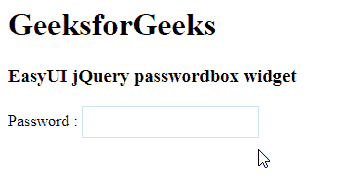

# EasyUI jQuery 密码箱构件

> 哎哎哎::1230【https://www . geeksforgeeks . org/easy ui-jquery-passwordbox 小部件/

EasyUI 是一个 HTML5 框架，用于使用基于 jQuery、React、Angular 和 Vue 技术的用户界面组件。它有助于构建交互式 web 和移动应用程序的功能，为开发人员节省了大量时间。

在本文中，我们将学习如何使用 jQuery EasyUI 设计密码箱。密码框允许用户输入密码。passwordbox 通过显示点而不是密码文本来保护您的密码。当你想检查你的密码时，只需点击眼睛按钮

**jQuery 易 UI 下载:**

```html
https://www.jeasyui.com/download/index.php
```

**语法:**

```html
<input class="easyui-passwordbox">
```

**属性:**

*   **密码字符:**要在文本框中显示的密码字符。
*   **检查间隔:**检查的间隔时间。
*   **lastDelay:** 将最后一个输入字符转换为密码字符的延迟时间。
*   **泄露:**定义是否泄露隐藏密码。
*   **显示眼睛:**定义是否显示眼睛图标。

**方法:**

*   **选项:**返回选项对象。
*   **显示密码:**显示真实密码。
*   **隐藏密码:**隐藏真实密码。

**CDN 链接:**首先，添加你的项目所需的 jQuery Easy UI 脚本，链接是本地路径。

**示例:**

## 超文本标记语言

```html
<!doctype html> 
<html> 

<head> 
    <meta charset="UTF-8"> 
    <meta name="viewport" content="initial-scale=1.0, 
        maximum-scale=1.0, user-scalable=no"> 

    <!-- EasyUI specific stylesheets-->
    <link rel="stylesheet" type="text/css"
        href="themes/metro/easyui.css"> 

    <link rel="stylesheet" type="text/css"
        href="themes/mobile.css"> 

    <link rel="stylesheet" type="text/css"
        href="themes/icon.css"> 

    <!--jQuery library -->
    <script type="text/javascript" src="jquery.min.js"> 
    </script> 

    <!--jQuery libraries of EasyUI -->
    <script type="text/javascript"
        src="jquery.easyui.min.js"> 
    </script> 

    <!--jQuery library of EasyUI Mobile -->
    <script type="text/javascript"
        src="jquery.easyui.mobile.js"> 
    </script> 
    <script type="text/javascript"> 
      $(document).ready(function (){ 
        $('#gfg').passwordbox({
          showEye: false
        }); 
      }); 
    </script> 
</head> 

<body>

    <h1>GeeksforGeeks</h1>
    <h3>EasyUI jQuery passwordbox widget</h3>
    <p>Password : 
         <input id="gfg" class="easyui-passwordbox">
    </p>

</body>
</html>
```

**输出:**



**参考:**T2】http://www.jeasyui.com/documentation/