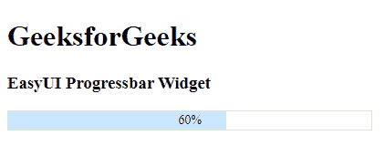

# easy ui jquery progress bar widget

> 哎哎哎:# t0]https://www . geeksforgeeks . org/easy ui-jquery progress bar 小部件/

在本文中，我们将学习如何使用 jQuery Easy UI 进度条设计进度条小部件。该组件可以通过 HTML 标记或编程方式创建。易 UI 是一个 HTML5 框架，用于使用基于 [jQuery](https://www.geeksforgeeks.org/jquery-tutorials/) 、 [React](https://www.geeksforgeeks.org/reactjs/) 、 [Angular](https://www.geeksforgeeks.org/angularjs-tutorials/) 和 [Vue](https://www.geeksforgeeks.org/vue-js-introduction-installation/) 技术的用户界面组件。它有助于构建交互式 web 和移动应用程序的功能，为开发人员节省了大量时间。

**jQuery 易 UI 下载:**

```
https://www.jeasyui.com/download/index.php
```

**语法:**

```
var a = $(".selector").progressbar({

});
```

**属性:**

*   **高度**:构件的高度
*   **宽度**:构件的宽度
*   **值**:百分比值
*   **文本:**要显示的文本模板。

**方法:**

*   **调整大小**:调整进度条的大小。
*   **getValue:** 返回当前搜索类型名称。
*   **设置值:**设置当前搜索类型名称。
*   **选项**:返回选项对象

**事件:**

*   **onChange:** 值改变时触发

**CDN 链接:**

*   首先，添加项目所需的 jQuery Easy UI 脚本。

**示例:**

## 超文本标记语言

```
<!doctype html> 
<html> 

<head> 
    <meta charset="UTF-8"> 
    <meta name="viewport" content="initial-scale=1.0, 
          maximum-scale=1.0, user-scalable=no"> 

    <!-- EasyUI specific stylesheets-->
    <link rel="stylesheet" type="text/css"
          href="themes/metro/easyui.css"> 

    <link rel="stylesheet" type="text/css"
          href="themes/mobile.css"> 

    <link rel="stylesheet" type="text/css"
          href="themes/icon.css"> 

    <!--jQuery library -->
    <script type="text/javascript" src="jquery.min.js"> 
    </script> 

    <!--jQuery libraries of EasyUI -->
    <script type="text/javascript"
            src="jquery.easyui.min.js"> 
    </script> 

    <!--jQuery library of EasyUI Mobile -->
    <script type="text/javascript"
            src="jquery.easyui.mobile.js"> 
    </script> 
</head> 

<body>     
    <h1>GeeksforGeeks</h1>
    <h3>EasyUI Progressbar Widget</h3>
    <div id="p" class="easyui-progressbar" 
                data-options="value:60" 
                style="width:400px;">
    </div>
</body>
</html>
```

**输出:**



**参考:**T2】http://www.jeasyui.com/documentation/