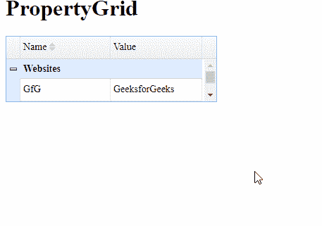

# easy ui jquery property grid widget

> 哎哎哎:# t0]https://www . geeksforgeeks . org/easy ui-jquery-property grid widget/

EasyUI 是一个 HTML5 框架，用于使用基于 jQuery、React、Angular 和 Vue 技术的用户界面组件。它有助于构建交互式 web 和移动应用程序的功能，为开发人员节省了大量时间。

在本文中，我们将学习如何使用 jQuery 易 UI 设计一个 propertygrid 。 propertygrid 为用户提供了浏览和编辑对象属性的界面。

**jQuery 易 UI 下载:**

```html
https://www.jeasyui.com/download/index.php
```

**语法:**

```html
<input class="easyui-propertgrid">
```

**属性:**

*   **显示组:**定义是否显示属性组。
*   **组字段:**定义组字段名称。
*   **组格式化程序:**定义如何格式化组值。

**方法:**

*   **组:**返回所有组
*   **展开组:**展开指定的组。
*   **折叠组:**折叠指定的组。

**进场:**

*   首先，添加项目所需的 jQuery Easy UI 脚本。

> < link rel= "样式表" type="text/css "
> 
> href = " https://www . jeas yui . com/easy ui/themes/default/easy ui . CSS " >
> 
> < link rel= "样式表" type="text/css "
> 
> href = " https://www . jeasyui . com/easyui/themes/icon . CSS " >
> 
> < script type="text/javascript "
> 
> src = " https://www . jeas yui . com/easy ui/jquery . min . js >
> 
> < script type="text/javascript "
> 
> src = " https://www . jeas yui . com/easy ui/jquery . easy ui . min . js >

**示例:**

## 超文本标记语言

```html
<html>
<head>    
    <link rel="stylesheet" type="text/css" 
        href="https://www.jeasyui.com/easyui/themes/default/easyui.css">

    <link rel="stylesheet" type="text/css" 
        href="https://www.jeasyui.com/easyui/themes/icon.css">

    <script type="text/javascript" 
        src="https://www.jeasyui.com/easyui/jquery.min.js"></script>

    <script type="text/javascript" 
        src="https://www.jeasyui.com/easyui/jquery.easyui.min.js"></script>
</head>

<body>
    <h1>PropertyGrid</h1>
    <table id="gfg" style="width:300px"></table>

    <script type="text/javascript">
        $('#gfg').propertygrid({
            showGroup: true,
            scrollbarSize: 20
        });
        var row = {
          name:'GfG',
          value:'GeeksforGeeks',
          group:'Websites',
          editor:'text'
        };
        $('#gfg').propertygrid('appendRow',row);
        var row = {
          name:'GfG',
          value:'Self Placed',
          group:'Courses',
          editor:'text'
        };
        $('#gfg').propertygrid('appendRow',row);
    </script>
</body>

</html>
```

**输出:**



**参考:**T2】http://www.jeasyui.com/documentation/