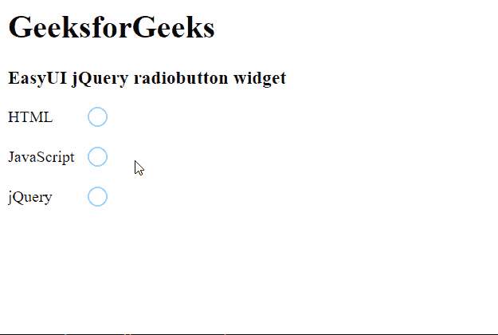

# easy ui jquery radio button widget

> 哎哎哎:# t0]https://www . geeksforgeeks . org/easy ui-jquery-radio button widget/

EasyUI 是一个 HTML5 框架，用于使用基于 jQuery、React、Angular 和 Vue 技术的用户界面组件。它有助于构建交互式 web 和移动应用程序的功能，为开发人员节省了大量时间。

在本文中，我们将学习如何使用 jQuery EasyUI 设计一个 Radiobutton。单选按钮小部件用于制作单选按钮，该按钮可用于选择所需的选项。一个组中只能选择一个选项。

**jQuery 易 UI 下载:**

```html
https://www.jeasyui.com/download/index.php
```

**语法:**

```html
<input class="easyui-radiobutton">
```

**属性:**

*   **宽度:**是要制作的 Radiobutton 组件的宽度。
*   **高度:**是要制作的 Radiobutton 组件的高度。
*   **值:**是绑定到要制作的单选按钮的默认值。
*   **选中:**定义是否选中单选按钮。
*   **禁用:**定义是否要禁用单选按钮。
*   **标签:**是绑定到要制作的 Radiobutton 上的标签。
*   **标签宽度:**是标签宽度。
*   **标签位置:**是标签位置。可能的值是“之前”、“之后”和“顶部”。
*   **标签对齐:**是标签对齐。可能的值是“左”和“右”。

**事件:**

*   **onChange:** 当值改变时，它会触发。

**方法:**

*   **选项:**返回选项对象。
*   **设置值:**设置单选按钮的值。
*   **禁用:**禁用组件。
*   **使能:**使能组件。
*   **检查:**检查部件。
*   **取消勾选:**取消勾选组件。
*   **清除:**清除“已检查”值。
*   **重置:**重置“已检查”值。

**CDN 链接:**首先，添加项目所需的 jQuery Easy UI 脚本。

> <！–易 UI 的 jQuery 库–>
> <脚本类型=【text/JavaScript】src =【jQuery . easui . min . js】></脚本>
> <！–易 UI Mobile 的 jQuery 库–>
> <脚本类型=“text/JavaScript”src =“jQuery . easui . Mobile . js”></脚本>

**示例:**

## 超文本标记语言

```html
<html>
<head>

  <!-- EasyUI specific stylesheets-->
  <link rel="stylesheet" 
        type="text/css" 
        href="themes/metro/easyui.css">

  <link rel="stylesheet"
        type="text/css"
        href="themes/mobile.css">

  <link rel="stylesheet"
        type="text/css"
        href="themes/icon.css">

  <!--jQuery library -->
  <script type="text/javascript"
          src="jquery.min.js">
  </script>

  <!--jQuery libraries of EasyUI -->
  <script type="text/javascript"
          src="jquery.easyui.min.js">
  </script>

  <!--jQuery library of EasyUI Mobile -->
  <script type="text/javascript"
          src="jquery.easyui.mobile.js">
  </script>
</head>
<body>
  <h1>GeeksforGeeks</h1>
  <h3>EasyUI jQuery radiobutton widget</h3>

  <form id="gfg">
    <div style="margin-bottom:20px">
      <input class="easyui-radiobutton" 
             name="language" 
             value="HTML" 
             label="HTML">
    </div>
    <div style="margin-bottom:20px">
      <input class="easyui-radiobutton" 
             name="language"
             value="JavaScript"
             label="JavaScript">
    </div>
    <div style="margin-bottom:20px">
      <input class="easyui-radiobutton" 
             name="language"
             value="jQuery"
             label="jQuery">
    </div>
  </form>
</body>
</html>
```

**输出:**



**参考:**T2】https://www.jeasyui.com/documentation/radiobutton.php