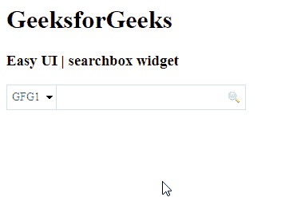

# easy ui jquery 搜索框小部件

> 哎哎哎:# t0]https://www . geeksforgeeks . org/easy ui-jquery-searchbox 小部件/

在本文中，我们将学习如何使用 jQuery EasyUI 搜索框小部件设计一个搜索框小部件，该部件允许用户通过搜索值来搜索数据。Easy UI 是一个 HTML5 框架，用于使用基于 jQuery、React、Angular 和 Vue 技术的用户界面组件。它有助于构建交互式 web 和移动应用程序的功能，为开发人员节省了大量时间。

**下载 jQuery 的 EasyUI:**

```html
https://www.jeasyui.com/download/index.php
```

**语法:**

```html
var a = $(".selector").searchbox ({

});
```

**属性:**

*   **高度**:构件的高度。
*   **宽度**:构件的宽度。
*   **提示**:输入框中显示的提示信息。
*   **值**:需要输入的值
*   **菜单**:搜索类型菜单。
*   **搜索器**:当用户按下搜索按钮或按下回车键时，将调用搜索器功能。
*   **禁用**:该属性用于禁用组件。

**方法:**

*   **复位**:复位数值。
*   **清零**:清零值。
*   **启用**:启用搜索框
*   **破坏**:破坏搜索框。
*   **禁用**:禁用搜索框。
*   **调整大小**:调整搜索框的大小
*   **选择名称:**选择当前搜索类型名称。
*   **getValue:** 它返回当前搜索类型名称
*   **设置值:**设置当前搜索类型名称
*   ****文本框:**返回文本框对象。**
*   ****菜单:**它返回搜索类型菜单对象。**
*   ****选项**:返回选项对象。**

****CDN 链接:**首先，添加项目所需的 jQuery Easy UI 脚本。**

> **<！–易 UI 的 jQuery 库–>
> <脚本类型=【text/JavaScript】src =【jQuery . easui . min . js】></脚本>
> <！–易 UI Mobile 的 jQuery 库–>
> <脚本类型=“text/JavaScript”src =“jQuery . easui . Mobile . js”></脚本>**

****示例:****

## **超文本标记语言**

```html
<!doctype html> 
<html> 

<head> 
    <meta charset="UTF-8"> 
    <meta name="viewport" 
          content="initial-scale=1.0, maximum-scale=1.0, 
                   user-scalable=no"> 

    <!-- EasyUI specific stylesheets-->
    <link rel="stylesheet" type="text/css"
          href="themes/metro/easyui.css"> 

    <link rel="stylesheet" type="text/css"
          href="themes/mobile.css"> 

    <link rel="stylesheet" type="text/css"
          href="themes/icon.css"> 

    <!--jQuery library -->
    <script type="text/javascript" 
            src="jquery.min.js"> 
    </script> 

    <!--jQuery libraries of EasyUI -->
    <script type="text/javascript"
        src="jquery.easyui.min.js"> 
    </script> 

    <!--jQuery library of EasyUI Mobile -->
    <script type="text/javascript"
        src="jquery.easyui.mobile.js"> 
    </script> 
</head> 

<body> 
    <h1>GeeksforGeeks</h1>
    <h3>Easy UI | searchbox widget</h3>
    <input id="ss" class="easyui-searchbox" 
           style="width:300px" data-options="menu:'#men'">
    <div id="men" style="width:120px">
       <div>GFG1</div>
       <div>GFG2</div>
    </div>
</body>
</html>
```

****输出:****

****

****参考:**T2】http://www.jeasyui.com/documentation/**