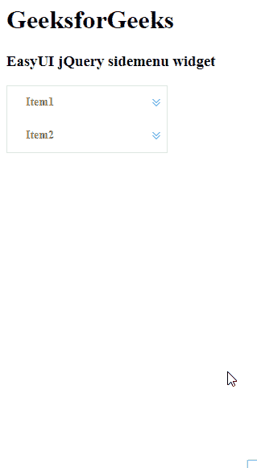

# easy ui jquery side menu widget

> 哎哎哎:# t0]https://www . geeksforgeeks . org/easy ui-jquery-side menu widget/

EasyUI 是一个 HTML5 框架，用于使用基于 jQuery、React、Angular 和 Vue 技术的用户界面组件。它有助于构建交互式 web 和移动应用程序的功能，为开发人员节省了大量时间。

在本文中，我们将学习如何使用 jQuery EasyUI 设计侧菜单。侧菜单用于上下文垂直菜单。它是构建另一个菜单组件的基础组件。它还可以用于导航和执行命令。

**jQuery 易 UI 下载:**

```html
https://www.jeasyui.com/download/index.php
```

**语法:**

```html
<div class="sidemenu">
</div>
```

**属性:**

*   **宽度:**侧菜单组件的宽度。
*   **高度:**侧菜单组件的高度。
*   **边框:**定义显示边框。
*   **动画:**定义在展开或折叠菜单时是否显示动画效果。
*   **倍数:**设置*为真*可以一次展开多个面板。
*   **数据:**要显示的菜单数据。
*   **浮动菜单宽度:**浮动菜单宽度。
*   **浮动菜单位置:**浮动菜单位置。

**事件:**

*   **开启选择菜单时，选择:**启动。

**方法:**

*   **选项**:返回侧菜单的选项。
*   **调整**大小:调整侧菜单的大小。
*   **折叠**:折叠侧菜单。
*   **展开**:展开侧菜单。
*   **破坏**:破坏侧菜单。

**CDN 链接:**首先，添加项目所需的 jQuery Easy UI 脚本。

> <！–易 UI 的 jQuery 库–>
> <脚本类型=【text/JavaScript】src =【jQuery . easui . min . js】></脚本>
> <！–易 UI Mobile 的 jQuery 库–>
> <脚本类型=“text/JavaScript”src =“jQuery . easui . Mobile . js”></脚本>

**示例:**

## 超文本标记语言

```html
<!doctype html> 
<html> 
    <head> 
        <meta charset="UTF-8"> 
        <meta name="viewport" content="initial-scale=1.0, 
            maximum-scale=1.0, user-scalable=no"> 

        <!-- EasyUI specific stylesheets-->
        <link rel="stylesheet" type="text/css"
            href="themes/metro/easyui.css"> 

        <link rel="stylesheet" type="text/css"
            href="themes/mobile.css"> 

        <link rel="stylesheet" type="text/css"
            href="themes/icon.css"> 

        <!--jQuery library -->
        <script type="text/javascript" src="jquery.min.js"> 
        </script> 

        <!--jQuery libraries of EasyUI -->
        <script type="text/javascript"
            src="jquery.easyui.min.js"> 
        </script> 

        <!--jQuery library of EasyUI Mobile -->
        <script type="text/javascript"
            src="jquery.easyui.mobile.js"> 
        </script> 

    <script type="text/javascript"> 
      $(document).ready(function (){ 
          $('#gfg').sidemenu({
              text: "GeeksforGeeks"
          }); 
      }); 
        </script> 
    </head> 

    <body>

        <h1>GeeksforGeeks</h1>
        <h3>EasyUI jQuery sidemenu widget</h3>
        <div id="gfg" class="easyui-sidemenu" 
             data-options="data:data">
        </div>
        <script type="text/javascript">
        var data = [{
            text: 'Item1',
            children: [{
                text: 'Geeks1'
            },{
                text: 'Geeks2'
            },{
                text: 'Geeks3',
                children: [{
                    text: 'For3.1'
                },{
                    text: 'For3.2'
                }]
            }]
        },{
            text: 'Item2',
            children: [{
                text: 'Geeks4'
            },{
                text: 'Geeks5'
            },{
                text: 'Geeks6'
            }]
        }];
        </script>

    </body>
</html>
```

**输出:**



**参考:**T2】http://www.jeasyui.com/documentation/