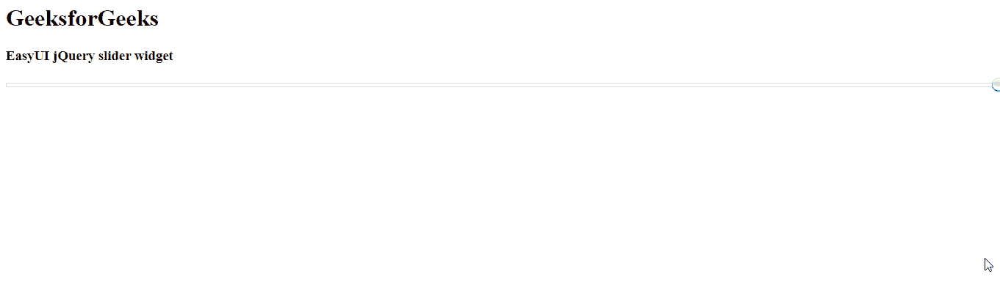
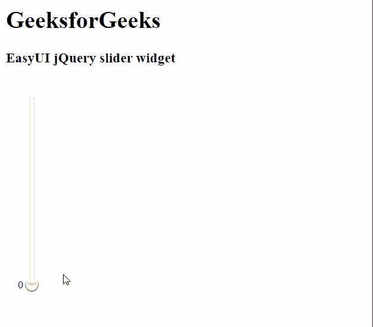

# easy ui jquery slider widget

> 哎哎哎:# t0]https://www . geeksforgeeks . org/easy ui-jquery slider 小部件/

EasyUI 是一个 HTML5 框架，用于使用基于 jQuery、React、Angular 和 Vue 技术的用户界面组件。它有助于构建交互式 web 和移动应用程序的功能，为开发人员节省了大量时间。

在本文中，我们将学习如何使用 jQuery EasyUI 设计滑块。滑块部件使用户能够从有限范围中选择数值。滑块的类型和范围可以在滑块的选项中自定义。

**jQuery 易 UI 下载:**

```
https://www.jeasyui.com/download/index.php
```

**语法:**

```
<input class="easyui-slider">
```

**属性:**

*   **宽度:**是滑块的宽度。
*   **高度:**是滑块的高度。
*   **模式:**表示什么类型的滑块。
*   **反转:**当该属性设置为真时，最小值和最大值将反转。
*   **显示提示:**定义是否显示提示信息。
*   **禁用:**定义是否禁用滑块。
*   **范围:**定义是否显示范围滑块。
*   **值:**定义默认值。
*   **min:** 定义最小允许值。
*   **max:** 定义最大允许值。
*   **步:**定义滑块增减的数值。
*   **规则:**定义滑块旁边的标签。
*   **tipFormatter:** 这是一个格式化滑块值的函数。
*   **转换器:**是转换器功能，允许用户确定如何将值转换到滑块位置。

**事件:**

*   **onChange:** 当字段值改变时触发。
*   **onSlideStart:** 滑块开始拖动时触发。
*   **onSlideEnd:** 滑块结束拖动时触发。
*   **完成:**当用户改变滑块值时触发。

**方法:**

*   **选项:**返回滑块选项。
*   **破坏:**破坏滑块对象。
*   **调整大小:**设置滑块大小。
*   **getValue:** 获取滑块值。
*   **获取值:**获取滑块值数组。
*   **设置值:**设置滑块值。
*   **设置值:**它以数组的形式设置滑块值。
*   **清除:**清除滑块值。
*   **重置:**重置滑块值。
*   **启用:**启用滑块组件。
*   **禁用:**禁用滑块组件。

**CDN 链接:**首先，添加项目所需的 jQuery Easy UI 脚本。

> <！–易 UI 的 jQuery 库–>
> <脚本类型=【text/JavaScript】src =【jQuery . easui . min . js】></脚本>
> <！–易 UI Mobile 的 jQuery 库–>
> <脚本类型=“text/JavaScript”src =“jQuery . easui . Mobile . js”></脚本>

**例 1:**

## 超文本标记语言

```
<html>
<head>

  <!-- EasyUI specific stylesheets-->
  <link rel="stylesheet" 
        type="text/css"
        href="themes/metro/easyui.css">

  <link rel="stylesheet" 
        type="text/css"
        href="themes/mobile.css">

  <link rel="stylesheet" 
        type="text/css" 
        href="themes/icon.css">

  <!-- jQuery library -->
  <script type="text/javascript" 
          src="jquery.min.js">
  </script>

  <!-- jQuery libraries of EasyUI -->
  <script type="text/javascript"
          src="jquery.easyui.min.js">
  </script>

  <!-- jQuery library of EasyUI Mobile -->
  <script type="text/javascript" 
          src="jquery.easyui.mobile.js">
  </script>

</head>
<body>
  <h1>GeeksforGeeks</h1>
  <h3>EasyUI jQuery slider widget</h3>

  <!-- Define the EasyUI slider with markup -->
  <input id="gfg" class="easyui-slider">
</body>
</html>
```

**输出:**



**例 2:**

## 超文本标记语言

```
<html>
<head>
  <!-- EasyUI specific stylesheets-->
  <link rel="stylesheet" 
        type="text/css" 
        href="themes/metro/easyui.css">

  <link rel="stylesheet" 
        type="text/css"
        href="themes/mobile.css">

  <link rel="stylesheet" 
        type="text/css"
        href="themes/icon.css">

  <!--jQuery library -->
  <script type="text/javascript"
          src="jquery.min.js">
  </script>

  <!--jQuery libraries of EasyUI -->
  <script type="text/javascript"
          src="jquery.easyui.min.js">
  </script>

  <!--jQuery library of EasyUI Mobile -->
  <script type="text/javascript" 
          src="jquery.easyui.mobile.js">
  </script>
</head>
<body>

  <h1>GeeksforGeeks</h1>
  <h3>EasyUI jQuery slider widget</h3>

  <div style="padding: 25px">

    <!-- Define the element that will
    created as the slider -->
    <input id='gfg'>
  </div>

  <script type="text/javascript">

    // Initialize the EasyUI slider
    $('#gfg').slider({
      height: "250px",
      mode: 'v',
      min: 0,
      max: 9,
      showTip: true
    });
  </script>
</body>
</html>
```

**输出:**



**参考:**T2】https://www.jeasyui.com/documentation/slider.php