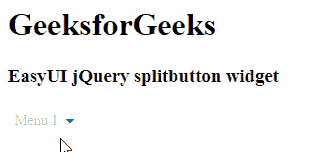

# easy ui jquery 拆分按钮构件

> 哎哎哎:# t0]https://www . geeksforgeeks . org/easy ui-jquery 拆分按钮构件/

EasyUI 是一个 HTML5 框架，用于使用基于 jQuery、React、Angular 和 Vue 技术的用户界面组件。它有助于构建交互式 web 和移动应用程序的功能，为开发人员节省了大量时间。

在本文中，我们将学习如何使用 jQuery EasyUI 设计 splitbutton。Splitbutton 是下拉菜单的一部分。它与链接按钮和菜单相关联。菜单隐藏时显示链接按钮。

**jQuery 易 UI 下载:**

```
https://www.jeasyui.com/download/index.php
```

**语法:**

```
<div class="splitbutton">
</div>
```

**属性:**

*   **持续时间:**悬停在按钮上时显示菜单的持续时间(毫秒)。
*   **菜单:**创建相应菜单的选择器。
*   **素色:**定义效果是一个 bollean 值，默认值为 true 表示素色效果。

**方法:**

*   **选项:**此方法返回选项对象。
*   **禁用:**已用于禁用 splitbutton。
*   **启用:**已用于启用 splitbutton。
*   **销毁:**该方法用于销毁 splitbutton。

**CDN 链接:**首先，添加你的项目所需的 jQuery Easy UI 脚本，链接是本地路径。

**示例:**

## 超文本标记语言

```
<!doctype html>
<html>

<head>
    <meta charset="UTF-8">
    <meta name="viewport" content="initial-scale=1.0,
        maximum-scale=1.0, user-scalable=no">

    <!-- EasyUI specific stylesheets-->
    <link rel="stylesheet" type="text/css"
        href="themes/metro/easyui.css">

    <link rel="stylesheet" type="text/css"
        href="themes/mobile.css">

    <link rel="stylesheet" type="text/css"
        href="themes/icon.css">

    <!--jQuery library -->
    <script type="text/javascript" src="jquery.min.js">
    </script>

    <!--jQuery libraries of EasyUI -->
    <script type="text/javascript"
        src="jquery.easyui.min.js">
    </script>

    <!--jQuery library of EasyUI Mobile -->
    <script type="text/javascript"
        src="jquery.easyui.mobile.js">
    </script>

    <script type="text/javascript">
      $(document).ready(function (){
        $('#gfg').splitbutton({
          disabled: true
        });
      });
    </script>
</head>

<body>

    <h1>GeeksforGeeks</h1>
    <h3>EasyUI jQuery splitbutton widget</h3>
    <a id="gfg" class="easyui-splitbutton">Menu 1</a>

</body>
</html>
```

**输出:**



**参考:**T2】http://www.jeasyui.com/documentation/