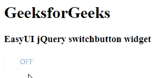

# easy ui jquery switch buttons widget

> 哎哎哎::1230【https://www . geeksforgeeks . org/easy ui-jquery-switch buttons 小部件/

EasyUI 是一个 HTML5 框架，用于使用基于 jQuery、React、Angular 和 Vue 技术的用户界面组件。它有助于构建交互式 web 和移动应用程序的功能，为开发人员节省了大量时间。

在本文中，我们将学习如何使用 jQuery 易用户界面设计 switchbutton。Switchbutton 有两个部分:“开”和“关”。用户可以点击或轻按来切换开关

**jQuery 易 UI 下载:**

```html
https://www.jeasyui.com/download/index.php
```

**语法:**

```html
<div class="switchbutton">
</div>
```

**属性:**

*   **宽度:**开关按钮的宽度
*   **高度:**开关按钮的高度
*   **手柄宽度:**开关按钮中央手柄的宽度
*   **选中:**定义按钮是否被选中
*   **禁用:**定义是否禁用按钮
*   **只读:**定义按钮是否只读
*   **反转:**设置为真，文本值和非文本值将切换它们的位置
*   **上下文:**左侧的文本值。
*   **offText:** 右侧的文本值
*   **手柄文本:**中心手柄的文本值。
*   **值:**绑定到按钮的默认值。

**事件:**

*   **onChange:** 当检查值改变时触发

**方法:**

*   **选项:**返回选项对象
*   **调整大小:**调整开关按钮的大小
*   **禁用:**禁用开关按钮
*   **启用:**启用开关按钮
*   **只读:**启用/禁用只读模式
*   **检查:**检查开关按钮
*   **取消选中:**取消选中开关按钮
*   **清除:**清除开关按钮的“已检查”值
*   **重置:**重置开关按钮的“已检查”值
*   **设置值:**设置开关按钮值

**CDN 链接:**首先，添加项目所需的 jQuery Easy UI 脚本。

**例 1:**

## 超文本标记语言

```html
<!doctype html>
<html>

<head>
    <meta charset="UTF-8">
    <meta name="viewport" content="initial-scale=1.0,
        maximum-scale=1.0, user-scalable=no">

    <!-- EasyUI specific stylesheets-->
    <link rel="stylesheet" type="text/css"
        href="themes/metro/easyui.css">

    <link rel="stylesheet" type="text/css"
        href="themes/mobile.css">

    <link rel="stylesheet" type="text/css"
        href="themes/icon.css">

    <!--jQuery library -->
    <script type="text/javascript" src="jquery.min.js">
    </script>

    <!--jQuery libraries of EasyUI -->
    <script type="text/javascript"
        src="jquery.easyui.min.js">
    </script>

    <!--jQuery library of EasyUI Mobile -->
    <script type="text/javascript"
        src="jquery.easyui.mobile.js">
    </script>

    <script type="text/javascript">
      $(document).ready(function (){
        $('#gfg').switchbutton({
          disabled: true
        });
      });
    </script>
</head>

<body>

    <h1>GeeksforGeeks</h1>
    <h3>EasyUI jQuery switchbutton widget</h3>
    <input id="gfg" class="easyui-switchbutton">

</body>
</html>
```

**输出:**



**参考:**T2】http://www.jeasyui.com/documentation/