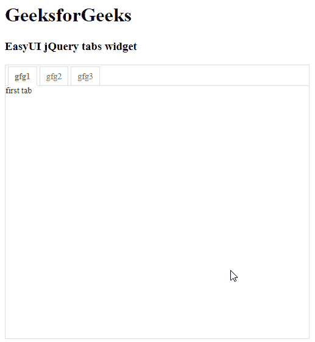

# easy ui jquery tab widget

> 哎哎哎:# t0]https://www . geeksforgeeks . org/easy ui-jquery tab 小部件/

EasyUI 是一个 HTML5 框架，用于使用基于 jQuery、React、Angular 和 Vue 技术的用户界面组件。它有助于构建交互式 web 和移动应用程序的功能，为开发人员节省了大量时间。

在本文中，我们将学习如何使用 jQuery EasyUI 设计选项卡。显示面板集合的选项卡。它一次只显示一个选项卡面板。每个选项卡面板都有标题和一些迷你按钮工具，包括关闭按钮和其他自定义按钮。

**jQuery 易 UI 下载:**

```html
https://www.jeasyui.com/download/index.php
```

**语法:**

```html
<div class="tabs"> </div>
```

**属性:**

*   **宽度**:用于设置拉环容器的宽度。
*   **高度**:用于设置拉环容器的高度。
*   **普通**:真，渲染不带背景容器图像的标签条。
*   **适合** : True 设置制表符容器的大小以适合其父容器。
*   **边框** : True 显示标签容器边框。
*   **滚动设置:**用于设置每次按下 tab 滚动按钮时滚动的像素数。
*   **滚动持续时间:**用于设置每个滚动动画应该持续的毫秒数。
*   **工具:**用于设置放置在表头左侧或右侧的工具栏。
*   **工具栏位置:**用于设置工具栏位置。
*   **tabPosition:** 用于设置 tab 位置。
*   **表头宽度:**用于设置标签表头宽度。
*   **tabWidth:** 用于设置 tab 条的宽度。
*   **tabHeight:** 用于设置 tab 条的高度。
*   **选中:**用于设置已初始化的选中标签索引。
*   **显示标题:**为真显示标签标题。
*   **对齐:**为真，使标签条与其父容器的宽度相等。
*   **缩小:**为真，删除标签条之间的空间。
*   **药丸:**真使拉环条看起来像药丸。

**事件:**

*   **在线加载:**当 Ajax 选项卡面板完成远程数据加载时触发。
*   **开启选择:**当用户选择选项卡面板时触发。
*   **未选择:**当用户取消选择选项卡面板时触发。
*   **开启关闭:**在选项卡面板关闭前触发
*   **onClose:** 当用户关闭选项卡面板时触发。
*   **onAdd:** 添加新选项卡面板时触发。
*   **更新选项卡面板时触发更新状态:**。
*   **右键单击选项卡面板时，打开上下文菜单:**。

**方法:**

*   **选项:**用于返回选项卡选项。
*   **选项卡:**用于返回所有选项卡面板。
*   **调整大小:**用于调整标签容器的大小，进行布局。
*   **添加:**用于添加新的页签面板。
*   **关闭:**用于关闭选项卡面板。
*   **获取标签:**用于获取指定的标签面板。
*   **getTabIndex:** 用于获取指定的选项卡面板索引
*   **获取选定:**用于获取选定的选项卡面板。
*   **选择:**用于选择选项卡面板。
*   **取消选择:**用于选择选项卡面板。
*   **显示表头:**用于显示页签表头。
*   **隐藏表头:**用于隐藏制表符表头。
*   **显示工具:**用于显示选项卡工具。
*   **隐藏工具:**用于隐藏选项卡工具。
*   **存在:**表示特殊面板是否存在
*   **更新:**用于更新指定的选项卡面板。
*   **启用选项卡:**用于启用指定选项卡面板。
*   **禁用选项卡:**用于禁用指定选项卡面板。
*   **滚动比:**用于将标签标题滚动指定的像素数。

**进场:**

*   首先，添加项目所需的 jQuery Easy UI 脚本。

**示例:**

## 超文本标记语言

```html
<!doctype html>
<html>

<head>
    <meta charset="UTF-8">
    <meta name="viewport" content="initial-scale=1.0, 
            maximum-scale=1.0, user-scalable=no">

    <!-- EasyUI specific stylesheets-->
    <link rel="stylesheet" type="text/css" 
        href="themes/metro/easyui.css">

    <link rel="stylesheet" type="text/css" 
        href="themes/mobile.css">

    <link rel="stylesheet" type="text/css" 
        href="themes/icon.css">

    <!--jQuery library -->
    <script type="text/javascript" 
        src="jquery.min.js">
    </script>

    <!--jQuery libraries of EasyUI -->
    <script type="text/javascript" 
        src="jquery.easyui.min.js">
    </script>

    <!--jQuery library of EasyUI Mobile -->
    <script type="text/javascript" 
        src="jquery.easyui.mobile.js">
    </script>

    <script type="text/javascript">
        $(document).ready(function () {
            $('#gfg').tabs('show', {
                borders: true
            });
        });
    </script>
</head>

<body>

    <h1>GeeksforGeeks</h1>
    <h3>EasyUI jQuery tabs widget</h3>

    <div id="tabs" class="easyui-tabs" 
        style="width:500px;height:450px;">
        <div title="gfg1">
            first tab
        </div>
        <div title="gfg2">
            second tab
        </div>
        <div title="gfg3">
            third tab
        </div>
    </div>
</body>

</html>
```

**输出:**



**参考:**T2】http://www.jeasyui.com/documentation/