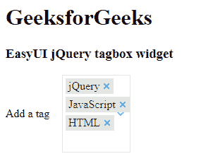

# EasyUI jQuery tagbox Widget

> 哎哎哎::1230【https://www . geeksforgeeks . org/easy ui-jquery-tagbox 小部件/

EasyUI 是一个 HTML5 框架，用于使用基于 jQuery、React、Angular 和 Vue 技术的用户界面组件。它有助于构建交互式 web 和移动应用程序的功能，为开发人员节省了大量时间。

在本文中，我们将学习如何使用 jQuery EasyUI 设计一个标记框。标记框允许用户显示标记标签，而不是在输入框中显示值。

**下载 jQuery 的 EasyUI:**

```
https://www.jeasyui.com/download/index.php
```

**语法:**

```
<input class="easyui-tagbox">
```

**属性:**

*   **有向下箭头:**返回布尔值 true 显示向下箭头按钮，否则返回 false。
*   **标记格式化程序:**返回格式化值的函数。
*   **标签样式器:**标签样式器功能。

**事件:**

*   **onClickTag:** 点击标签时触发。
*   **onBeforeRemoveTag:** 在移除标记之前激发。
*   **移除标签时，会触发 onRemoveTag:** 。

**方法:**首先，添加项目所需的 jQuery Easy UI 脚本。

> <脚本类型= " text/JavaScript " src = " jquery . easy ui . min . js "></脚本>
> 
> <脚本类型= " text/JavaScript " src = " jquery . easy ui . mobile . js "></脚本>

**示例:**

## 超文本标记语言

```
<!doctype html>
<html>

<head>
    <meta charset="UTF-8">
    <meta name="viewport" content=
        "initial-scale=1.0, maximum-scale=1.0, 
        user-scalable=no">

    <!-- EasyUI specific stylesheets-->
    <link rel="stylesheet" type="text/css" 
        href="themes/metro/easyui.css">

    <link rel="stylesheet" type="text/css" 
        href="themes/mobile.css">

    <link rel="stylesheet" type="text/css" 
        href="themes/icon.css">

    <!-- jQuery library -->
    <script type="text/javascript" 
        src="jquery.min.js">
    </script>

    <!-- jQuery libraries of EasyUI -->
    <script type="text/javascript" 
        src="jquery.easyui.min.js">
    </script>

    <!-- jQuery library of EasyUI Mobile -->
    <script type="text/javascript" 
        src="jquery.easyui.mobile.js">
    </script>

    <script type="text/javascript">
        $(document).ready(function() {
            $('#gfg').tagbox({
                hasDownArrow: true
            });
        });
    </script>
</head>

<body>
    <h1>GeeksforGeeks</h1>
    <h3>EasyUI jQuery tagbox widget</h3>

    <input id="gfg" class="easyui-tagbox" 
        value="jQuery,JavaScript,HTML" 
        label="Add a tag">
</body>

</html>
```

**输出:**



**参考:**T2】http://www.jeasyui.com/documentation/