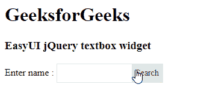

# easy ui jquery textbox widget

> 哎哎哎:# t0]https://www . geeksforgeeks . org/easy ui-jquery-textbox widget/

EasyUI 是一个 HTML5 框架，用于使用基于 jQuery、React、Angular 和 Vue 技术的用户界面组件。它有助于构建交互式 web 和移动应用程序的功能，为开发人员节省了大量时间。

在本文中，我们将学习如何使用 jQuery 易用户界面设计一个文本框。文本框用于以形式输入文本。

**jQuery 易 UI 下载:**

```
https://www.jeasyui.com/download/index.php
```

**语法:**

```
<input class="easyui-textbox">
```

**属性:**

*   **宽度:**组件的宽度。
*   **高度:**构件的高度。
*   **cls:** 给文本框添加一个 CSS 类。
*   **提示:**输入框中显示的提示信息。
*   **值:**默认值。
*   **类型:**文本框类型。
*   **标签:**绑定到文本框的标签选择器。
*   **标签宽度:**标签宽度。
*   **标签位置:**标签位置。
*   **标签对齐:**标签对齐。
*   **多行:**它定义了一个多行文本框。
*   **可编辑:**定义用户是否可以直接在字段中输入文本。
*   **禁用:**定义字段是否需要禁用。
*   **只读:**定义组件是否只读。
*   **图标:**附加到文本框的图标。
*   **图标图标:**文本框上显示的背景图标。
*   **图标对齐:**定义图标的位置。
*   **图标宽度:**图标宽度。
*   **按钮文本:**附加到文本框的按钮的显示文本。
*   **按钮图标:**附加到文本框的按钮的显示图标。
*   **按钮对齐:**按钮的位置。

#### **事件:**

*   **onChange** :当字段值改变时，该事件触发。
*   **onResize** :文本框调整大小时，此事件触发。
*   **onClickButton** :当用户点击按钮时，该事件触发。
*   **onClickIcon** :当用户点击一个图标时，该事件触发。

**方法:**

*   **选项:**返回选项对象。
*   **文本框:**返回文本框对象。
*   **按钮:**返回按钮对象。
*   **销毁:**销毁文本框组件。
*   **调整大小:**调整组件宽度。
*   **禁用:**禁用组件。
*   **启用:**启用组件。
*   **只读:**启用/禁用只读模式。
*   **清除:**清除组件值。
*   **复位:**复位元件值。
*   **初始化值:**初始化组件值。
*   **设置文本:**设置显示文本值。
*   **获取文本:**获取显示文本值。
*   **设置值:**设置组件值。
*   **getValue:** 获取组件值。
*   **getIcon:** 获取指定图标对象。

**进场:**

*   首先，添加项目所需的 jQuery Easy UI 脚本。

**示例:**

## 超文本标记语言

```
<!doctype html> 
<html> 

<head> 
    <meta charset="UTF-8"> 
    <meta name="viewport" content="initial-scale=1.0, 
        maximum-scale=1.0, user-scalable=no"> 

    <!-- EasyUI specific stylesheets-->
    <link rel="stylesheet" type="text/css"
        href="themes/metro/easyui.css"> 

    <link rel="stylesheet" type="text/css"
        href="themes/mobile.css"> 

    <link rel="stylesheet" type="text/css"
        href="themes/icon.css"> 

    <!--jQuery library -->
    <script type="text/javascript" src="jquery.min.js"> 
    </script> 

    <!--jQuery libraries of EasyUI -->
    <script type="text/javascript"
        src="jquery.easyui.min.js"> 
    </script> 

    <!--jQuery library of EasyUI Mobile -->
    <script type="text/javascript"
        src="jquery.easyui.mobile.js"> 
    </script> 

<script type="text/javascript"> 
  $(document).ready(function (){ 
      $('#gfg').textbox({
          buttonText:'Search'
      }); 
  }); 
    </script> 
</head> 

<body>

    <h1>GeeksforGeeks</h1>
    <h3>EasyUI jQuery textbox widget</h3>

  Enter name : <input id="gfg" class="easyui-textbox">

</body>
</html>
```

**输出:**



**参考:**T2】http://www.jeasyui.com/documentation/