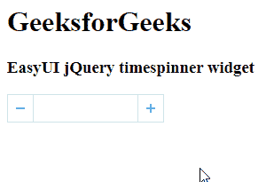

# easy ui jquery time pinner widget

> 哎哎哎::1230【https://www . geeksforgeeks . org/easy ui-jquery-time pinner 小部件/

在本文中，我们将学习如何使用 jQuery EasyUI 设计一个时间微调器。TimeSpinner 小部件结合了可编辑文本框和两个小按钮让用户通过增加或减少时间来选择时间值。

EasyUI 是一个 HTML5 框架，用于使用基于 jQuery、React、Angular 和 Vue 技术的用户界面组件。它有助于构建交互式 web 和移动应用程序的功能，为开发人员节省了大量时间。

**jQuery 易 UI 下载:**

```html
https://www.jeasyui.com/download/index.php
```

**语法:**

```html
<input class="easyui-timespinner">
```

**属性:**

*   **分隔符:**是一小时一分一秒之间的分隔符
*   **显示秒:**定义是否显示第二条信息。
*   **小时 12:** 定义是否以 12 小时格式显示。
*   **ampm:** 是显示在输入框上的 AM/PM 标签。
*   **突出显示:**最初必须突出显示的字段。

**方法:**

*   **选项:**返回选项对象。
*   **设置值:**设置时间间隔值。
*   **getHours:** 获取当前小时值。
*   **获取分钟:**获取当前分钟值。
*   **获取秒:**获取当前秒值。

**CDN 链接:**首先，添加项目所需的 jQuery Easy UI 脚本。

> <！–易 UI 的 jQuery 库–>
> <脚本类型=【text/JavaScript】src =【jQuery . easui . min . js】></脚本>
> <！–易 UI Mobile 的 jQuery 库–>
> <脚本类型=“text/JavaScript”src =“jQuery . easui . Mobile . js”></脚本>

**例 1:**

## 超文本标记语言

```html
<html>
<head>

  <!-- EasyUI specific stylesheets-->
  <link rel="stylesheet"
        type="text/css"
        href="themes/metro/easyui.css">

  <link rel="stylesheet" 
        type="text/css" 
        href="themes/mobile.css">

  <link rel="stylesheet" 
        type="text/css"
        href="themes/icon.css">

  <!-- jQuery library -->
  <script type="text/javascript" 
          src="jquery.min.js">
  </script>

  <!-- jQuery libraries of EasyUI -->
  <script type="text/javascript"
          src="jquery.easyui.min.js">
  </script>

  <!-- jQuery library of EasyUI Mobile -->
  <script type="text/javascript"
          src="jquery.easyui.mobile.js">
  </script>

  <script type="text/javascript">
    $('#gfg').timespinner({
      hour12: false
    })
  </script>
</head>
<body>
  <h1>GeeksforGeeks</h1>
  <h3>EasyUI jQuery timespinner widget</h3>

  <!-- Define the TimeSpinner using markup -->
  <input id="gfg" class="easyui-timespinner">
</body>
</html>
```

**输出:**



**例 2:**

## 超文本标记语言

```html
<html>
<head>

  <!-- EasyUI specific stylesheets-->
  <link rel="stylesheet"
        type="text/css"
        href="themes/metro/easyui.css">

  <link rel="stylesheet" 
        type="text/css" 
        href="themes/mobile.css">

  <link rel="stylesheet"
        type="text/css"
        href="themes/icon.css">

  <!--jQuery library -->
  <script type="text/javascript"
          src="jquery.min.js">
  </script>

  <!--jQuery libraries of EasyUI -->
  <script type="text/javascript"
          src="jquery.easyui.min.js">
  </script>

  <!--jQuery library of EasyUI Mobile -->
  <script type="text/javascript" 
          src="jquery.easyui.mobile.js">
  </script>
</head>
<body>
  <h1>GeeksforGeeks</h1>
  <h3>EasyUI jQuery timespinner widget</h3>

  <!-- Define the element to be used 
  as the TimeSpinner -->
  <input id='gfg'>
  <script type="text/javascript">

    // Initialize the EasyUI TimeSpinner
    $('#gfg').timespinner({
      hour12: false
    });
  </script>
</body>
</html>
```

**输出:**


**参考:**T2】https://www.jeasyui.com/documentation/timespinner.php