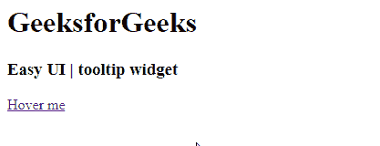

# easy ui jquery tooltip widget

> 哎哎哎:# t0]https://www . geeksforgeeks . org/easy ui-jquery 工具提示小部件/

在本文中，我们将学习如何使用 jQuery EasyUI 设计工具提示小部件。EasyUI 是一个 HTML5 框架，用于使用基于 jQuery、React、Angular 和 Vue 技术的用户界面组件。它有助于构建交互式 web 和移动应用程序的功能，为开发人员节省了大量时间。

**下载 jQuery 的 EasyUI:**

```html
https://www.jeasyui.com/download/index.php
```

**语法:**

```html
var a = $(".selector").tooltip({

});
```

**属性:**

*   **位置:**该属性为工具提示位置。
*   **内容:**该属性为工具提示内容。
*   **轨迹鼠标:**该属性使工具提示能够随鼠标移动。
*   **deltaX:** 这个属性是距离工具提示位置的水平距离。
*   **deltaY:** 该属性是工具提示位置的垂直距离。
*   **显示事件:**该属性使工具提示出现。
*   **隐藏事件:**该属性使工具提示消失。
*   **显示延迟:**这个属性是显示工具提示的时间延迟。
*   **隐藏延迟:**这个属性是隐藏工具提示的时间延迟。

#### **方法:**

*   **破坏:**此方法破坏工具提示。
*   **重新定位:**此方法重置工具提示位置。
*   **更新:**此方法更新工具提示内容。
*   **隐藏:**此方法隐藏工具提示。
*   **显示:**此方法显示工具提示
*   **箭头:**此方法返回箭头对象。
*   **提示:**此方法返回提示对象。
*   **选项:**返回选项属性。

**事件:**

*   **onDestroy:** 当工具提示被破坏时，此事件会触发。
*   **onPosition:** 当工具提示位置改变时，此事件触发。
*   **onUpdate:** 工具提示内容更新时触发此事件。
*   **在旁边:**隐藏工具提示时触发此事件。
*   **:当工具提示显示时，该事件触发。**

****CDN 链接:**首先，添加项目所需的 jQuery Easy UI 脚本。**

> **<！–易 UI 的 jQuery 库–>
> <脚本类型=【text/JavaScript】src =【jQuery . easui . min . js】></脚本>
> <！–易 UI Mobile 的 jQuery 库–>
> <脚本类型=“text/JavaScript”src =“jQuery . easui . Mobile . js”></脚本>**

****示例:****

## **超文本标记语言**

```html
<!doctype html> 
<html> 

<head> 
    <meta charset="UTF-8"> 
    <meta name="viewport" 
          content="initial-scale=1.0, maximum-scale=1.0,
                   user-scalable=no"> 

    <!-- EasyUI specific stylesheets-->
    <link rel="stylesheet" type="text/css"
          href="themes/metro/easyui.css"> 

    <link rel="stylesheet" type="text/css"
          href="themes/mobile.css"> 

    <link rel="stylesheet" type="text/css"
          href="themes/icon.css"> 

    <!--jQuery library -->
    <script type="text/javascript" src="jquery.min.js"> 
    </script> 

    <!--jQuery libraries of EasyUI -->
    <script type="text/javascript"
            src="jquery.easyui.min.js"> 
    </script> 

    <!--jQuery library of EasyUI Mobile -->
    <script type="text/javascript"
            src="jquery.easyui.mobile.js"> 
    </script> 

    <h1>GeeksforGeeks</h1>
    <h3>Easy UI | tooltip widget</h3>
</head> 

<body>     
    <a href="#" title="This is the tooltip message." 
       class="easyui-tooltip">
          Hover me
    </a>
</body>
</html>
```

****输出:****

****

****参考:**T2】http://www.jeasyui.com/documentation/**