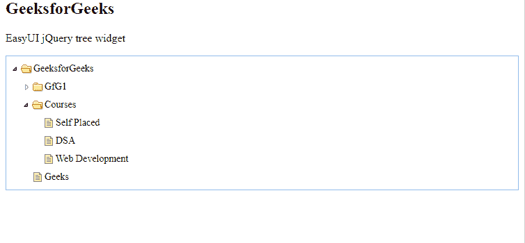

# easy ui jquery tree widget

> 哎哎哎:# t0]https://www . geeksforgeeks . org/easy ui-jquery-tree widget/

EasyUI 是一个 HTML5 框架，用于使用基于 jQuery、React、Angular 和 Vue 技术的用户界面组件。它有助于构建交互式 web 和移动应用程序的功能，为开发人员节省了大量时间。

在本文中，我们将学习如何使用 jQuery EasyUI 设计组合网格。树在网页中以树形结构显示分层数据

**jQuery 易 UI 下载:**

```html
https://www.jeasyui.com/download/index.php
```

**语法:**

```html
<input class="easyui-tree">
```

**属性:**

*   **url:** 检索远程数据的 url。
*   **方法:**检索数据的 http 方法。
*   **动画化:**定义当节点展开或折叠时是否显示动画效果。
*   **复选框:**定义是否在每个节点前显示复选框。
*   **级联检查:**定义是否级联检查。
*   **仅叶检查:**定义是否仅在叶节点前显示复选框。
*   **线条:**定义是否显示树节点之间的线条。
*   **dnd:** 定义是否启用拖放。
*   **数据:**待加载的节点数据。
*   **查询参数:**请求远程数据时将发送到服务器的附加参数。
*   **格式化程序:**定义如何呈现节点的文本。
*   **过滤:**定义如何过滤本地树数据。
*   **加载器:**定义如何从远程服务器加载数据。
*   **加载过滤器:**返回过滤后的数据进行显示。

**事件:**

*   **点击:**当用户点击一个节点时触发。
*   **on blclick:**当用户单击节点时触发。
*   **onBeforeLoad:** 在请求加载数据之前触发
*   **数据加载成功时触发“加载成功”**。
*   **加载错误:**当加载的数据失败时触发。
*   **onBeforeExpand:** 在节点展开前激发。
*   **当节点展开时，onExpand:** 激发。
*   **onbeforecollfail:**在节点折叠之前激发。
*   **肿瘤失效:**当节点折叠时触发。
*   **onBeforeCheck:** 在用户单击复选框之前触发。
*   **开启检查:**当用户点击复选框时触发。
*   **onBeforeSelect:** 在选择节点之前激发。
*   **onSelect:** 选择节点时触发。
*   **onContextMenu:** 右键单击节点时触发。
*   **onBeforeDrag:** 当节点开始拖动时触发。
*   **onStartDrag:** 开始拖动节点时触发。
*   **ontopdrag:**停止拖动节点后激发。
*   **OndAgenter:**当一个节点被拖动进入某个可以放下的目标节点时触发。
*   **onDragOver:** 当一个节点被拖动到某个可以放下的目标节点上时触发。
*   **onDragLeave:** 当一个节点被拖动离开某个可以放下的目标节点时触发。
*   **OnbeforeProp:**在删除节点之前激发，返回 false 拒绝删除。
*   **onDrop:** 节点被丢弃时触发。
*   **在编辑节点之前激发。**
*   **on afterredit:**编辑节点后激发。
*   **取消编辑动作时触发。**

**方法:**

*   **选项:**返回树的选项。
*   **加载数据:**加载树数据。
*   **getNode:** 获取指定的节点对象。
*   **getData:** 获取指定的节点数据，包括其子节点。
*   **重新加载:**重新加载树数据。
*   **getRoot:** 获取根节点
*   **获取根:**获取根节点
*   **获取父节点:**获取父节点
*   **获取子节点:**获取子节点
*   **获取勾选的:**获取勾选的节点。
*   **获取选定:**获取选定节点并返回。
*   **isLeaf:** 确定指定的节点是叶子。
*   **找到:**指定的节点，返回节点对象。
*   **查找方式:**通过字段查找指定节点。
*   **选择:**选择一个节点。
*   **检查；**将指定节点设置为选中。
*   **取消选中:**将指定节点设置为未选中。
*   **折叠:**折叠一个节点。
*   **展开:**展开一个节点。
*   **折叠所有:**折叠所有节点。
*   **展开:**展开所有节点。
*   **扩展到:**从根节点扩展到指定节点。
*   **滚动至:**滚动至指定节点。
*   **追加:**向父节点追加一些子节点
*   **切换:**切换节点的展开/折叠状态。
*   **插入:**在指定节点之前或之后插入一个节点。
*   **移除:**移除一个节点及其子节点。
*   **pop:** Pop 一个节点及其子节点。
*   **更新:**更新指定节点。
*   **启用 Dnd:** 启用拖放功能。
*   **禁用并:**禁用拖放功能。
*   **开始编辑节点。**
*   **endEdit:** 结束编辑节点。
*   **取消编辑:**取消编辑节点。
*   **doFilter:** 进行过滤动作。

**CDN 链接:**首先，添加项目所需的 jQuery Easy UI 脚本。

> <！–易 UI 的 jQuery 库–>
> <脚本类型=【text/JavaScript】src =【jQuery . easui . min . js】></脚本>
> <！–易 UI Mobile 的 jQuery 库–>
> <脚本类型=“text/JavaScript”src =“jQuery . easui . Mobile . js”></脚本>

**例 1:**

## 超文本标记语言

```html
<!doctype html>
<html>

<head>
    <meta charset="UTF-8">
    <meta name="viewport"
          content="initial-scale=1.0,
                   maximum-scale=1.0, user-scalable=no">

    <!-- EasyUI specific stylesheets-->
    <link rel="stylesheet" type="text/css"
        href="themes/metro/easyui.css">

    <link rel="stylesheet" type="text/css"
        href="themes/mobile.css">

    <link rel="stylesheet" type="text/css"
        href="themes/icon.css">

    <!--jQuery library -->
    <script type="text/javascript"
            src="jquery.min.js">
    </script>

    <!--jQuery libraries of EasyUI -->
    <script type="text/javascript"
        src="jquery.easyui.min.js">
    </script>

    <!--jQuery library of EasyUI Mobile -->
    <script type="text/javascript"
        src="jquery.easyui.mobile.js">
    </script>
    <script type="text/javascript">
        $(document).ready(function (){
            $('#gfg').tree({
                dnd: false,
                animate: true
            });
        });

    </script>
</head>
<body>
    <h2>GeeksforGeeks</h2>

<p>EasyUI jQuery tree widget</p>

    <div class="easyui-panel" style="padding:5px">
        <ul id='gfg'>
            <li>
                <span>GeeksforGeeks</span>
                <ul>
                    <li data-options="state:'closed'">
                        <span>GfG1</span>
                        <ul>
                            <li>
                                <span>Geeks</span>
                            </li>
                            <li>
                                <span>for</span>
                            </li>
                            <li>
                                <span>Geeks</span>
                            </li>
                        </ul>
                    </li>
                    <li>
                        <span>Courses</span>
                        <ul>
                            <li>Self Placed</li>
                            <li>DSA</li>
                            <li>Web Development</li>
                        </ul>
                    </li>
                    <li>Geeks</li>
                </ul>
            </li>
        </ul>
    </div>
</body>
</html>
```

**输出:**



**参考:**T2】http://www.jeasyui.com/documentation/