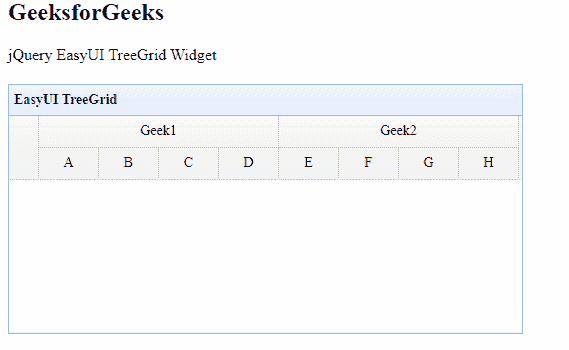

# easy ui jquery tree grid widget

> 哎哎哎:# t0]https://www . geeksforgeeks . org/easy ui-jquery-tree grid 小部件/

EasyUI 是一个 HTML5 框架，用于使用基于 jQuery、React、Angular 和 Vue 技术的用户界面组件。它有助于构建交互式 web 和移动应用程序的功能，为开发人员节省了大量时间。

在本文中，我们将学习如何使用 jQuery EasyUI 设计 treegrid。树形网格用于显示网格中的分层数据。

**jQuery 易 UI 下载:**

```html
https://www.jeasyui.com/download/index.php
```

**语法:**

```html
<input class="easyui-treegrid">
```

**属性:**

*   **标识字段:**表示哪个字段是标识字段。
*   **树字段:**定义树节点字段。
*   **动画化:**定义当节点展开或折叠时是否显示动画效果。
*   **复选框:**定义是否在每个行节点前显示复选框。
*   **级联检查:**定义是否级联检查。
*   **仅叶检查:**定义是否仅在叶节点前显示复选框。
*   **线条:**定义是否显示树网格节点之间的线条。
*   **加载器:**如何从远程服务器加载数据。返回*假*可以中止这个动作。
*   **加载过滤器:**返回过滤后的数据进行显示。

**事件:**

*   **onLoadSuccess:** 数据加载成功时触发。
*   **onLoadError:** 在加载远程数据时出现一些错误时触发。
*   **onBeforeLoad:** 在请求加载数据之前被激发。
*   **onClickRow:** 当用户单击一行时会触发，参数包含。
*   **onDblClickRow:** 当用户双击一行时会触发，参数包含。
*   **onClickCell:** 当用户点击一个单元格时就会被触发。
*   **onDblClickCell:** 当用户双击一个单元格时会被激发。
*   **onBeforeSelect:** 在用户选择一行之前触发。
*   **onSelect:** 当用户选择一行时，它将被激发。
*   **onBeforeUnselect:** 在用户取消选择行之前触发。
*   **不选择:**当用户取消选择一行时，它将被触发。
*   **onBeforeCheckNode:** 它在用户检查一行之前被激发。
*   **onCheckNode:** 当用户检查一行时，它被激发。
*   **onBeforeExpand:** 在一行展开之前被解雇
*   **onExpand:** 在行扩展时被触发。
*   **onbeforecollfuse:**它在一行被折叠之前被触发。
*   **肿瘤失效:**当一行被折叠时，它会被触发。
*   **onContextMenu:** 右键单击一行时会触发。
*   **onBeforeEdit:** 当用户开始编辑一行时，它会被激发。
*   **on afterredit:**当用户完成编辑时，它会被触发。
*   **onCancelEdit:** 当用户取消编辑一行时，它会被触发。

**方法:**

*   **选项:**返回树网格的选项。
*   **调整大小:**设置树网格大小。
*   **固定行高:**固定指定行高。
*   **加载数据:**加载树网格数据。
*   **加载:**加载并显示第一页。
*   **重载:**它重载 treegrid 数据。
*   **重新加载页脚:**重新加载页脚数据。
*   **获取数据:**获取加载的数据。
*   **getFooterRows:** 获取页脚数据。
*   **getRoot:** 获取根节点，返回节点对象
*   **getroot:**它获取根节点，返回节点数组。
*   **getParent:** 它获取父节点。
*   **获取子节点:**获取子节点。
*   **获取选定的:**获取选定的节点并返回，如果没有选定的节点返回空值。
*   **获取选择:**获取所有选中的节点。
*   **getCheckedNodes:** 它获取所有选中的行。
*   **getLevel:** 获取指定的节点级别。
*   **查找:**查找指定节点，返回节点数据。
*   **选择:**选择一个节点。
*   **取消选择:**取消选择一个节点。
*   **选择全部:**选择所有节点。
*   **取消选择所有:**它**T3】取消选择所有节点。**
*   **检查节点:**设置要检查的指定行节点。
*   **取消选中节点:**将指定的行节点设置为取消选中
*   **折叠:**它折叠一个节点。
*   **展开:**它展开一个节点。
*   **collapseal:**它折叠所有节点。
*   **expandal:**扩展所有节点。
*   **扩展到:**从根节点扩展到指定节点。
*   **切换:**切换节点的展开/折叠状态。
*   **追加:**它将节点追加到父节点。
*   **移除:**移除一个节点及其子节点。
*   **弹出:**弹出，移除该节点后返回包含其子节点的节点数据。
*   **刷新:**刷新指定节点。
*   **更新:**更新指定节点
*   **开始编辑:**开始编辑节点。
*   **endEdit:** 结束编辑节点。
*   **取消编辑:**取消编辑节点。
*   **getEditors:** 获取指定的行编辑器。
*   **getEditor:** 获取指定的编辑器。
*   **显示线:**显示树格线。

**方法:**首先，添加项目所需的 jQuery Easy UI 脚本。

> <脚本类型= " text/JavaScript " src = " jquery . easy ui . min . js "></脚本>
> 
> <脚本类型= " text/JavaScript " src = " jquery . easy ui . mobile . js "></脚本>

**示例:**

## 超文本标记语言

```html
<!DOCTYPE html>
<html>

<head>
    <link rel="stylesheet" type="text/css" 
        href=
"https://www.jeasyui.com/easyui/themes/default/easyui.css">

    <link rel="stylesheet" type="text/css" 
        href=
        "https://www.jeasyui.com/easyui/themes/icon.css">

    <script type="text/javascript" src=
        "https://www.jeasyui.com/easyui/jquery.min.js">
    </script>

    <script type="text/javascript" src=
    "https://www.jeasyui.com/easyui/jquery.easyui.min.js">
    </script>

    <script type="text/javascript">
        $(document).ready(function() {
            $('#gfg').treegrid({
                rownumbers: true,
                showFooter: true,
                idField: 'id',
                treeField: 'region',
                animate: true
            });
        });
    </script>
</head>

<body>
    <h2>GeeksforGeeks</h2>

    <p>jQuery EasyUI TreeGrid Widget</p>

    <div style="margin:20px 0;"></div>
    <table id='gfg' title="EasyUI TreeGrid">
        <thead>
            <tr>
                <th colspan="4">Geek1</th>
                <th colspan="4">Geek2</th>
            </tr>
            <tr>
                <th field="1" width="60" 
                    align="Center">A</th>

                <th field="2" width="60" 
                    align="Center">B</th>

                <th field="3" width="60" 
                    align="Center">C</th>

                <th field="4" width="60" 
                    align="Center">D</th>

                <th field="5" width="60" 
                    align="Center">E</th>

                <th field="6" width="60" 
                    align="Center">F</th>

                <th field="7" width="60" 
                    align="Center">G</th>

                <th field="8" width="60" 
                    align="Center">H</th>
            </tr>
        </thead>
    </table>
</body>

</html>
```

**输出:**



树格栅

**参考:**T2】http://www.jeasyui.com/documentation/