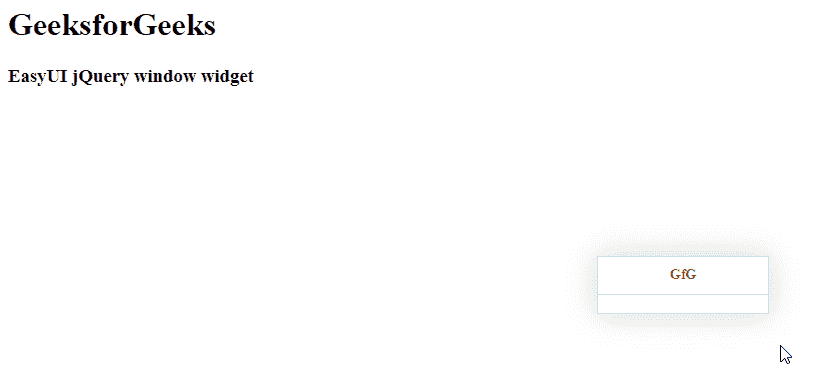

# easy ui jquery 窗口小部件

> 哎哎哎:# t0]https://www . geeksforgeeks . org/easy ui-jquery-window widget/

在本文中，我们将学习如何使用 jQuery EasyUI 设计一个窗口。**窗口**小部件是可拖动面板，可用作应用程序窗口。它浮动在页面上，可以移动到任何需要的地方。 EasyUI 是一个 HTML5 框架，用于使用基于 jQuery、React、Angular 和 Vue 技术的用户界面组件。它有助于构建交互式 web 和移动应用程序的功能，为开发人员节省了大量时间。

**jQuery 易 UI 下载:**

```html
https://www.jeasyui.com/download/index.php
```

**语法:**

```html
<input class="easyui-window">
```

**属性:**

*   **标题:**是窗口的标题文本。
*   **可折叠:**定义是否显示可折叠按钮。
*   **可最小化:**定义是否显示可最小化按钮。
*   **最大化:**定义是否显示最大化按钮。
*   **可关闭:**定义是否显示可关闭按钮。
*   **关闭:**定义窗户是否关闭。
*   **zIndex:** 是窗口的 z-index。
*   **可拖动:**定义窗口是否可以拖动。
*   **可调整大小:**定义窗口是否可以调整大小。
*   **阴影:**它定义了窗户的阴影。如果设置为 true，将显示阴影。
*   **内联:**它定义了如何使窗口停留在其父窗口内。
*   **模态:**定义窗口是否为模态窗口。
*   **边框:**定义窗口边框样式。
*   **约束:**定义是否约束窗口位置。

**方法:**

*   **窗口:**返回外窗对象。
*   **中心:**它使窗户水平居中。
*   **vcenter:** 它将窗口垂直居中。
*   **居中:**它将窗口居中显示在屏幕上。

**CDN 链接:**首先，添加项目所需的 jQuery Easy UI 脚本。

> <！–易 UI 的 jQuery 库–>
> <脚本类型=【text/JavaScript】src =【jQuery . easui . min . js】></脚本>
> <！–易 UI Mobile 的 jQuery 库–>
> <脚本类型=“text/JavaScript”src =“jQuery . easui . Mobile . js”></脚本>

**示例:**

## 超文本标记语言

```html
<html> 
<head>             
    <!-- EasyUI specific stylesheets-->
    <link rel="stylesheet" type="text/css"
          href="themes/metro/easyui.css"> 

    <link rel="stylesheet" type="text/css"
          href="themes/mobile.css"> 

    <link rel="stylesheet" type="text/css"
          href="themes/icon.css"> 

    <!--jQuery library -->
    <script type="text/javascript"
            src="jquery.min.js"> 
    </script> 

    <!--jQuery libraries of EasyUI -->
    <script type="text/javascript"
        src="jquery.easyui.min.js"> 
    </script> 

    <!--jQuery library of EasyUI Mobile -->
    <script type="text/javascript"
        src="jquery.easyui.mobile.js"> 
    </script> 

    <script type="text/javascript">
        $(document).ready(function (){ 
            $('#gfg').window({ 
                title: 'GfG',
                resizable: true
            }); 
      }); 
    </script> 
</head> 
<body>
    <h1>GeeksforGeeks</h1>
    <h3>EasyUI jQuery window widget</h3>

   <!-- Create the easyUI window -->
   <input id="gfg" class="easyui-window">
</body>
</html>
```

**输出:**



**参考:**T2】https://www.jeasyui.com/documentation/window.php