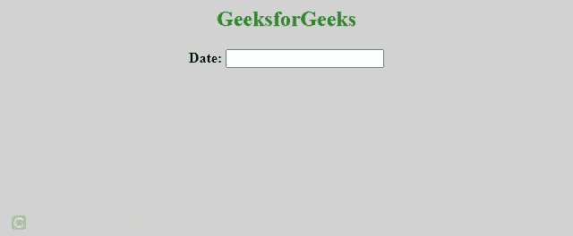

# 如何在 jQuery UI 日期选择器中更改日期格式？

> 原文:[https://www . geesforgeks . org/how-to-change-date-format-in-jquery-ui-date picker/](https://www.geeksforgeeks.org/how-to-change-date-format-in-jquery-ui-datepicker/)

在本文中，我们将了解 [jQuery](https://www.geeksforgeeks.org/jquery-tutorials/) 中的[日期选择器](https://www.geeksforgeeks.org/jquery-ui-date-picker/)。jQuery 是最快和轻量级的 JavaScript 库，用于简化 [HTML/CSS](https://www.geeksforgeeks.org/web-technology/html-css/) 文档，或者更准确地说[文档对象模型(DOM)](https://www.geeksforgeeks.org/dom-document-object-model/) 和 [JavaScript](https://www.geeksforgeeks.org/javascript-tutorial/) 之间的交互。

jQuery 以其座右铭**“**少写多做而闻名。**”**简单来说就是只需要写几行代码就可以达到目的。

在许多形式中，您可以从日历中选择日期和年份。 [Datepicker](https://www.geeksforgeeks.org/jquery-ui-date-picker/) 是一个标准形式的输入字段，用于仅通过查看日历来选择日期和年份。它是一个指定覆盖的交互式日历。

当您点击日历中提到的任何日期时，反馈将出现在输入文本中。

**进场:**

*   创建一个 [HTML](https://www.geeksforgeeks.org/html-tutorials/) 文件，导入 [jQuery](https://www.geeksforgeeks.org/jquery-tutorials/) 库。
*   jQuery [datepicker()](https://www.geeksforgeeks.org/jquery-ui-date-picker/) 方法用于创建交互式日历的覆盖。
*   根据需要将 [CSS](https://www.geeksforgeeks.org/css-tutorials/) 应用到您的应用程序中。

**语法 1:**

```
<script type="text/javascript">
    $(function() {
        $("#txtDate").datepicker({ 
            dateFormat: 'dd/mm/yy' 
        });
    });
</script>
```

**示例:**

## 超文本标记语言

```
<!DOCTYPE html>
<html>

<head>
    <title>
        jQuery UI datepicker format dd/mm/yyyy
    </title>
    <link type="text/css" href=
"https://code.jquery.com/ui/1.12.1/themes/base/jquery-ui.css"
        rel="stylesheet" />
    <script type="text/javascript" 
        src="https://code.jquery.com/jquery-1.12.4.js">
    </script>
    <script type="text/javascript" src=
        "https://code.jquery.com/ui/1.12.1/jquery-ui.js">
    </script>

    <style type="text/css">
        .ui-datepicker {
            font-size: 8pt !important
        }

        body {
            text-align: center;
            background-color: lightgray;
        }
    </style>
</head>

<body>
    <h2 style="color:green">
        GeeksforGeeks
    </h2>

    <form id="form1" runat="server">
        <div class="demo">
            <b>Date:</b> <input type="" 
                name="" id="txtDate" runat="server" />
        </div>

        <script type="text/javascript">
            $(function () {
                $("#txtDate").datepicker({ 
                    dateFormat: 'dd/mm/yy' 
                });
            });
        </script>
    </form>
</body>

</html>
```

**输出:**



**语法 2:**

```
<script type="text/javascript">
    $(function() {
        $("#txtDate").datepicker({ 
            dateFormat: 'yy/mm/dd' 
        });
    });
</script>
```

**示例:**

## 超文本标记语言

```
<!DOCTYPE html>
<html>

<head>
    <title>
        jQuery ui datepicker format dd/mm/yyyy
    </title>
    <link type="text/css" href=
"https://code.jquery.com/ui/1.12.1/themes/base/jquery-ui.css"
        rel="stylesheet" />
    <script type="text/javascript" 
        src="https://code.jquery.com/jquery-1.12.4.js">
    </script>
    <script type="text/javascript" 
        src="https://code.jquery.com/ui/1.12.1/jquery-ui.js">
    </script>

    <style type="text/css">
        .ui-datepicker {
            font-size: 8pt !important
        }

        body {
            text-align: center;
            background-color: lightgray;
        }
    </style>
</head>

<body>
    <h2 style="color:green">
        GeeksforGeeks
    </h2>

    <form id="form1" runat="server">
        <div class="demo">
            <b>Date:</b> <input type="" 
                name="" id="txtDate" runat="server" />
        </div>

        <script type="text/javascript">
            $(function () {
                $("#txtDate").datepicker({ 
                    dateFormat: 'yy/mm/dd' 
                });
            });
        </script>
    </form>
</body>

</html>
```

**输出:**

