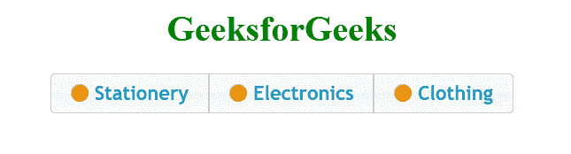
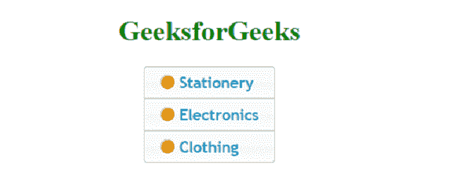

# 如何使用 jQuery-ui 创建控件组小部件？

> 原文:[https://www . geesforgeks . org/how-create-control group-widget-using-jquery-ui/](https://www.geeksforgeeks.org/how-to-create-controlgroup-widget-using-jquery-ui/)

[**【控制组】**](https://www.geeksforgeeks.org/jquery-ui-controlgroup-widget/) 用于将一组按钮分组，在视觉上形成单个块。它看起来像一个导航组件。Controlgroup 用于对各种输入小部件进行分组，如复选框、按钮等。

**水平控件组小部件:**在水平控件组中，我们可以水平创建一组按钮。

**语法:**

```
$(".first_class" ).controlgroup({});
```

**示例:**

## 超文本标记语言

```
<!DOCTYPE html>
<html>

<head>
    <link href=
'https://ajax.googleapis.com/ajax/libs/jqueryui/1.12.1/themes/ui-lightness/jquery-ui.css'
        rel='stylesheet'>

    <script src="https://ajax.googleapis.com/ajax/libs/jquery/3.1.1/jquery.min.js">
    </script>
    <script src="https://ajax.googleapis.com/ajax/libs/jqueryui/1.12.1/jquery-ui.min.js">
    </script>
</head>

<body>
    <center>
        <h1 style="color:green">GeeksforGeeks</h1>
        <div class="first_class">
            <label for="radio_1">
                Stationery
            </label>
            <input type="radio" name="type" id="radio_1">
            <label for="radio_2">
                Electronics
            </label>
            <input type="radio" name="type" id="radio_2">
            <label for="radio_3">
                Clothing
            </label>
            <input type="radio" name="type" id="radio_3">
        </div>

        <script>
            $(document).ready(function () {
                $(".first_class").controlgroup({});
            })
        </script>
    </center>
</body>

</html>
```

**输出:**



**垂直控件组小部件:**在垂直控件组小部件中，我们可以垂直创建一组按钮。

**语法:**

```
$(".first_class").controlgroup({"direction": "vertical"});
```

**示例:**

## 超文本标记语言

```
<!DOCTYPE html>
<html>

<head>
    <link href=
'https://ajax.googleapis.com/ajax/libs/jqueryui/1.12.1/themes/ui-lightness/jquery-ui.css'
        rel='stylesheet'>
    <script src="https://ajax.googleapis.com/ajax/libs/jquery/3.1.1/jquery.min.js">
    </script>
    <script src="https://ajax.googleapis.com/ajax/libs/jqueryui/1.12.1/jquery-ui.min.js">
    </script>
</head>

<body>
    <center>
        <h1 style="color:green">GeeksforGeeks</h1>
        <div class="first_class">
            <label for="radio_1">
                Stationery
            </label>
            <input type="radio" name="type" id="radio_1">
            <label for="radio_2">
                Electronics
            </label>
            <input type="radio" name="type" id="radio_2">
            <label for="radio_3">
                Clothing
            </label>
            <input type="radio" name="type" id="radio_3">
        </div>

        <script>
            $(document).ready(function () {
                $(".first_class").controlgroup(
                    { "direction": "vertical" });
            })
        </script>
    </center>
</body>

</html>
```

**输出:**

