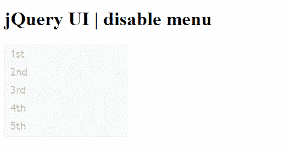

# 如何禁用一个 jQuery UI 菜单？

> 原文:[https://www . geesforgeks . org/如何禁用-a-jquery-ui-menu/](https://www.geeksforgeeks.org/how-to-disable-a-jquery-ui-menu/)

在本文中，我们将禁用一个 jQuery 用户界面菜单

**语法:**

```html
$(".selector").menu( "disable" );
```

了解更多关于 jQuery 中[选择器](https://www.geeksforgeeks.org/jquery-selectors-and-event-methods/)和[菜单](https://www.geeksforgeeks.org/jquery-ui-menu/)选项的信息。

**进场:**

*   首先，添加项目所需的 jQuery UI 脚本。

> <link href="“https://code.jquery.com/ui/1.10.4/themes/ui-lightness/jquery-ui.css”<br/"> rel = "样式表">
> <script src = " https://code . jquery . com/jquery-1 . 10 . 2 . js "></script>
> <script src = " https://code . jquery . com/ui/1 . 10 . 4/jquery-ui . js "></script>

**例 1:**

## 超文本标记语言

```html
<!DOCTYPE html>
<html lang="en">
    <head>
        <meta charset="utf-8" />
        <link href=
"https://code.jquery.com/ui/1.10.4/themes/ui-lightness/jquery-ui.css"
              rel="stylesheet" />
        <script src="https://code.jquery.com/jquery-1.10.2.js">
      </script>
        <script src="https://code.jquery.com/ui/1.10.4/jquery-ui.js">
      </script>

        <style>
            .ui-menu {
                width: 200px;
            }
        </style>

        <script>
            $(function () {
                $("#gfg").menu();
                $("#gfg").menu("disable");
            });
        </script>
    </head>

    <body>
        <h1>jQuery UI | disable menu</h1>
        <ul id="gfg">
            <li><a href="https://www.geeksforgeeks.org/">1st</a>
          </li>
            <li><a href="https://www.geeksforgeeks.org/">2nd</a>
          </li>
            <li><a href="https://www.geeksforgeeks.org/">3rd</a>
          </li>
            <li><a href="https://www.geeksforgeeks.org/">2th</a>
          </li>
            <li><a href="https://www.geeksforgeeks.org/">5th</a>
          </li>
        </ul>
    </body>
</html>
```

**输出:**

