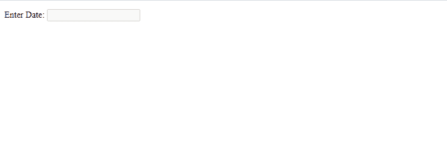

# 如何在 jQuery UI 中禁用日期选择器？

> 原文:[https://www . geesforgeks . org/how-disable-an-date picker-in-jquery-ui/](https://www.geeksforgeeks.org/how-to-disable-an-datepicker-in-jquery-ui/)

要在 jQuery 用户界面中禁用日期选择器，我们将使用下面讨论的 disable()方法:

jQuery UI disable()方法用于禁用日期选择器。

**语法:**

```
$( ".selector" ).datepicker( "disable" )
```

**参数:**此方法不接受任何参数。

**返回值:** 该方法返回一个对象值

**方法:**首先，添加项目所需的 jQuery UI 脚本。

> <link>

**示例:**

## 超文本标记语言

```
<!DOCTYPE html>
<html lang="en">

<head>
    <meta charset="utf-8" />
    <link href=
"https://code.jquery.com/ui/1.10.4/themes/ui-lightness/jquery-ui.css"
        rel="stylesheet" />
    <script src="https://code.jquery.com/jquery-1.10.2.js"></script>

    <script src="https://code.jquery.com/ui/1.10.4/jquery-ui.js">
    </script>

    <script>
        $(function() {
            $("#gfg").datepicker();
            $("#gfg").datepicker("disable");
        });
    </script>
</head>

<body>
    <p>Enter Date: <input type="text" id="gfg" /></p>
</body>

</html>
```

**输出:**

