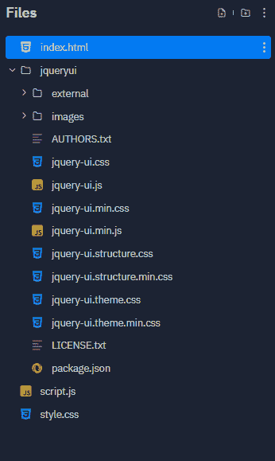
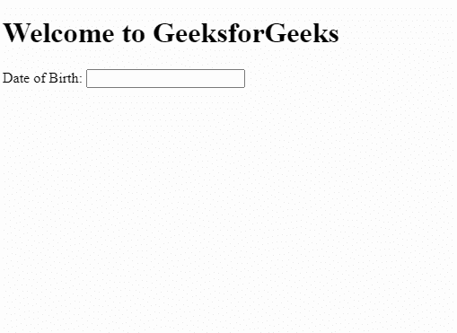
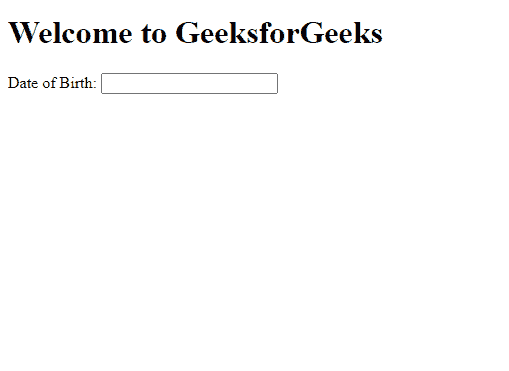

# 如何使用 jQuery UI 在页面中显示日期选择器？

> 原文:[https://www . geesforgeks . org/how-display-date-picker-in-page-use-jquery-ui/](https://www.geeksforgeeks.org/how-to-display-date-picker-in-the-page-using-jquery-ui/)

每当我们想向用户询问日期时，都需要日期选择器。我们可以存储数据，并将其用于未来的用途。 [jQuery](https://www.geeksforgeeks.org/jquery-tutorials/) 提供了一个简单的方法来创建我们的日期选择器。jQuery 的日期选择器是内联的，所以用户界面非常简单，但是很有吸引力。

**语法:**

我们需要一个输入元素，然后我们将调用 jQuery 日期选择器函数。

```
<input type="text" id="dob">
```

在代码的脚本部分，调用 **datepicker()** 函数来实例化 datepicker 小部件。

```
<script>
    $("#dob").datepicker();
</script>
```

**项目设置:**

日期选择器和类似的用户界面可从 [jQuery 用户界面](https://download.jqueryui.com/download)获得。我们需要下载它们，然后将它们存储在项目目录中。将其提取到项目目录中的文件夹“jqueryui”中。项目结构如下所示。



在[头](https://www.geeksforgeeks.org/html-head-tag/)标签内导入如下文件。

> <link rel="”stylesheet”" href="”/jqueryui/jquery-ui.min.css”">
> <脚本 src = "/jqueryui/external/jquery/jquery . js "></脚本>
> <脚本 src = "/jqueryui/jquery-ui . min . js "></脚本>

**示例 1:** 下面的代码演示了一个简单的日期选择器。我们将从输入元素中启动日期选择器。

## 超文本标记语言

```
<!DOCTYPE html>
<html lang="en">

<head>
    <meta charset="utf-8">
    <meta name="viewport"
          content="width=device-width, initial-scale=1">
    <link rel="stylesheet"
          href="jqueryui/jquery-ui.min.css">
    <script src="jqueryui/external/jquery/jquery.js">
    </script>
    <script src="jqueryui/jquery-ui.min.js"></script>
</head>

<body>
    <h1>Welcome to GeeksforGeeks</h1>
    <p>Date of Birth:
        <input type="text" id="dob">
    </p>
    <script>
        $("#dob").datepicker();
    </script>
</body>

</html>
```

**输出:**



**示例 2:** 下面的代码演示了一个定制的日期选择器。我们的日期选择器没有年或月更改按钮。另外，格式也不好看。所以我们改变它们如下。

*   **更改月份:**是布尔类型，如果设置为*真*，我们可以更改月份。
*   **更改年份:**是布尔类型，如果设置为*真*，我们可以更改年份。
*   **minDate:** 设置最小日期。
*   **最大日期:**设置最大日期。设为+1 表示明天，设为-1 表示昨天。如果您想将日期设置为明年，请使用+1y，反之亦然。
*   **日期格式:**设置日期格式。" dd/mm/yy "首先将日期设置为日期，然后是月份，然后是年份。

## 超文本标记语言

```
<!DOCTYPE html>
<html lang="en">

<head>
    <meta charset="utf-8">
    <meta name="viewport" 
          content="width=device-width, initial-scale=1">
    <link rel="stylesheet" 
          href="jqueryui/jquery-ui.min.css">
    <script src="jqueryui/external/jquery/jquery.js">
    </script>
    <script src="jqueryui/jquery-ui.min.js"></script>
</head>

<body>
    <h1>Welcome to GeeksforGeeks</h1>
    <p>Date of Birth:
        <input type="text" id="dob">
    </p>
    <script>
        $("#dob").datepicker({
            dateFormat: "dd/mm/yy",
            maxDate: 0,
            minDate: "01/01/2000",
            changeYear: true,
            changeMonth: true
        });
    </script>
</body>

</html>
```

**输出:**

