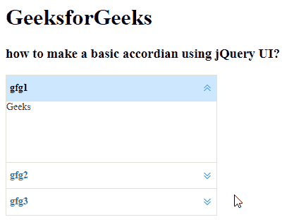

# 如何用 jQuery 简易 UI 制作手风琴？

> 原文:[https://www . geeksforgeeks . org/如何制作手风琴-使用-jquery-easy-ui/](https://www.geeksforgeeks.org/how-to-make-an-accordian-using-jquery-easy-ui/)

EasyUI 是一个 HTML5 框架，用于使用基于 jQuery、React、Angular 和 Vue 技术的用户界面组件。它有助于构建交互式 web 和移动应用程序的功能，为开发人员节省了大量时间。

在本文中，我们将学习如何使用 jQuery EasyUI 设计手风琴。它一次显示一个或多个选项卡面板。每个选项卡面板都有标题和一些迷你按钮工具，包括关闭按钮和其他自定义按钮。

**jQuery 易 UI 下载:**

```html
https://www.jeasyui.com/download/index.php
```

**语法:**

```html
<div class="accordion">
</div>
```

**集装箱选项:**

*   **宽度:**手风琴容器的宽度。
*   **高度:**手风琴容器的高度。
*   **适合:**设置为真以设置折叠容器大小适合其父容器。
*   **边框:**定义是否显示边框。
*   **动画化:**定义展开或折叠面板时是否显示动画效果。
*   **倍数:**为真，可一次展开多个面板。
*   **选定:**初始化选定面板索引。
*   **halign:** 手风琴面板的头部对齐。

**面板选项:**

*   **选中:**设置为真，展开面板。
*   **可折叠:**定义是否显示可折叠按钮

**事件:**

*   **开启选择:**选择面板时触发。
*   **未选择:当面板未被选择时**触发。
*   **onAdd:** 添加新面板时触发。
*   **onBeforeRemove:** 在移除面板之前触发。
*   **onRemove:** 移除面板时触发。

**方法:**

*   **选项:**返回手风琴的选项。
*   **面板:**获取所有面板。
*   **调整大小:**调整手风琴的大小。
*   **获取选中:**获取第一个选中的面板。
*   **获取选择:**获取所有选择的面板。
*   **获取面板:**获取指定的面板。
*   **获取面板索引:**获取指定的面板索引。
*   **选择:**选择指定面板。
*   **取消选择:**取消选择指定面板。
*   **添加:**添加新面板。
*   **移除:**移除指定面板

**进场:**

*   首先，添加项目所需的 jQuery Easy UI 脚本。

**示例:**

## 超文本标记语言

```html
<!doctype html> 
<html> 

<head> 
    <meta charset="UTF-8"> 
    <meta name="viewport" content="initial-scale=1.0, 
        maximum-scale=1.0, user-scalable=no"> 

    <!-- EasyUI specific stylesheets-->
    <link rel="stylesheet" type="text/css"
        href="themes/metro/easyui.css"> 

    <link rel="stylesheet" type="text/css"
        href="themes/mobile.css"> 

    <link rel="stylesheet" type="text/css"
        href="themes/icon.css"> 

    <!--jQuery library -->
    <script type="text/javascript" src="jquery.min.js"> 
    </script> 

    <!--jQuery libraries of EasyUI -->
    <script type="text/javascript"
        src="jquery.easyui.min.js"> 
    </script> 

    <!--jQuery library of EasyUI Mobile -->
    <script type="text/javascript"
        src="jquery.easyui.mobile.js"> 
    </script> 

    <h1>GeeksforGeeks</h1>
    <h3>how to make a basic accordian using jQuery UI?</h3>
</head> 

<body>     
<div id="geek" 
     class="easyui-accordion" 
     style="width:300px;height:200px;">
    <div title="gfg1">
            Geeks
    </div>
    <div title="gfg2">
        for
    </div>
    <div title="gfg3">
        Geeks
    </div>
</div>

</body>
</html>
```

**输出:**



**参考:**T2】http://www.jeasyui.com/documentation/