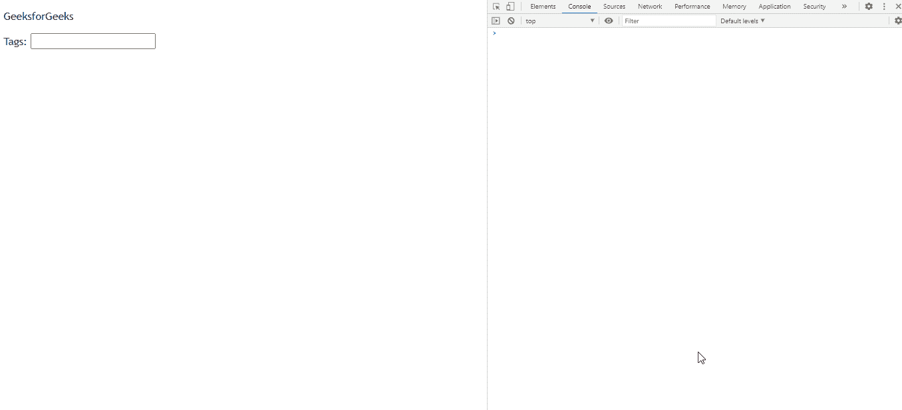

# 如何使用 jQuery UI 进行基本的自动完成？

> 原文:[https://www . geesforgeks . org/how-make-basic-autocomplete-use-jquery-ui/](https://www.geeksforgeeks.org/how-to-make-basic-autocomplete-using-jquery-ui/)

jQuery UI 自动完成可以为网页中的文本字段提供自动完成支持。当自动完成选项作为数组提供给自动完成器以显示为选项时，使用本地自动完成器。

**方法:**首先，添加项目所需的 jQuery UI 脚本。

> <src 脚本= " https://Ajax . Google APIs . com/Ajax/libs/jquery ui/1 . 8 . 16/jquery-ui . js "></script><link href = " http://Ajax . Google APIs . com/Ajax

**示例:**

## 超文本标记语言

```
<!DOCTYPE html>
<html>
    <head>
        <meta charset="utf-8" />
        <meta name="viewport"
              content="width=device-width,
                       initial-scale=1" />

        <script src=
 "https://ajax.googleapis.com/ajax/libs/jquery/1.7.1/jquery.js">
      </script>

        <script src=
"https://ajax.googleapis.com/ajax/libs/jqueryui/1.8.16/jquery-ui.js">
      </script>

        <link href=
"http://ajax.googleapis.com/ajax/libs/jqueryui/1.8.16/themes/ui-lightness/jquery-ui.css" 
              rel="stylesheet" 
              type="text/css" />

        <style>
            .height {
                height: 10px;
            }
        </style>

        <script>
            $(function () {
                var list = ["One", "Two", "Three", "Four"];
                $("#gfg").autocomplete({
                    source: list,
                });
            });
        </script>
    </head>

    <body>
        <div class="ui-widget">
            <p>GeeksforGeeks</p>

            <label for="gfg">Tags: </label>
            <input id="gfg" />
        </div>
    </body>
</html>
```

**输出:**

