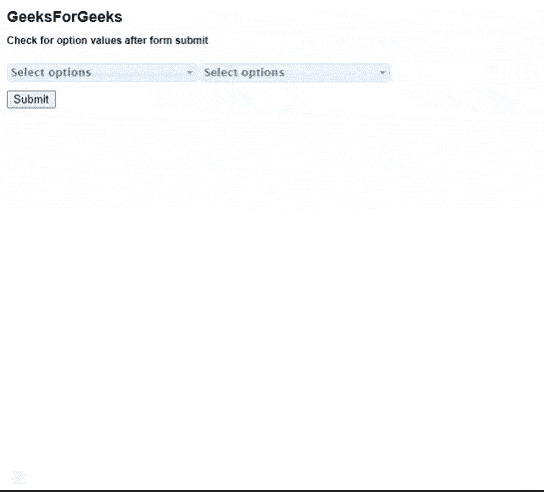
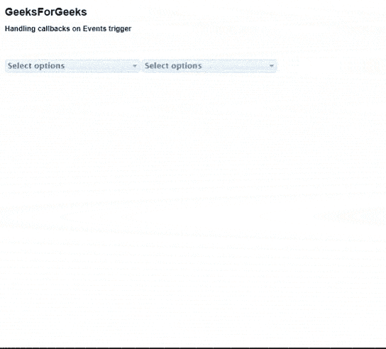

# 如何使用 jQuery UI 多选小部件？

> 原文:[https://www . geesforgeks . org/使用方法-jquery-ui-multiselect-widget/](https://www.geeksforgeeks.org/how-to-use-jquery-ui-multiselect-widget/)

在本文中，我们将学习为我们的网页使用 jQuery UI **多选小部件**。在实施以下示例代码之前，请从[官方网站](https://github.com/ehynds/jquery-ui-multiselect-widget)下载所需的预编译文件。请注意项目文件夹中的文件路径。

**示例 1:** 以下示例演示了使用 jQuery UI **多选小部件**插件的下拉框的基本示例。

## 超文本标记语言

```
<!DOCTYPE html>
<html lang="en">

<head>
    <meta http-equiv="Content-Type" 
        content="text/html; charset=utf-8" />

    <link rel="stylesheet" type="text/css" 
        href="css/jquery.multiselect.css" />

    <link rel="stylesheet" type="text/css" 
        href="style.css" />

    <link rel="stylesheet" type="text/css"
        href=
"http://ajax.googleapis.com/ajax/libs/jqueryui/1/themes/redmond/jquery-ui.css" />

    <script type="text/javascript" src=
"http://ajax.googleapis.com/ajax/libs/jquery/1/jquery.js">
    </script>

    <script type="text/javascript" src=
"http://ajax.googleapis.com/ajax/libs/jqueryui/1/jquery-ui.min.js">
    </script>

    <script type="text/javascript" src="src/jquery.multiselect.js">
    </script>
</head>

<body>
    <h2>GeeksForGeeks</h2>

<p><b>
        Check for option values 
        after form submit
    </b></p>

    <form action="#" method="post" 
        style="margin-top:20px">

        <select id="multipleSelectID" 
            name="multipleSelect" 
            multiple="multiple" size="5">

            <b>Select country:</b><br>
            <option value="america">America</option>
            <option value="china">China</option>
            <option value="japan">Japan</option>
            <option value="australia">Australia</option>
        </select>

        <select id="selectID" name="select" size="5">
            <b>Select city:</b><br>
            <option value="jaipur">Jaipur</option>
            <option value="delhi">Delhi</option>
            <option value="mumbai">Mumbai</option>
            <option value="chennai">Chennai</option>
        </select>
        <div style="height:10px;"></div>
        <div>
            <input type="submit" value="Submit" />
        </div>
    </form><br>
    <div id="selectResultID">
    </div>

    <script type="text/javascript">
        $("#multipleSelectID").multiselect();
        $("#selectID").multiselect({ multiple: false });

        $("form").bind("submit", function () {
            $("#selectResultID").html(
                "<b>Options selected : </b>" 
                + $(this).serialize());
            return false;
        });
    </script>
</body>

</html>
```

**输出:**


从下拉列表中选择的选项

当所有选项都被选中然后又被取消选中时。



**示例 2:** 以下示例演示了如何使用回调函数来处理任何类型的事件触发器。为了更好地理解，请参考输出。

## 超文本标记语言

```
<!DOCTYPE html>
<html lang="en">

<head>
    <meta http-equiv="Content-Type" 
        content="text/html; charset=utf-8" />

    <link rel="stylesheet" type="text/css" 
        href="css/jquery.multiselect.css" />

    <link rel="stylesheet" type="text/css" 
        href="style.css" />

    <link rel="stylesheet" type="text/css" 
        href=
"http://ajax.googleapis.com/ajax/libs/jqueryui/1/themes/redmond/jquery-ui.css" />

    <script type="text/javascript" src=
"http://ajax.googleapis.com/ajax/libs/jquery/1/jquery.js">
    </script>

    <script type="text/javascript" src=
"http://ajax.googleapis.com/ajax/libs/jqueryui/1/jquery-ui.min.js">
    </script>

    <script type="text/javascript" 
        src="src/jquery.multiselect.js">
    </script>
</head>

<body>
    <h2>GeeksForGeeks</h2>

<p><b>
        Handling callbacks on 
        Events trigger
    </b></p>

    <br />
    <div id="callbackResultID"></div>

    <form action="#" method="post" 
        style="margin-top:20px">

        <select id="multipleSelectID" 
            name="multipleSelect" 
            multiple="multiple" size="5">

            <b>Select country:</b><br>
            <option value="america">America</option>
            <option value="china">China</option>
            <option value="japan">Japan</option>
            <option value="australia">Australia</option>
        </select>

        <select id="selectID" name="select" size="5">
            <b>Select city:</b><br>
            <option value="jaipur">Jaipur</option>
            <option value="delhi">Delhi</option>
            <option value="mumbai">Mumbai</option>
            <option value="chennai">Chennai</option>
        </select>
        <div style="height:10px;"></div>
    </form><br>

    <script type="text/javascript">
        $(function () {

            var $callback = $("#callbackResultID");

            $("select").multiselect({
                click: function (event, ui) {
                    $callback.text(ui.value + ' ' +
                        (ui.checked ? 'checked' : 'unchecked'));
                },
                beforeopen: function () {
                    $callback.text("Selectobox will open..");
                },
                open: function () {
                    $callback.text("Selectbox opened!");
                },
                beforeclose: function () {
                    $callback.text(
                        "Before Selectbox to be closed...");
                },
                close: function () {
                    $callback.text("Selectbox closed!");
                },
                checkAll: function () {
                    $callback.text("Check all options click event!");
                },
                uncheckAll: function () {
                    $callback.text("Uncheck all option clicked!");
                },
                optgrouptoggle: function (event, ui) {
                    var values = $.map(ui.inputs, function (checkbox) {
                        return checkbox.value;
                    }).join(", ");

                    $callback.html("<strong>Checkboxes " +
                        (ui.checked ? "checked" : "unchecked") +
                        ":</strong> " + values);
                },
                groupsCollapsable: true,
                beforecollapsetoggle: function () {
                    $callback.text("Before Option group collapsed");
                },
                collapsetoggle: function () {
                    $callback.text("Option group collapsed");
                }
            });

        });
    </script>
</body>

</html>
```

**输出:**

