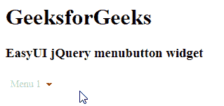

# jquery easy ui menu button widget

> 哎哎哎:# t0]https://www . geeksforgeeks . org/jquery-easy ui-menu button widget/

EasyUI 是一个 HTML5 框架，用于使用基于 jQuery、React、Angular 和 Vue 技术的用户界面组件。它有助于构建交互式 web 和移动应用程序的功能，为开发人员节省了大量时间。

在本文中，我们将学习如何使用 jQuery EasyUI 设计菜单按钮。菜单按钮是下拉菜单的一部分。它与链接按钮和菜单相关联。菜单隐藏时显示链接按钮。

**jQuery 易 UI 下载:**

```
https://www.jeasyui.com/download/index.php
```

**语法:**

```
<div class="menubutton">
</div>
```

#### **属性:**

*   **素颜:**置*真*显示素颜效果。
*   **菜单:**创建相应菜单的选择器。
*   **菜单设计:**设置顶层菜单的对齐方式。
*   **持续时间:**以毫秒为单位定义持续时间
*   **显示事件:**导致菜单出现的事件。
*   **隐藏事件:**导致菜单消失的事件。
*   **有向下箭头:**定义向下箭头图标的显示。

#### **方法:**

*   **选项:**返回选项对象。
*   **禁用:**禁用菜单按钮。
*   **启用**:启用菜单按钮。
*   **破坏:**破坏菜单按钮。

**CDN 链接:**首先，添加项目所需的 jQuery Easy UI 脚本。

> <！–易 UI 的 jQuery 库–>
> <脚本类型=【text/JavaScript】src =【jQuery . easui . min . js】></脚本>
> <！–易 UI Mobile 的 jQuery 库–>
> <脚本类型=“text/JavaScript”src =“jQuery . easui . Mobile . js”></脚本>

**示例:**

## 超文本标记语言

```
<!DOCTYPE html>
<html>
  <head>
    <meta charset="UTF-8" />
    <meta
      name="viewport"
      content="initial-scale=1.0, 
               maximum-scale=1.0, user-scalable=no"/>

    <!-- EasyUI specific stylesheets-->
    <link rel="stylesheet" type="text/css" 
          href="themes/metro/easyui.css" />

    <link rel="stylesheet" type="text/css" 
          href="themes/mobile.css" />

    <link rel="stylesheet" type="text/css"
          href="themes/icon.css" />

    <!--jQuery library -->
    <script type="text/javascript" 
            src="jquery.min.js">
    </script>

    <!--jQuery libraries of EasyUI -->
    <script type="text/javascript" 
            src="jquery.easyui.min.js">
    </script>

    <!--jQuery library of EasyUI Mobile -->
    <script type="text/javascript" 
            src="jquery.easyui.mobile.js">
    </script>

    <script type="text/javascript">
      $(document).ready(function () {
        $("#gfg").menubutton({
          disabled: true,
        });
      });
    </script>
  </head>

  <body>
    <h1>GeeksforGeeks</h1>
    <h3>EasyUI jQuery menubutton widget</h3>

    <a id="gfg" class="easyui-menubutton">Menu 1</a>
  </body>
</html>
```

**输出:**



菜单按钮

**参考:**T2】http://www.jeasyui.com/documentation/