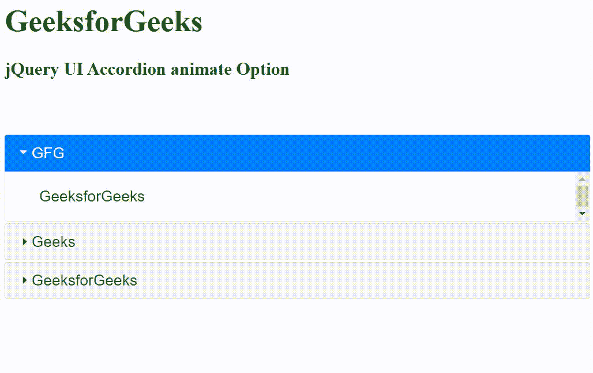

# jQuery UI 手风琴动画选项

> 原文:[https://www . geesforgeks . org/jquery-ui-accordion-animate-option/](https://www.geeksforgeeks.org/jquery-ui-accordion-animate-option/)

jQuery UI 由 GUI 小部件、视觉效果和使用 jQuery、CSS 和 HTML 实现的主题组成。jQuery 用户界面非常适合为网页构建用户界面。jQuery UI 手风琴动画选项用于向手风琴元素添加动画效果。它的可能值是布尔值、数字、字符串或对象。

**语法:**

```
$( ".selector" ).accordion({
  animate: val
});
```

**CDN 链接:**首先，添加项目所需的 jQuery UI 脚本。

> <link rel="”stylesheet”" href="”//code.jquery.com/ui/1.12.1/themes/smoothness/jquery-ui.css”">
> <脚本 src =//code . jquery . com/jquery-1 . 12 . 4 . js "></脚本>
> <脚本 src =//code . jquery . com/ui/1 . 12 . 1/jquery-ui . js "></脚本>

**示例:**

## 超文本标记语言

```
<!DOCTYPE html>
<html lang="en">

<head>
    <meta charset="utf-8">
    <link rel="stylesheet" href=
    "//code.jquery.com/ui/1.12.1/themes/base/jquery-ui.css">
    <script src="https://code.jquery.com/jquery-1.12.4.js">
    </script>
    <script src="https://code.jquery.com/ui/1.12.1/jquery-ui.js">
    </script>

    <script>
        $(function () {
            $("#gfg").accordion({
                animate: 1000
            });
        });
    </script>
</head>

<body>
    <h1 style="color:green">GeeksforGeeks</h1>
    <h3>jQuery UI Accordion animate Option</h3>
    <br><br>

    <div id="gfg">
        <h3>GFG</h3>
        <div>GeeksforGeeks</div>
        <h3>Geeks</h3>
        <div>GeeksforGeeks</div>
        <h3>GeeksforGeeks</h3>
        <div>Welcome to GeeksforGeeks</div>
    </div>
</body>

</html>
```

**输出:**



**参考:**T2】https://api.jqueryui.com/accordion/#option-animate