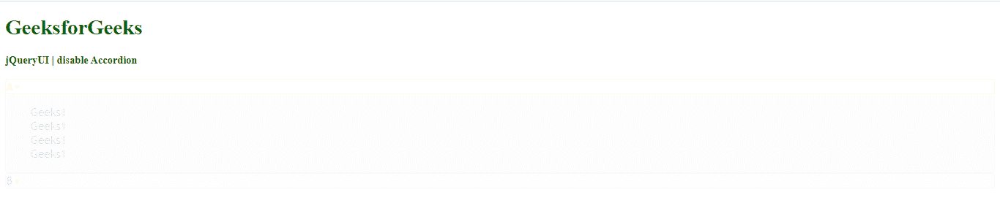

# jQuery UI 手风琴禁用()方法

> 原文:[https://www . geesforgeks . org/jquery-ui-accordion-disable-method/](https://www.geeksforgeeks.org/jquery-ui-accordion-disable-method/)

要在 jQuery 用户界面中禁用手风琴，我们将使用 disable()方法，该方法将在下面讨论:

jQuery UI disable()方法用于完全禁用手风琴。它将 acordion 元素完全返回到其初始状态。

**语法:**

```
$( ".selector" ).accordion( "disable" )
```

**参数:**此方法不接受任何参数。

**返回值:**该方法只是将按钮返回到其初始前的状态。

**方法:**首先，添加项目所需的 jQuery Mobile 脚本。

> <src 脚本= " https://Ajax . Google APIs . com/Ajax/libs/jquery ui/1 . 8 . 16/jquery-ui . js "></script><link href = " http://Ajax . Google APIs . com/Ajax

**示例:**

```
<!DOCTYPE html> 
<html> 

<head> 
    <meta charset="utf-8"> 
    <meta name="viewport" content= 
        "width=device-width, initial-scale=1"> 

    <script src= 
"https://ajax.googleapis.com/ajax/libs/jquery/1.7.1/jquery.js"> 
    </script> 

    <script src= 
"https://ajax.googleapis.com/ajax/libs/jqueryui/1.8.16/jquery-ui.js"> 
    </script> 

    <link href= 
"http://ajax.googleapis.com/ajax/libs/jqueryui/1.8.16/themes/ui-lightness/jquery-ui.css"
        rel="stylesheet" type="text/css" /> 

    <style> 
        .height { 
            height: 10px; 
        } 
    </style> 

    <script> 
        $(function () { 
            $( "#gfg" ).accordion();
            $( "#gfg" ).accordion( "disable" );
        }); 
    </script> 
    <style>
         #gfg{font-size: 17px;}
    </style>
</head> 

<body> 
    <h1 style="color:green">GeeksforGeeks</h1> 
    <b>jQueryUI | disable Accordion</b> 
    <br>
    <br>
    <div id="gfg">
        <h2>A</h2>
         <div>Geeks1
            <br>Geeks1
            <br>Geeks1
            <br>Geeks1
            <br>
        </div>
        <h2>B</h2>
        <div>Geeks2
            <br>Geeks2
            <br>Geeks2
            <br>Geeks2
        </div>
    </div>
</body> 

</html>
```

**输出:**

