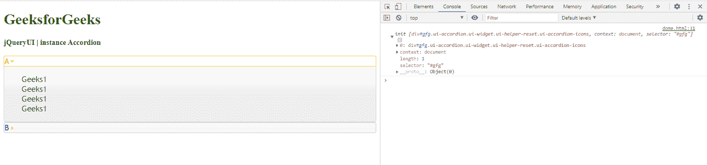

# jQuery UI 手风琴实例()方法

> 原文:[https://www . geesforgeks . org/jquery-ui-accordion-instance-method/](https://www.geeksforgeeks.org/jquery-ui-accordion-instance-method/)

jQuery UI **手风琴小部件实例方法**用于获取手风琴的实例对象。

**语法:**

```
var a = $( ".selector" ).accordion( "instance" )
```

**参数:**此方法不接受任何参数

**返回值:**该方法返回一个对象值。

**方法:**首先，添加项目所需的 jQuery UI 脚本。

> <src 脚本= " https://Ajax . Google APIs . com/Ajax/libs/jquery ui/1 . 8 . 16/jquery-ui . js "></script><link href = " http://Ajax . Google APIs . com/Ajax

**示例:**

```
<!DOCTYPE html>
<html>

<head>
    <meta charset="utf-8">
    <meta name="viewport" content=
        "width=device-width, initial-scale=1">

    <script src=
"https://ajax.googleapis.com/ajax/libs/jquery/1.7.1/jquery.js">
    </script>

    <script src=
"https://ajax.googleapis.com/ajax/libs/jqueryui/1.8.16/jquery-ui.js">
    </script>

    <link href=
"http://ajax.googleapis.com/ajax/libs/jqueryui/1.8.16/themes/ui-lightness/jquery-ui.css"
        rel="stylesheet" type="text/css" />

    <style>
        #gfg {
            font-size: 17px;
        }
    </style>

    <script>
        $(function () {
            $("#gfg").accordion();
            var a = $("#gfg").accordion("instance");
            console.log(a)
        }); 
    </script>
</head>

<body>
    <h1 style="color:green">
        GeeksforGeeks
    </h1>

    <b>jQueryUI | instance Accordion</b>

    <br><br>
    <div id="gfg">
        <h2>A</h2>
        <div>Geeks1
            <br>Geeks1
            <br>Geeks1
            <br>Geeks1
            <br>
        </div>

        <h2>B</h2>
        <div>Geeks2
            <br>Geeks2
            <br>Geeks2
            <br>Geeks2
        </div>
    </div>
</body>

</html>
```

**输出:**

