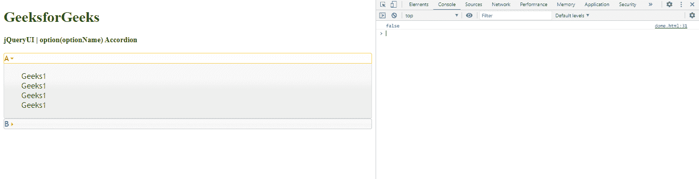

# jQuery UI 手风琴选项(选项名)方法

> 原文:[https://www . geesforgeks . org/jquery-ui-accordion-option option name-method/](https://www.geeksforgeeks.org/jquery-ui-accordion-optionoptionname-method/)

jQuery UI 折叠选项(optionName)方法用于检查方法是否返回一个布尔值，该值表示对象选项是否存在。

**语法:**

```html
var a = $( ".selector" ).accordion( "option", "disabled" )
```

**参数:**

*   **选项名称:**要检查的选项。

**返回值:** 这个方法返回一个布尔值。

**进场:**

*   首先，添加项目所需的 jQuery Mobile 脚本。

```html
    <script src= 
"https://ajax.googleapis.com/ajax/libs/jquery/1.7.1/jquery.js"> 
    </script> 

    <script src= 
"https://ajax.googleapis.com/ajax/libs/jqueryui/1.8.16/jquery-ui.js"> 
    </script> 

    <link href= 
"http://ajax.googleapis.com/ajax/libs/jqueryui/1.8.16/themes/ui-lightness/jquery-ui.css"
        rel="stylesheet" type="text/css" />
```

**例 1:**

## 超文本标记语言

```html
<!DOCTYPE html>
<html>

<head>
    <meta charset="utf-8">
    <meta name="viewport" content=
        "width=device-width, initial-scale=1">

    <script src=
"https://ajax.googleapis.com/ajax/libs/jquery/1.7.1/jquery.js">
    </script>

    <script src=
"https://ajax.googleapis.com/ajax/libs/jqueryui/1.8.16/jquery-ui.js">
    </script>

    <link href=
"http://ajax.googleapis.com/ajax/libs/jqueryui/1.8.16/themes/ui-lightness/jquery-ui.css"
        rel="stylesheet" type="text/css" />

    <style>
        .height {
            height: 10px;
        }
    </style>

    <script>
        $(function () {
            $( "#gfg" ).accordion();
            var a = $( "#gfg" ).accordion( "option", "disabled" );
            console.log(a)
        });
    </script>
    <style>
         #gfg{font-size: 17px;}
    </style>
</head>

<body>
    <h1 style="color:green">GeeksforGeeks</h1>
    <b>jQueryUI | option(optionName) Accordion</b>
    <br>
    <br>
    <div id="gfg">
        <h2>A</h2>
         <div>Geeks1
            <br>Geeks1
            <br>Geeks1
            <br>Geeks1
            <br>
        </div>
        <h2>B</h2>
        <div>Geeks2
            <br>Geeks2
            <br>Geeks2
            <br>Geeks2
        </div>
    </div>
</body>

</html>
```

**输出:**

