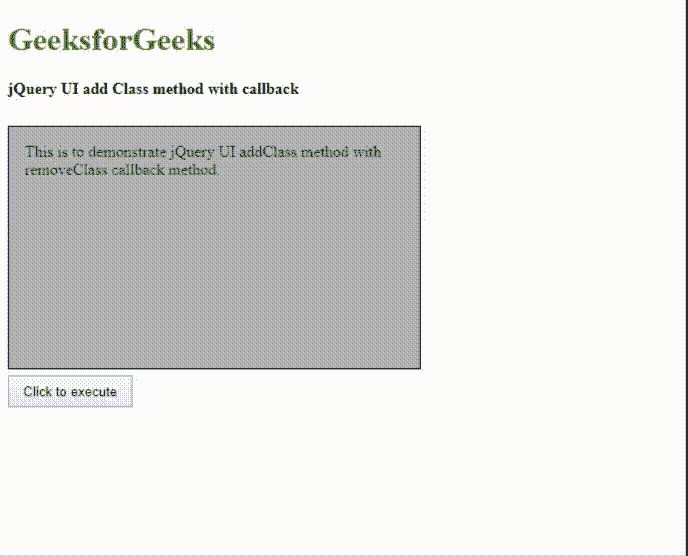

# jQuery UI | addClass()方法

> 原文:[https://www.geeksforgeeks.org/jquery-ui-addclass-method/](https://www.geeksforgeeks.org/jquery-ui-addclass-method/)

**addClass()方法**是 jQuery UI 框架中的一个内置方法，用于管理用户界面视觉效果。此方法将类添加到所有选定的元素中，并为 CSS 属性中定义的所有样式设置动画。它主要管理文本缩进、宽度、高度、填充、边距、字体大小和字母间距的动画方法，提供平滑的效果过渡。

**语法:**

```html
$(selector).addClass(className, options);
```

**参数:**该方法接受两个参数，如上所述，如下所述:

*   **类名:**此参数保存需要添加的类名。
*   **选项:**为可选参数。

**返回值:**返回添加了新类名的选中元素。

**选项:**

*   **持续时间:**此选项允许您选择视觉效果的持续时间(以毫秒为单位)。类型为数字或字符串，默认值为 400。
    **语法:**

    ```html
    $(".selector").addClass(className, "fast");  
    ```

*   **缓和:**这个选项说出视觉效果想要什么样的缓和或者进步。类型为字符串，默认值为*摇摆*。
    **语法:**

    ```html
    $(".selector").addClass(className, "easeOutBounce");  
    ```

*   **完成:**该选项是视觉效果完成后对每个匹配的元素调用的回调方法。类型是函数。
*   **子代:**该选项告知视觉效果或动画是否应用于其所有后代。类型为布尔型，默认值为*假*。
*   **队列:**该选项告知视觉效果或动画是否放置在效果队列中。类型为布尔或字符串，默认值为*真*。

**jQuery 界面链接:**

> <src = " https://Ajax . Google APIs . com/Ajax/libs/jquery ui/1 . 8 . 16/jquery-ui . js "></script><link
> =【http://Ajax

**jQuery 代码用单个类展示此方法的工作:**
**例 1:**

```html
<!DOCTYPE html>
<html>

<head>
    <meta charset = "utf-8">
    <meta name="viewport" content=
        "width=device-width,initial-scale=1">

    <title>jQuery UI addClass() Example</title>

    <link href =
"https://code.jquery.com/ui/1.10.4/themes/ui-lightness/jquery-ui.css"
        rel = "stylesheet">

    <script src = 
"https://code.jquery.com/jquery-1.10.2.js"></script>
    <script src = 
"https://code.jquery.com/ui/1.10.4/jquery-ui.js"></script>

    <style>
        .welcomeClass {
            width: 200px;
            height: 50px;
            text-align:center;
            padding :10px 10px 10px 10px;
            background-color: lightgreen;
            border: 2px solid green;
        }
        .newClass {
            font-size: 40px;
            background-color: #cccccc;
            color: red;
        }
        .highlight {
            color:#090;
            font-family:Calibri;         
            font-size:2em;
            text-shadow:2px 2px #FF0000;
        }
        .height{ height: 10px;}
        .square {
            width: 100px;
            height: 100px;
            text-align: center;
            padding :8px 10px 8px 10px;
            background-color: #cccccc;         
        }

        .easing-square {
            width: 200px;
            height: 200px;
            padding: 20px;
            background-color: lightgreen;
            border: 2px solid green; 
        }
    </style>

    <script type = "text/javascript">

        $(document).ready(function() {
            $('.btnClass').click(function() {
                if (this.id == "addID") {
                    $('#welcomeId').addClass(
                            "newClass", "fast")
                } 
                else {
                    $('#welcomeId').removeClass(
                            "newClass", "fast")
                }
            })

            $( ".square" ).click(function() {
                $( this ).addClass( "easing-square",
                                    700, "swing" );
                $( this ).text("addclass() method "
                        + "executed successfully!");
            }); 
        });
    </script>
</head> 

<body>     
    <h1 style="color:green">
        GeeksforGeeks
    </h1> 

    <b class="highlight">
        jQuery UI addClass method
    </b>

    <div class="height"></div><br>

    <div id = welcomeId class = "welcomeClass">
        Welcome !
    </div>
    <div class="height"></div><br>

    <button class = "btnClass" id = "addID">
        Add Class
    </button>

    <button class = "btnClass" id = "removeID">
        Remove Class
    </button>

    <div class="height"> </div><br>
    <div class="square" >Click this </div>
</body>

</html>
```

在上例中，选择的元素是:*【b】*和*【div】*。“高光”等级应用于元素*“b”*。*“新类”*类应用于 id 为 *welcomeId* 的元素“div”。借助*正方形*类在元素“div”上应用“宽松正方形”类。jQuery UI 的 addClass()方法。
**输出:**


**jQuery 代码，显示该方法在多个类中的工作情况:**

**设计结构:**在下面的代码中，选择元素*“p”*，借助**增加类即*“红”*、*“字体”*、*“填充”*、*“边框”*。jQuery UI 的 addClass()** 方法。下面的 CSS 代码用于定义“p”元素的所有类，也用于设计用户界面部分。下面的 jQuery 代码用于管理 click 事件，并向所选元素添加多个类。

**注意:**在 **addClass()** 方法中，多个类之间用空格隔开。

*   **CSS 代码:**

    ```html
    <style>
        .red { 
            background: red; 
            width:400px;          
        }          

        .font{ 
            font-size: 3em;
            text-align : center;
        }  

        .padding { 
           padding: 1em; 
        }  

        .border {
            border: 2px solid black;
            border-radius: 25px;
        }
    </style>
    ```

*   **jQuery 代码:**

    ```html
    <script>
        $(document).ready(function() {  
            $('.btnClass').click(function() {  
                $( "#paraId" ).addClass(
                    "red font padding border", 2500 );  
            });                
        }); 
    </script> 
    ```

**最终解决方案:**

```html
<!DOCTYPE html> 
<html lang="en">

<head> 
    <meta charset="utf-8">
    <meta name="viewport" content=
        "width=device-width, initial-scale=1">

    <title>
        jQuery UI adding multiple classes
    </title> 

    <link href=
"http://code.jquery.com/ui/1.10.4/themes/ui-lightness/jquery-ui.css"
        rel="stylesheet"> 

    <script src=
"http://code.jquery.com/jquery-1.10.2.js"></script> 

    <script src=
"http://code.jquery.com/ui/1.10.4/jquery-ui.js">
    </script> 

    <style> 
        .red { 
            background: red; 
            width:400px;         
        }         

        .font { 
            font-size: 3em;
            text-align : center;
        } 

        .padding { 
            padding: 1em; 
        } 

        .border {
            border: 2px solid black;
            border-radius: 25px;
        }
    </style> 

    <script> 
        $(document).ready(function() { 
            $('.btnClass').click(function() { 
                $( "#paraId" ).addClass( 
                    "red font padding border", 2500 ); 
            });     
        });
    </script> 
</head> 

<body> 
    <h1 style="color:green">
        GeeksforGeeks
    </h1> 

    <b>jQuery UI adding multiple classes</b>

    <div class="height"></div> 

    <p id="paraId">GFG website</p> 

    <button class="btnClass">
        Click this
    </button>         
</body> 

</html>
```

**输出:**


**用回调方法显示该方法工作的 jQuery 代码:**

*   **CSS 代码:**

    ```html
    <style>
        .height { 
            height: 10px;
        }        

        .parent { 
            width: 500px;
            height: 250px; 
            position: relative;
        }

        #btnClick { 
            padding: .5em 1em;
            text-decoration: none;
        }

        #container { 
            width: 380px;
            height: 210px; 
            padding: 1em;
            color: #2d2d2d;          
            border: 1px solid black; 
            background: #b3b3b3;           
        }

        .newClass { 
            text-indent: 20px; 
            letter-spacing: .2em;
            width: 380px; 
            height: 210px; 
            padding: 20px; 
            margin: 10px; 
            font-size: 1.1em;
        }    
    </style>
    ```

*   **jQuery 代码:**

    ```html
    <script>
        $(document).ready(function() {
            $( "#btnClick" ).on( "click", function() {
                $( "#container" ).addClass(
                        "newClass", 4000, callback );
            });

            function callback() {
                setTimeout(function() {
                    $( "#container" ).removeClass( "newClass" );
                }, 4000 );
            }            
        });
    </script>
    ```

**最终解决方案:**

```html
<!DOCTYPE html>
<html>

<head>
    <meta charset = "utf-8">
    <meta name="viewport" content=
        "width=device-width,initial-scale=1">

    <title>jQuery UI addClass with callback</title>

    <link href = 
"https://code.jquery.com/ui/1.10.4/themes/ui-lightness/jquery-ui.css"
        rel = "stylesheet">
    <script src = 
"https://code.jquery.com/jquery-1.10.2.js"></script>
    <script src = 
"https://code.jquery.com/ui/1.10.4/jquery-ui.js"></script>

    <style>
        .height { 
            height: 10px;
        }        

        .parent { 
            width: 500px;
            height: 250px; 
            position: relative;
        }

        #btnClick { 
            padding: .5em 1em;
            text-decoration: none;
        }

        #container { 
            width: 380px;
            height: 210px; 
            padding: 1em;
            color: #2d2d2d;          
            border: 1px solid black; 
            background: #b3b3b3;           
        }

        .newClass { 
            text-indent: 20px; 
            letter-spacing: .2em;
            width: 380px; 
            height: 210px; 
            padding: 20px; 
            margin: 10px; 
            font-size: 1.1em;
        }    
    </style>

    <script>
        $(document).ready(function() {
            $( "#btnClick" ).on( "click", function() {
                $( "#container" ).addClass(
                        "newClass", 4000, callback );
            });

            function callback() {
                setTimeout(function() {
                    $( "#container" ).removeClass( "newClass" );
                }, 4000 );
            }            
        });
    </script>
</head>

<body>
    <h1 style="color:green">GeeksforGeeks</h1> 

    <b>jQuery UI add Class method with callback</b>

    <div class="height"></div><br>

    <div class="parent">
        <div id="container">
            This is to demonstrate jQuery 
            UI addClass method with
            removeClass callback method.
        </div>
    </div>

    <button id="btnClick">
        Click to execute
    </button>
</body>

</html>
```

在上面的代码中，在**的帮助下，选择了 id 为*容器*的“div”元素。addClass()** 函数一个新的类被添加到选定的“div”元素中。回调函数也是在**的帮助下执行的。jQuery UI 的 removeClass()** 方法。

**输出:**
