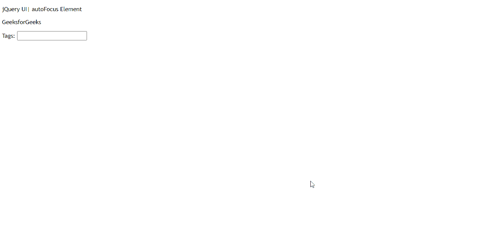
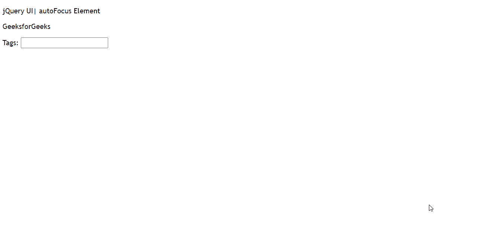

# jQuery UI 自动完成自动对焦选项

> 原文:[https://www . geesforgeks . org/jquery-ui-自动完成-自动对焦-选项/](https://www.geeksforgeeks.org/jquery-ui-autocomplete-autofocus-option/)

在本文中，我们将讨论 JqueryUI 中的自动完成自动对焦选项。jQuery UI 自动完成自动对焦选项当设置为 true 时，当菜单显示时，第一个项目将自动对焦。默认值为**假**

**语法:**

```html
$( ".selector" ).autocomplete({autoFocus: true }),
```

**方法:**首先，添加项目所需的 jQuery Mobile 脚本。

> <src 脚本= " https://Ajax . Google APIs . com/Ajax/libs/jquery ui/1 . 8 . 16/jquery-ui . js "></script><link href = " http://Ajax . Google APIs . com/Ajax

**例 1:**

## 超文本标记语言

```html
<!DOCTYPE html> 
<html> 

<head> 
    <meta charset="utf-8"> 
    <meta name="viewport" content= 
        "width=device-width, initial-scale=1"> 

    <script src= 
"https://ajax.googleapis.com/ajax/libs/jquery/1.7.1/jquery.js"> 
    </script> 

    <script src= 
"https://ajax.googleapis.com/ajax/libs/jqueryui/1.8.16/jquery-ui.js"> 
    </script> 

    <link href= 
"http://ajax.googleapis.com/ajax/libs/jqueryui/1.8.16/themes/ui-lightness/jquery-ui.css"
        rel="stylesheet" type="text/css" /> 

    <style> 
        .height { 
            height: 10px; 
        } 
    </style> 

    <script>
         $(function() {
            var list  =  [
               "One",
               "two",
               "Three",
               "Four",
            ];
            $( "#gfg" ).autocomplete({
               source: list,
               autoFocus:false
            });
         });
      </script>
   </head>

   <body>
      <div class = "ui-widget">
        <p>jQuery UI| autoFocus Element</p>
        <p>GeeksforGeeks</p>
        <label for = "gfg">Tags: </label>
        <input id = "gfg">
      </div>
   </body>
</html>
```

**输出:**



**例 2:**

## 超文本标记语言

```html
<!DOCTYPE html> 
<html> 

<head> 
    <meta charset="utf-8"> 
    <meta name="viewport" content= 
        "width=device-width, initial-scale=1"> 

    <script src= 
"https://ajax.googleapis.com/ajax/libs/jquery/1.7.1/jquery.js"> 
    </script> 

    <script src= 
"https://ajax.googleapis.com/ajax/libs/jqueryui/1.8.16/jquery-ui.js"> 
    </script> 

    <link href= 
"http://ajax.googleapis.com/ajax/libs/jqueryui/1.8.16/themes/ui-lightness/jquery-ui.css"
        rel="stylesheet" type="text/css" /> 

    <style> 
        .height { 
            height: 10px; 
        } 
    </style> 

    <script>
         $(function() {
            var list  =  [
               "One",
               "two",
               "Three",
               "Four",
            ];
            $( "#gfg" ).autocomplete({
               source: list,
               autoFocus:true
            });
         });
      </script>
   </head>

   <body>
      <div class = "ui-widget">
        <p>jQuery UI| autoFocus Element</p>      
        <p>GeeksforGeeks</p>
        <label for = "gfg">Tags: </label>
        <input id = "gfg">
      </div>
   </body>
</html>
```

**输出:**

