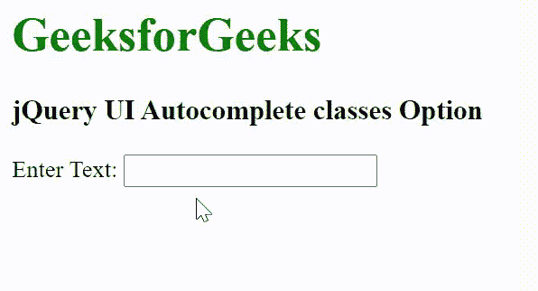

# jQuery 用户界面自动完成类选项

> 原文:[https://www . geesforgeks . org/jquery-ui-autocomplete-class-option/](https://www.geeksforgeeks.org/jquery-ui-autocomplete-classes-option/)

jQuery UI 由 GUI 小部件、视觉效果和使用 jQuery、CSS 和 HTML 实现的主题组成。jQuery 用户界面非常适合为网页构建用户界面。jQuery UI 自动完成类选项用于添加一些额外的类，以便将样式添加到元素中。

**语法:**

```
$( ".selector" ).autocomplete({
  classes: {
    "ui-autocomplete": "highlight"
  }
});
```

**CDN 链接:**首先，添加项目所需的 jQuery UI 脚本。

> <link rel="”stylesheet”" href="”//code.jquery.com/ui/1.12.1/themes/smoothness/jquery-ui.css”">
> <脚本 src =//code . jquery . com/jquery-1 . 12 . 4 . js "></脚本>
> <脚本 src =//code . jquery . com/ui/1 . 12 . 1/jquery-ui . js "></脚本>

**示例:**

## 超文本标记语言

```
<!DOCTYPE html>
<html lang="en">

<head>
    <meta charset="utf-8">
    <link rel="stylesheet" href=
    "//code.jquery.com/ui/1.12.1/themes/base/jquery-ui.css">
    <script src="https://code.jquery.com/jquery-1.12.4.js"></script>
    <script src="https://code.jquery.com/ui/1.12.1/jquery-ui.js"></script>
    <style>
        .highlight {
            background: green;
            color: white;
        }
    </style>
    <script>
        $(function () {
            var list = [
                "One",
                "two",
                "Three",
                "Four",
            ];
            $("#gfg").autocomplete({
                source: list,
                classes: {
                    "ui-autocomplete": "highlight"
                }
            });
        });
    </script>
</head>

<body>
    <h1 style="color: green;">GeeksforGeeks</h1>
    <h3>jQuery UI Autocomplete classes Option</h3>

    <label for="gfg">Enter Text:</label>
    <input id="gfg">
</body>

</html>
```

**输出:**



**参考:**[https://API . jquery ui . com/auto complete/# option-classes](https://api.jqueryui.com/autocomplete/#option-classes)