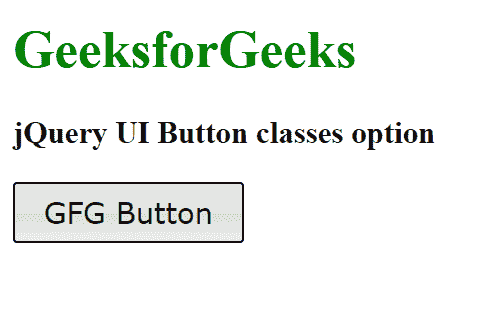

# jQuery 用户界面按钮类选项

> 原文:[https://www . geesforgeks . org/jquery-ui-button-class-option/](https://www.geeksforgeeks.org/jquery-ui-button-classes-option/)

jQuery UI 由 GUI 小部件、视觉效果和使用 HTML、CSS 和 jQuery 实现的主题组成。jQuery 用户界面非常适合为网页构建用户界面。jQuery UI 按钮类选项用于向按钮元素添加一些额外的类。

**语法:**

```
$( ".selector" ).button({
  classes: {
    "ui-button": "highlight"
  }
});
```

**CDN 链接:**首先，添加项目所需的 jQuery UI 脚本。

> <link rel="”stylesheet”" href="”//code.jquery.com/ui/1.12.1/themes/smoothness/jquery-ui.css”">
> <脚本 src =//code . jquery . com/jquery-1 . 12 . 4 . js "></脚本>
> <脚本 src =//code . jquery . com/ui/1 . 12 . 1/jquery-ui . js "></脚本>

**示例:**

## 超文本标记语言

```
<!doctype html>
<html lang="en">

<head>
    <meta charset="utf-8">
    <link rel="stylesheet" href=
    "//code.jquery.com/ui/1.12.1/themes/smoothness/jquery-ui.css">
    <script src="//code.jquery.com/jquery-1.12.4.js"></script>
    <script src="//code.jquery.com/ui/1.12.1/jquery-ui.js"></script>
</head>

<body>
    <h1 style="color: green;">GeeksforGeeks</h1>

    <h3>jQuery UI Button classes option</h3>

    <button>GFG Button</button>

    <script>
        $("button").button({
            classes: {
                "ui-button": "ui-corner-all",
                "ui-button": "highlight"
            }
        });
    </script>
</body>

</html>
```

**输出:**

