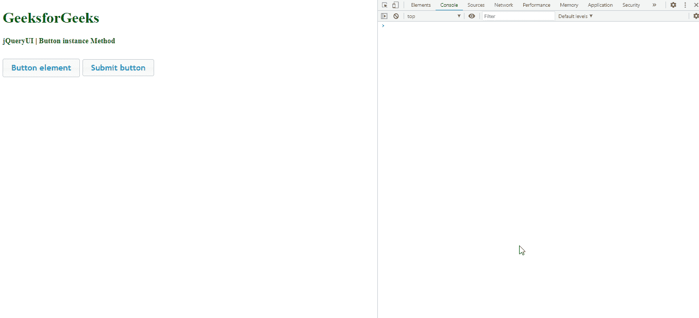

# jQuery UI 按钮实例()方法

> 原文:[https://www . geesforgeks . org/jquery-ui-button-instance-method/](https://www.geeksforgeeks.org/jquery-ui-button-instance-method/)

jQuery UI 按钮实例方法用于获取按钮的实例对象。

**语法:**

```
var a = $( ".selector" ).button( "instance" )
```

**参数:**此方法不接受任何参数

**返回值:**该方法返回一个对象值。

**方法:**首先，添加项目所需的 jQuery UI 脚本。

> <src 脚本= " https://Ajax . Google APIs . com/Ajax/libs/jquery ui/1 . 8 . 16/jquery-ui . js "></script><link href = " http://Ajax . Google APIs . com/Ajax

**示例:**

```
<!DOCTYPE html> 
<html> 

<head> 
    <meta charset="utf-8"> 
    <meta name="viewport" content= 
        "width=device-width, initial-scale=1"> 

    <script src= 
"https://ajax.googleapis.com/ajax/libs/jquery/1.7.1/jquery.js"> 
    </script> 

    <script src= 
"https://ajax.googleapis.com/ajax/libs/jqueryui/1.8.16/jquery-ui.js"> 
    </script> 

    <link href= 
"http://ajax.googleapis.com/ajax/libs/jqueryui/1.8.16/themes/ui-lightness/jquery-ui.css"
        rel="stylesheet" type="text/css" /> 

    <style> 
        .height { 
            height: 10px; 
        } 
    </style> 

    <script> 
        $(function () { 
            $("#buttonId, #submitId").button();

            $('#buttonId, #submitId').click(function (event) { 
                event.preventDefault(); 
                var a = $( this ).button("instance" );
                console.log(a) 
            });  
        }); 
    </script> 
</head> 

<body> 
    <h1 style="color:green">GeeksforGeeks</h1> 

    <b>jQueryUI | Button instance Method</b> 

    <div class="height"> </div><br> 

    <div class="buttons-div"> 
        <button id="buttonId">Button element</button> 
        <input id="submitId" type="submit" 
            value="Submit button">  
    </div>
</body> 

</html>
```

**输出:**

