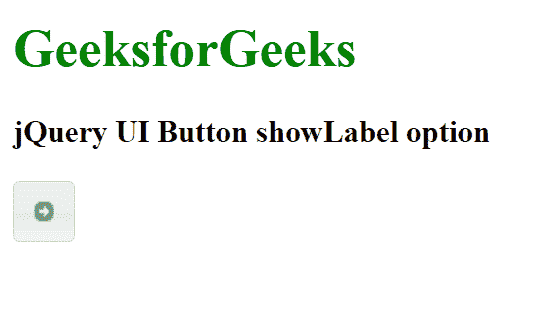

# jQuery UI 按钮显示标签选项

> 哎哎哎:# t0]https://www . geeksforgeeks . org/jquery-ui-button-show label 选项/

jQuery UI 由 GUI 小部件、视觉效果和使用 HTML、CSS 和 jQuery 实现的主题组成。jQuery 用户界面非常适合为网页构建用户界面。jQuery UI 按钮显示标签选项用于显示标签。如果我们将 showLabel 值设置为 false，将不会显示任何文本，但必须使用图标选项，否则将忽略 showLabel 选项。

**语法:**

```html
$( ".selector" ).button({
  showLabel: false
});
```

**CDN 链接:**首先，添加项目所需的 jQuery UI 脚本。

> <link rel="”stylesheet”" href="”//code.jquery.com/ui/1.12.1/themes/smoothness/jquery-ui.css”">
> <脚本 src =//code . jquery . com/jquery-1 . 12 . 4 . js "></脚本>
> <脚本 src =//code . jquery . com/ui/1 . 12 . 1/jquery-ui . js "></脚本>

**示例:**

## 超文本标记语言

```html
<!doctype html>
<html lang="en">

<head>
    <meta charset="utf-8">
    <link rel="stylesheet" href=
    "//code.jquery.com/ui/1.12.1/themes/smoothness/jquery-ui.css">
    <script src="//code.jquery.com/jquery-1.12.4.js"></script>
    <script src="//code.jquery.com/ui/1.12.1/jquery-ui.js"></script>
</head>

<body>
    <h1 style="color: green;">GeeksforGeeks</h1>

    <h3>jQuery UI Button showLabel option</h3>

    <button>Button</button>

    <script>
        $("button").button({
            icon: "ui-icon-circle-arrow-e",
            showLabel: false
        });
    </script>
</body>

</html>
```

**输出:**



**参考:**[https://API . jquery ui . com/button/# option-show label](https://api.jqueryui.com/button/#option-showLabel)