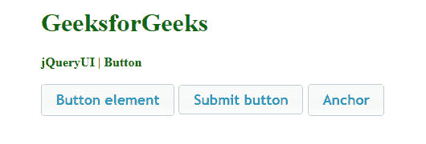
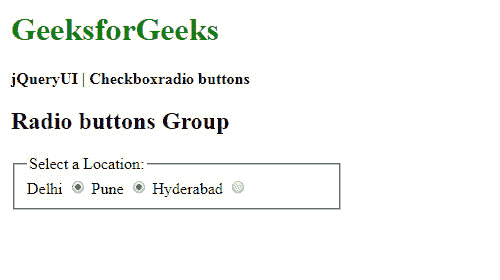
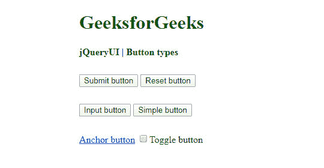
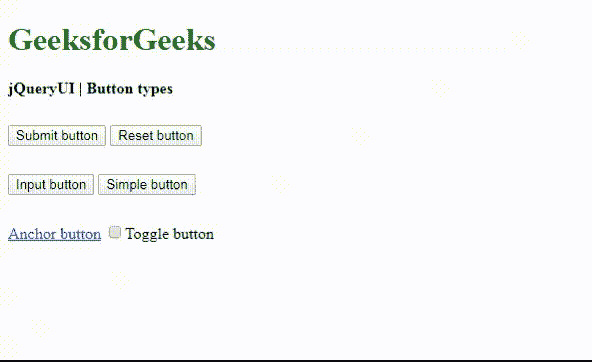
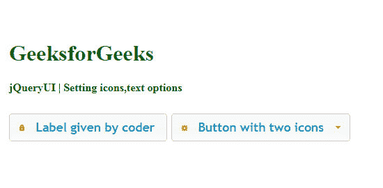
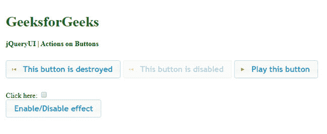
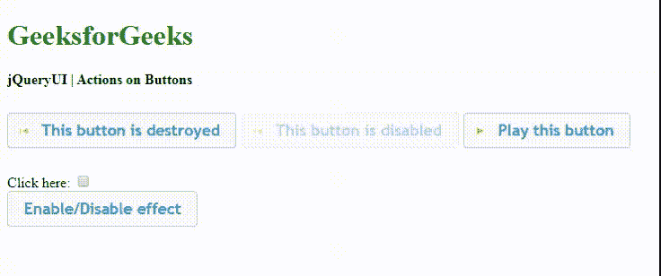
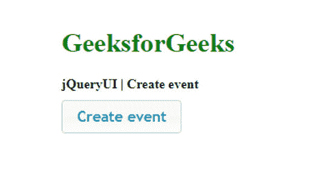
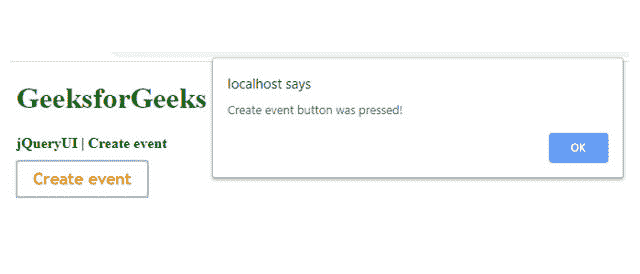

# jQuery UI | Button

> 哎哎哎:# t0]https://www . geeksforgeeks . org/jquery-ui-button/

通过 jQuery UI 框架，让我们学习如何使用 jQuery UI **button()** 方法设计可操作的直观按钮，以及管理与之相关的选项、动作、事件和鼠标移动。这些按钮在网页设计项目中非常有用，在这些项目中，用户界面应该是高度交互的。
**语法:**

```html
$(selector, context).button(options)
```

*选项*参数负责按钮的设计或外观及其行为。
如果要提供多个选项，您可以使用逗号将它们分开，如下所示:

```html
$(selector, context).button ({option1: value1, 
       option2: value2, option3: value3...})
```

**按钮()**方法也可以处理按钮上的动作，如下所示:

```html
 $(selector, context).button ("action", [parameters]);
```

*   **jQuery 用户界面库链接:**

> <link rel="’stylesheet’&nbsp;<br/">href = " http://Ajax . Google APIs . com/Ajax/libs/jquery ui/1 . 8 . 16/themes/ui-light/jquery-ui . CSS ">t1<src = " https://Ajax . Google APIs . com/Ajax/libs/jquery/1 . 7 . 1/jquery . js ">T2】脚本

*   或

> <link rel="’stylesheet’&nbsp;<br/">href = " https://code . jquery . com/ui/1 . 10 . 4/themes/ui-light/jquery-ui . CSS ">
> <src = " https://code . jquery . com/jquery-1 . 10 . 2 . js ">/script>

**示例 1:** 以下示例演示了如何创建基本按钮。

## 超文本标记语言

```html
<!DOCTYPE html>
<html>

<head>
    <meta charset="utf-8">
    <meta name="viewport" content=
        "width=device-width, initial-scale=1">
    <title>jQueryUI Button</title>

    <script src=
"https://ajax.googleapis.com/ajax/libs/jquery/1.7.1/jquery.js">
    </script>

    <script src=
"https://ajax.googleapis.com/ajax/libs/jqueryui/1.8.16/jquery-ui.js">
    </script>

    <link href=
"http://ajax.googleapis.com/ajax/libs/jqueryui/1.8.16/themes/ui-lightness/jquery-ui.css"
        rel="stylesheet" type="text/css" />

    <style>
        .height {
            height: 10px;
        }
    </style>

    <script>
        $(function () {
            $("#buttonId, #submitId, #anchorId").button();
        });
    </script>
</head>

<body>
    <h1 style="color:green">GeeksforGeeks</h1>
    <b>jQueryUI | Button </b>
    <div class="height"> </div><br>
    <div class="buttons-div">
        <button id="buttonId">Button element</button>
        <input id="submitId" type="submit" value="Submit button">
        <a id="anchorId" href="">Anchor</a>
    </div>

</body>

</html>
```

上述示例程序的脚本部分也可以写成如下

## java 描述语言

```html
<script>
    $(function () {
        $("#buttonId, #submitId, #anchorId")
            .button().click(function (event) {
                event.preventDefault();
            });
    });
</script>
```

**输出:**



**例 2:** 按钮的可视化分组使用 jQuery UI **按钮集()**方法处理。

## 超文本标记语言

```html
<!DOCTYPE html>
<html>

<head>
    <meta charset="utf-8">
    <meta name="viewport" content=
        "width=device-width, initial-scale=1">

    <title>jQueryUI | Checkboxradio buttons</title>

    <script src=
"https://ajax.googleapis.com/ajax/libs/jquery/1.7.1/jquery.js">
    </script>

    <script src=
"https://ajax.googleapis.com/ajax/libs/jqueryui/1.8.16/jquery-ui.js">
    </script>

    <link href=
"http://ajax.googleapis.com/ajax/libs/jqueryui/1.8.16/themes/ui-lightness/jquery-ui.css"
        rel="stylesheet type=" text/css" />

    <script>
        $(function () {
            $("input").checkboxradio();
            $("#buttonsetId").buttonset();
        });
    </script>
</head>

<body>
    <h1 style="color:green">GeeksforGeeks</h1>
    <b>jQueryUI | Checkboxradio buttons </b>

    <h2>Radio buttons Group</h2>
    <div id="buttonsetId">
        <fieldset style="width:300px">
            <legend>Select a Location: </legend>
            <label for="radioId1">Delhi</label>
            <input type="radio" name="radioId1" id="radioId1">
            <label for="radioId2">Pune</label>
            <input type="radio" name="radioId2" id="radioId2">
            <label for="radioId3">Hyderabad</label>
            <input type="radio" name="radioId3" id="radioId3">
        </fieldset>
    </div>
</body>

</html>
```

**输出:**



**示例 3:** 以下示例演示了不同类型的 jQuery UI 按钮的使用。

## 超文本标记语言

```html
<!DOCTYPE html>
<html>

<head>
    <title>jQueryUI Button types</title>

    <script src=
"https://ajax.googleapis.com/ajax/libs/jquery/1.7.1/jquery.js">
    </script>

    <script src=
"https://ajax.googleapis.com/ajax/libs/jqueryui/1.8.16/jquery-ui.js">
    </script>

    <link href=
"http://ajax.googleapis.com/ajax/libs/jqueryui/1.8.16/themes/ui-lightness/jquery-ui.css"
        rel="stylesheet" type="text/css" />

    <style>
        .height {
            height: 10px;
        }
    </style>

    <script>
        $(function () {
            $('.btnClass').click(function (event) {
                event.preventDefault();
                $(this).button();
            });
        });
    </script>
</head>

<body>
    <h1 style="color:green">GeeksforGeeks</h1>
    <b>jQueryUI | Button types</b>
    <div class="height"></div><br>
    <input class="btnClass" type="submit" value="Submit button">
    <input class="btnClass" type="reset" value="Reset button">
    <div class="height"></div><br />
    <input class="btnClass" type="button" value="Input button">
    <button class="btnClass">Simple button </button>
    <div class="height"></div><br />
    <a class="btnClass" href="#">Anchor button</a>
    <input class="btnClass" type="checkbox" id="checkboxID">
    <label for="checkboxID">Toggle button</label><br>
</body>

</html>
```

**输出:**

*   **点击按钮前:** 

*   **点击按钮后:** 

**$(选择器，上下文)。按钮(选项)方法:**
**示例 4:** 以下示例演示了带有选项**文本**和**图标**的 jQuery UI **按钮()**方法的使用。还处理其他选项，例如通过**图标位置**选项将图标位置设置为*“开始”*或*“结束”*。按钮上有一两个图标。如下图所示，**主**图标设置在左侧，**副**图标设置在右侧。jQuery UI **按钮()**的库中有这么多可用的选项，程序员可以根据项目需求选择或自定义其他选项。

## 超文本标记语言

```html
<!DOCTYPE html>
<html>

<head>
    <title>jQueryUI | Setting icons, text options</title>

    <meta charset="utf-8">
    <meta name="viewport" content=
        "width=device-width, initial-scale=1">

    <script src=
"https://ajax.googleapis.com/ajax/libs/jquery/1.7.1/jquery.js">
    </script>

    <script src=
"https://ajax.googleapis.com/ajax/libs/jqueryui/1.8.16/jquery-ui.js">
    </script>

    <link href=
"http://ajax.googleapis.com/ajax/libs/jqueryui/1.8.16/themes/ui-lightness/jquery-ui.css"
        rel="stylesheet" type="text/css" />

    <script>
        $(function () {
            $("#iconBtnId").button({
                iconPosition: "end",

                // text shown on the button
                label: "Label given by coder",          
                icons: {
                    primary: "ui-icon-locked"
                },

                text: true // text to be shown or not
            });
            $("#buttonId").button({
                icons: {
                    primary: "ui-icon-gear",
                    secondary: "ui-icon-triangle-1-s"
                }
            });
        });
    </script>
</head>

<body>
    <h1 style="color:green">GeeksforGeeks</h1>
    <b>jQueryUI | Setting icons, text options </b>

    <h2>Other functionalities of jQuery UI buttons</h2>
    <button id="iconBtnId">
        Button with icon
    </button>
    <button id="buttonId">
        Button with two icons
    </button>
</body>

</html>
```

**输出:**



**示例 5:** jQuery UI **按钮()**提供了许多方法和选项，可用于控制可主题化的小部件。程序员可以根据需要使用它们中的任何一个。该示例仅演示了其中一些作为指南。
以下代码演示了按钮触发的**点击**和**更改**事件，以及使用**图标**、**销毁**和**禁用**等选项。jQuery UI **button()** 方法也支持已实现的事件管理。还支持 jQuery UI 按钮的**启用**和**禁用**状态。

## 超文本标记语言

```html
<!DOCTYPE html>
<html>

<head>
    <meta charset="utf-8">
    <meta name="viewport" content=
        "width=device-width, initial-scale=1">

    <title>jQueryUI | Actions on Buttons </title>

    <script src=
"https://ajax.googleapis.com/ajax/libs/jquery/1.7.1/jquery.js">
    </script>

    <script src=
"https://ajax.googleapis.com/ajax/libs/jqueryui/1.8.16/jquery-ui.js">
    </script>

    <link href=
"http://ajax.googleapis.com/ajax/libs/jqueryui/1.8.16/themes/ui-lightness/jquery-ui.css"
        rel="stylesheet" type="text/css" />

    <style>
        .height {
            height: 10px;
        }
    </style>

    <script>
        $(function () {
            $('#destroyedBtnId').button().click(function (e) {

                /* This option removes and returns
                   the element to its original state */
                $('#destroyedBtnId').button("destroy");
                e.preventDefault();
            })
            $("#destroyedBtnId").button({

                // It is set to true, so that the
                // text is visible
                text: true,
                icons: {
                    primary: "ui-icon-seek-start"
                }
            });
            $("#disabledBtnId").button({
                icons: {
                    primary: "ui-icon-seek-prev"
                }
            });

            // It disables the themeable button
            $("#disabledBtnId").button('disable');

            $("#btnToPlay").button({
                text: true,
                icons: {
                    primary: "ui-icon-play"
                }
            });

            // 'change' event management
            $('#checkboxId').change(function (e) {
                $('#btnToEnable').button(

                    // Handles status of the button
                    // through 'enable' or 'disable'           
                    $(':checked').length == 1 ? "enable" : "disable"
                )
            });
            $("#btnToEnable").button();
        });
    </script>
</head>

<body>
    <h1 style="color:green">GeeksforGeeks</h1>
    <b>jQueryUI | Actions on Buttons </b>
    <div class="height"> </div><br>
    <div class="buttons-div">
        <button id="destroyedBtnId">This button is destroyed</button>
        <button id="disabledBtnId">This button is disabled</button>
        <button id="btnToPlay">Play this button </button>
        <div class="height"> </div><br>
        <div>Click here: <input type=checkbox id="checkboxId" /></div>
        <button id="btnToEnable">Enable/Disable effect </button>
    </div>
</body>

</html>
```

**输出:**

*   **点击按钮前:**
    

*   **After Clicking the Button: **
     

    **示例 6:** 当按钮被创建时，事件被触发，如以下代码中所实现的。

    ## 超文本标记语言

    ```html
    <!DOCTYPE html>
    <html>

    <head>
        <title>jQueryUI | Create event </title>

        <script src=
    "https://ajax.googleapis.com/ajax/libs/jquery/1.7.1/jquery.js">
        </script>

        <script src=
    "https://ajax.googleapis.com/ajax/libs/jqueryui/1.8.16/jquery-ui.js">
        </script>

        <link href=
    "http://ajax.googleapis.com/ajax/libs/jqueryui/1.8.16/themes/ui-lightness/jquery-ui.css"
            rel="stylesheet" type="text/css" />

        <style>
            .height {
                height: 10px;
            }
        </style>

        <script>

            // When the button is created, event is triggered
            $(function () {
                $("#btnCreateId").button({
                        create: function (event) {
                            $(event.target).click(function (event) {
                                event.preventDefault();
                                alert("Create event button was pressed!");
                            })
                        }
                });
            });
        </script>
    </head>

    <body>
        <h1 style="color:green">GeeksforGeeks</h1>
        <b>jQueryUI | Create event </b><br />
        <div class="height"></div>
        <button id="btnCreateId">Create event</button>
    </body>

    </html>
    ```

    **输出:**

    *   **点击按钮前:**
        *   **点击按钮后:**
    