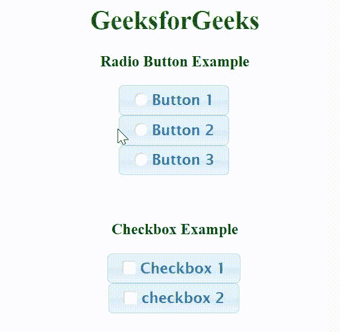

# jquery ui check box radio classes option

> 哎哎哎::1230【https://www . geeksforgeeks . org/jquery-ui-checkbox radio-classes 选项/

复选框单选小部件类选项用于使用 jQuery 用户界面指定需要添加到复选框单选按钮上的小部件元素的附加类。

**语法:**

```
$( ".selector" ).checkboxradio({
  classes: {
    "ui-checkboxradio": "highlight"
  }
});
```

**方法:**首先，添加项目所需的 jQuery UI 脚本。

> < link href = " https://code . jquery . com/ui/1 . 10 . 4/themes/ui-light/
> 
> jquery-ui.css" rel = "stylesheet " >

**示例:**在本例中，我们将使用 ui-checkboxradio 设置主题类。

## 超文本标记语言

```
<!DOCTYPE html>
<html>

<head>
    <link rel='stylesheet' href=
'https://ajax.googleapis.com/ajax/libs/jqueryui/1.12.1/themes/cupertino/jquery-ui.css'>

    <script src=
        "https://ajax.googleapis.com/ajax/libs/jquery/3.1.1/jquery.min.js">
    </script>

    <script src=
        "https://ajax.googleapis.com/ajax/libs/jqueryui/1.12.1/jquery-ui.min.js">
    </script>
</head>

<body>
    <center>
        <h1 style="color:green">GeeksforGeeks</h1>

        <h3>Radio Button Example</h3>
        <label for="radio1">Button 1</label>
        <input type="radio" name="radio" 
           id="radio1" class='radio'>
        <br>

        <label for="radio2">Button 2</label>
        <input type="radio" name="radio" 
            id="radio2" class='radio'>
        <br>

        <label for="radio3">Button 3</label>
        <input type="radio" name="radio" 
            id="radio3" class='radio'>
        <br><br><br>

        <h3>Checkbox Example</h3>
        <label for="checkbox1">Checkbox 1</label>
        <input type="checkbox" name="checkbox1" 
            id="checkbox1" class='checkbox'>
        <br>

        <label for="checkbox2">checkbox 2</label>
        <input type="checkbox" name="checkbox2" 
            id="checkbox2" class='checkbox'>

        <script>
            $(document).ready(function () {
              $(".radio, .checkbox").checkboxradio({
                classes: {
                 "ui-checkboxradio": "highlight"
                }
              });
            }); 
        </script>
    </center>
</body>

</html>
```

**输出:**

